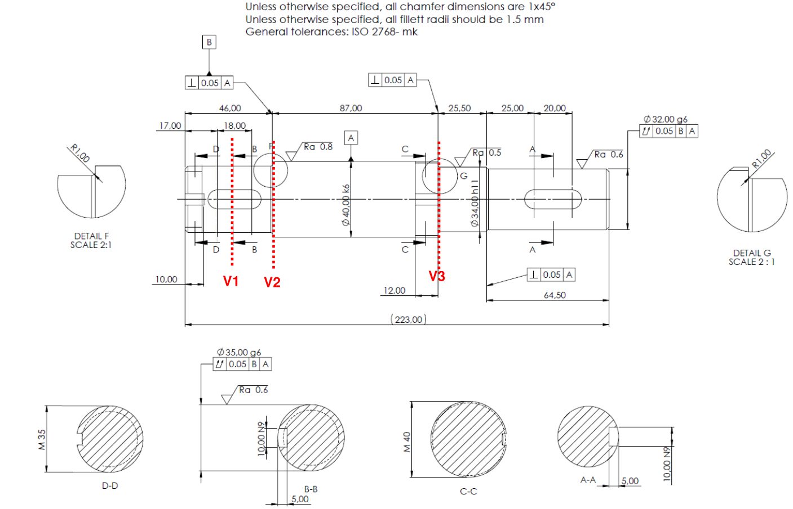
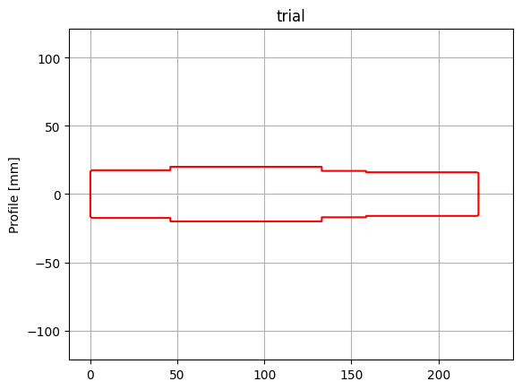
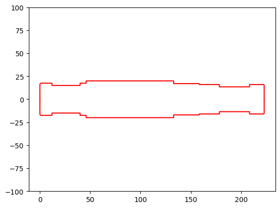
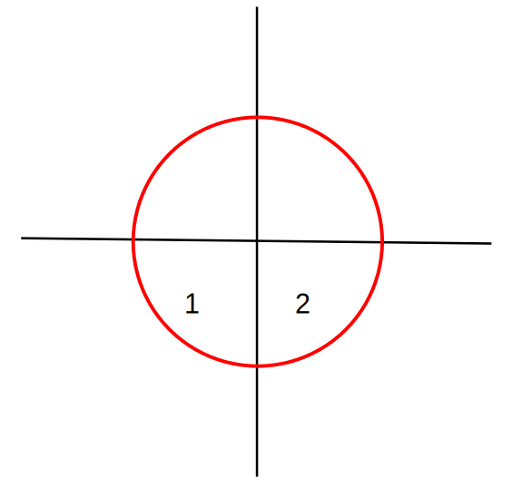
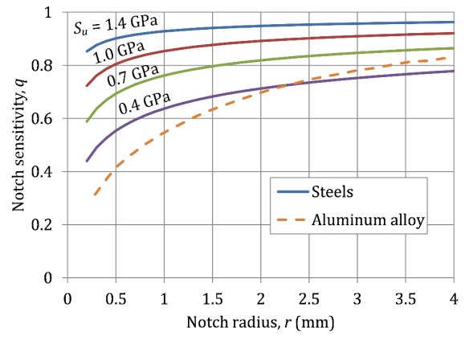
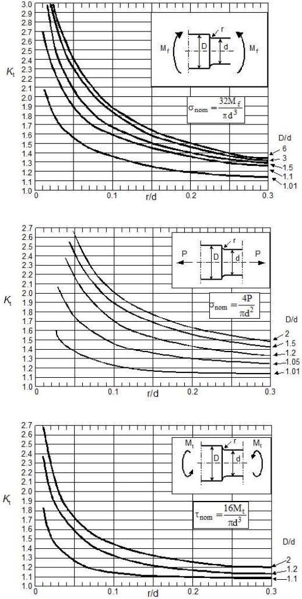
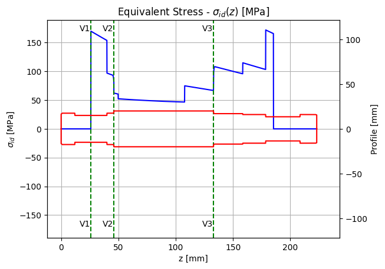
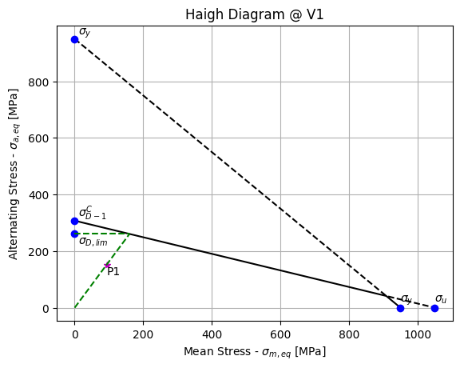
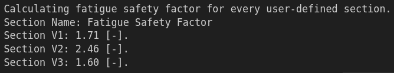

## Outline
Hello and welcome to the second part of this tutorial series. In the previous part, we learnt how to:
1) install **PyGRITbx** along with the tools required to work with it
2) define components that constitute a given gearbox
3) define interactions between components
4) calculate the forces exchanged between said components and the reaction forces produced by the bearings.

In this part, we will take our previous results to:
1) define a shaft profile based on the given technical drawing
2) calculate and plot internal loads and stresses on the defined shaft profile
3) perform static and fatigue verification by calculating the corresponding safety factors.

Without further talk, let's get down to business.

## Shaft Profile
Recall the configuration of the gearbox from [**Figure 1**](#figure-1).

<figure id="figure-1">
    
    <figcaption>Figure 1 - Gearbox Assembly</figcaption>
</figure>

Our goal is to define the profile of shaft **A2** to be able to calculate the internall stresses along the axis of the shaft after having computed the internal loads. To achieve this, we refer to the technical drawing of shaft **A2** as portrayed in [**Figure 2**](#figure-2).

<figure id="figure-2">
    
    <figcaption>Figure 2 - Shaft A2 Technical Drawing</figcaption>
</figure>

### Locating Corners

To define the shaft profile, we would need to know the radius of the shaft at every cross-section along its axis. Using the radius and axial location, we can specify the coordinates of certain points that we can locate on the technical drawing. These points would be the *corners* that define a radius change along the shaft's axis. For example, since **A2** rotates around the **z-axis** and this axis is pointing to the right, we start from the left most part of the shaft by locating the 4 points shown in [**Figure 3**](#figure-3).

<figure id="figure-3">
    
    <figcaption>Figure 3 - Shaft A2 First Corners</figcaption>
</figure>

**- P1**

It's clear that corner **P1** is located at location **0 [mm]** along the shaft's axis. What about the radius at which this corner is located? We can tell from section **D-D** ([**Figure 2**](#figure-2)) that the diameter corresponds to the notation **M 35**. This means that the diameter is equal to **35 [mm]**; thus, corresponding to a **17.5 [mm]** radius. However, this is true regarding corners **P2** and **P3** but not **P1** since there's a chamfer to get from corner **P1** to corner **P2**. The chamfer is specified to be of size **1 [mm]**. This means that corner **P1** is located at a radius equal to **16.5 [mm]**.

Therefore, **P1** is located at $\rArr (0, 16.5)$.

**- P2**

Due to the chamfer, the axial location of corner **P2** is equal to **1 [mm]**. The diameter at which it's located has been explained earlier and is equal to **35 [mm]**.

Therefore, **P2** is located at $\rArr (1, 17.5)$.

**- P3**

Corner **P3** is located along the same radius as corner **P2**. The axial location however can be seen as a dimension on the technical drawing set to **46 [mm]**. However, since corner **P4** is also located at that axial location, we will offset corner **P3** by **0.1 [mm]** to the left so as to locate it axially at **45.9 [mm]**.

Therefore, **P3** is located at $\rArr (45.9, 17.5)$.

**- P4**

The axial location of corner **P4** is **46 [mm]** as specified by the axial dimension on the technical drawing. The diameter is also shown, **40 [mm]**, corresponding to a radius equal to **20 [mm]**.

Therefore, **P4** is located at $\rArr (46, 20)$.

By continuing in this manner, we can define 2 numpy arrays: the first specifying all the points' axial locations and, the second, all their corresponding radii as shown in the following code block:

```python
# Define Radii and Axial Locations
radii = np.array([33, 35,    35, 40,    40,  34,    34,    32,   32,  31]) / 2 
alocs = np.array([ 0,  1,  45.9, 46, 132.9, 133, 158.4, 158.5,  222, 223])
```

To define and check the profile, you can run the following code:

```python
# Define a Shaft Profile for Trial
trial = pgt.ShaftProfile(name="trial", radii=radii, locs=alocs)

# Plot Defined Profile
trial.plotProfile()
```

This should produce the plot seen in [**Figure 4**](#figure-4).

<figure id="figure-4">
    
    <figcaption>Figure 4 - Shaft A2 Trial Profile</figcaption>
</figure>

I would be more than happy to inform you that this is almost all it takes to define the *general* profile of the shaft. However, it's specified in this project that for **static verification**, sections where there's a keyseat should be considered with a diameter equal to the nominal diameter stated in the technical drawing minus the depth of the keyseat!

Hence, this requirement presents us with new corners and the proper radii and locations should be defined as follows:

```python
# Define Radii and Axial Locations with Keyseats
static_radii = np.array([33, 35,   35, 30,   30, 35,   35, 40,    40,  34,    34,    32,    32,    27,    27,    32,  32,  31]) / 2
static_alocs = np.array([ 0,  1, 11.9, 12, 39.9, 40, 45.9, 46, 132.9, 133, 158.4, 158.5, 178.4, 178.5, 208.4, 208.5, 222, 223])
```

We can then define and plot the **static_profile** similar to the previous definition of the trial profile.

```python
# Define a Shaft Profile for Static Verification
static_profile = pgt.ShaftProfile(name="Static Profile", radii=static_radii, locs=static_alocs)

# Plot Defined Profile
static_profile.plotProfile()
```

This will procduce the profile shown in [**Figure 5**](#figure-5).

<figure id="figure-5">
    
    <figcaption>Figure 5 - Shaft A2 Static Profile</figcaption>
</figure>

### Refinements and Fillets
Our current definition of the shaft profile is coarse. This means that any calculations performed along the shaft's axis won't be distributed properly along the axis but only on those *corners* that we have defined earlier. We need a fine profile with more points interpolated between the defined corners to have a precise representation of the profile whenever we need it to perform certain calculations along its axis.

Luckily, **PyGRITbx** has the feature that refines a profile based on a given *delta* separating one point from another along the shaft's axis. Small values of *delta* allow for a finer profile with more precise calculations at the cost of memory and speed. By default, *delta* is set to **0.1 [mm]**. To refine the profile, use the code in the following block:

```python
# Refine Static Profile
static_profile_refined = static_profile.refineProfile(delta=0.1)
```

Now that we have a refined profile, we can add fillets as shown in the technical drawing. Why are fillets important? Because stresses are calculated based on the cross-sectional properties. If we don't take into consideration the change in those properties due to the change in diameter caused by the fillets, we would be missing out on valuable information regarding *how* the trend of these stresses changes along the shaft's axis.

To define a fillet, we need the following information:
1) **radius**: this is simply the radius of the fillet and must be in **[mm]**
2) **zOff**: this is the axial location of the center of the circle the fillet is part of (**[mm]**)
3) **dOff**: this is the radial location of the center of the circle the fillet is part of (**[mm]**)
4) **quadrant**: an array specifying one or more quadrants of the circle the fillet is part of ([**Figure 6**](#figure-6))

<figure id="figure-6">
    
    <figcaption>Figure 6 - Fillet Quadrants</figcaption>
</figure>

From detail **F-F** in [**Figure 2**](#figure-2), we can see that there's a fillet of radius **1 [mm]** belonging to quadrant **2** at an axial location equal to **45 [mm]** and a radial location equal to **18.5 [mm]**. Therefore we can simply add this fillet to the static profile using the following piece of code:

```python
# Add First Fillet to Static Profile
static_profile_refined.addFillet(radius=1, quadrant=[2], zOff=45, dOff=18.5)
```

Similarly we can locate the second fillet shown in detail **G-G** except that this one belongs to qudrant **1**:

```python
# Add Second Fillet to Static Profile
static_profile_refined.addFillet(radius=1, quadrant=[1], zOff=134, dOff=18)
```

Finally, we can add the profile to the shaft object:

```python
# Add Static Profile to Shaft A2
A2.addProfile(profile=static_profile_refined)
```

## Shaft Sections
The last step before proceeding with static analysis is defining the shaft sections. These are the given sections in the techinal drawing: ***V1***, ***V2***, and ***V3***. Sections are imperative to locate potentially critical locations at which you might suspect the component to fail (in this case the shaft). Moreover, we can include in the analysis the notch sensitivity and geometrical stress concentration factors on said sections to consider material properties, surface finish, and the topology of the shaft!

Defining a section is a relatively easy task in **PyGRITbx**. All you need is:
1) **name**: to act as a label when plotting
2) **loc**: axial location of the section along the shaft's rotational axis
3) **d**: the diameter of the shaft at the specified section
4) **Ra**: surface roughness of the shaft at the specified section
5) **material**: the material of the shaft

**- V1**

Therefore, to define section **V1**, you execute the following:

```python
# Section V1 Definition
V1 = pgt.ShaftSection(name="V1", loc=26, d=30, Ra=0.8, material=shaftMaterial)
```
Note that section **V1** is in the middle of a keyseat. In the project description, it's specified that the stress concentration raiser $\mathbf{K_f}$ is equal to **1.6** for *Bending Load* and equal to **2.0** for **Torsional Load*. Therefore, in addition to the section definition we need to execute the following:

```python
# Section V1 Stress Concentration Raiser
V1.appendKf(Kf=np.array([1.6, 2.0]), loadType=np.array(["Bending", "Torsion"]))
```

**- V2**

Similarly, we can define section **V2**:

```python
# Section V2 Definition
V2 = pgt.ShaftSection(name="V2", loc=46, d=40, Ra=0.8, material=shaftMaterial)
```

Given that there's a fillet and a shoulder at section **V2**, we'd need to define the characteristics of the notch sensitivity as well as the geometric stress raiser. This is simply done as shown in the following block:

```python
# Section V2 Notch Sensitivity and Geometric Stress Rasier
V2.addNotchSensitivity(notchRadius=1, sigma_u=shaftMaterial.sigma_u)
V2.addGeometricStressRaiser(r2d=1/35, D2d=40/35)
```

For the notch sensitivity $\mathbf{q}$, **PyGRITbx** uses the graph shown in [**Figure 7**](#figure-7) to get the proper value.

<figure id="figure-7">
    
    <figcaption>Figure 7 - Notch Sensitivity Graph</figcaption>
</figure>

For the geometric stress concentration factor $\mathbf{K_t}$, the toolbox uses the set of graphs in [**Figure 8**](#figure-8) to get the proper value for each type of load.

<figure id="figure-8">
    
    <figcaption>Figure 8 - Geometric Stress Concentration Factor Graph</figcaption>
</figure>

The geometric stress raiser is then calculated according to the following equation:

$$
K_f = 1 + q * (K_t - 1)
$$

**- V3**

Similar to section **V2**, section **V3** is defined along with a notch sensitivity and a geometric stress raiser.

```python
# Section V3 Definition
V3 = pgt.ShaftSection(name="V3", loc=133, d=40, Ra=0.8, material=shaftMaterial)

# Section V3 Notch Sensitivity and Geometric Stress Raiser
V3.addNotchSensitivity(notchRadius=1, sigma_u=shaftMaterial.sigma_u)
V3.addGeometricStressRaiser(r2d=1/34, D2d=40/34)
```

Once all sections are properly defined, we can proceed by adding them to the shaft they belong to.

```python
# Add Sections to Shaft A2
userSections = np.array([V1, V2, V3])
A2.addSections(sections=userSections)
```

## Static Verification
At this point, the shaft profile has been defined and the proper sections along its axis have been located with their corresponding characteristics. Now, we can proceed by performing the static verification on the shaft. To do that we simply call the function ```.performStaticVerification()``` on the shaft object. **PyGRITbx** will then proceed to calculate the internal loads along the axis of the shaft and will ask you whether you want to plot them. Answer **y** if you want them to be plotted (this is the case here). The toolbox will then calculate the internal stresses along the shaft's axis based on the cross-sectional properties and the previously calculated internal loads. It will then ask you whether you would like to plot these stresses; answer **y** if you want them to be plotted (again, this is the case here). You can simply answer **n** if you don't want the internal loads or the internal stresses to be plotted.

```python
# Perform Static Verification on Shaft A2
A2.performStaticVerification(RF=RF, profile=A2.profiles[0])
```

Executing the code above and answering **y** on the 2 prompts will produce 10 graphs: 5 with internal loads and 5 with their corresponding internal stresses. For brevity I will only show you 1 of each as an example. In [**Figure 9**](#figure-9), you can see the bending moment $\mathbf{M_B(z)}$ which is the resultant bending moment between the x-axis and the y-axis components.

<figure id="figure-9">
    
    <figcaption>Figure 9 - Bending Moment Plot</figcaption>
</figure>

In [**Figure 10**](#figure-10), you can see the equivalent stress plot $\boldsymbol{\sigma_{id}(z)}$ which is calculated according to the resultant normal stress and torsional stress.

<figure id="figure-10">
    
    <figcaption>Figure 10 - Equivalent Stress Plot</figcaption>
</figure>

After all the plots, the output message shows the calculated static safety factor at each cross section as shown in [**Figure 11**](#figure-11).

<figure id="figure-11">
    
    <figcaption>Figure 11 - Static Safety Factor</figcaption>
</figure>

## Fatigue Verification
To perform the fatigue verification, we follow the same procedure as that of the static verification:
1) define a profile (if not already defined)
2) define sections of interest with their corresponding characteristics (if not already defined)
3) calculate and plot new stresses based on this profile (internal loads don't change but internal stresses do)
4) calculate mean and alternating stresses for sections of interest and plot them on the Haigh Diagram
5) calculate the fatigue safety factor for each section of interest

We already defined the proper fatigue profile by the way. It's actually the trial profile presented earlier because it's specified in the project description that for keyseats, the diameter remains the same! Therefore, we will simply copy/paste the previous code block for defining the trial profile and change the name accordingly:

```python
# Define Radii and Axial Locations
radii = np.array([33, 35,    35, 40,    40,  34,    34,    32,   32,  31]) / 2 
alocs = np.array([ 0,  1,  45.9, 46, 132.9, 133, 158.4, 158.5,  222, 223])

# Define a Shaft Profile for Fatigue Verification
fatigue_profile = pgt.ShaftProfile(name="Fatigue Profile", radii=radii, locs=alocs)

# Refine Fatigue Profile
fatigue_profile_refined = fatigue_profile.refineProfile(delta=0.1)

# Add First Fillet to Fatigue Profile
fatigue_profile_refined.addFillet(radius=1, quadrant=[2], zOff=45, dOff=18.5)

# Add Second Fillet to Fatigue Profile
fatigue_profile_refined.addFillet(radius=1, quadrant=[1], zOff=134, dOff=18)

# Add Fatigue Profile to Shaft A2
A2.addProfile(profile=fatigue_profile_refined)

# Modify Diameter for First Section Accordingly
A2.sections[0].d = 35
userSections[0].d = 35
```

Notice that in the last lines we modify the diameter of the first section that is present on the keyseat since for the fatigue profile the diameter is actually different. Other than that, we simply reproduced what we've done before for the static verification profile.

At this point, we can simply proceed with the fatigue verfication. As you might've guessed, we would simply call the ```.performFatigueVerification()``` function on the shaft object **A2**.

```python
# Perform Fatigue Verification on Shaft A2
A2.performFatigueVerification(RF=RF, profile=A2.profiles[1])
```

Running this will result in 3 prompts in the following order:
1) Do internal loads need to plotted: in this case, not necessarily because we've already plotted them on the static profile and they won't change
2) Do internal stresses need to plotted: yes because, even though the internal loads didn't change, the cross-sectional properties along the axis of the shaft changed indeed and this will result in slightly different trends
3) Do the Haigh Diagrams need to be plotted: yes because it's required in the project description and it is of interest to see the operating point at each cross-section

In [**Figure 12**](#figure-12), you can see an example of the Haigh Diagram for section **V1** where the purple asterisk represents the operating point.

<figure id="figure-12">
    
    <figcaption>Figure 12 - Haigh Diagram Example</figcaption>
</figure>

The final output after the plots is the calculated fatigue safety factor at the interested sections as shown in [**Figure 13**](#figure-13).

<figure id="figure-13">
    
    <figcaption>Figure 13 - Fatigue Safety Factor</figcaption>
</figure>

With this, we mark the finish of this part of the tutorial!

## Tips, Tricks, and Final Remarks
Eventhough we were able to perform the static and fatigue verification of the shaft **A2**, the project description asks for a bit more. Yes, the toolbox is able to present you with beautiful plots of the internal loads, internal stresses, and Haigh Diagrams which are required; however, the project asks also for alternating and mean stresses for every cross section as well as the stress concentration factors, fatigue limit correction factors, fatigue limit correction for the component, and the equivalent alternating and mean stresses.

The latter requirements are calculated by the toolbox automatically but one needs to know how to extract this information so I'll give you examples of each.

### Alternating and Mean Stresses
For every section of interest, the alternating and mean stresses are calculated automatically by the toolbox. To extract this information, refer to the following example applied on section **V1**.

```python
# Section V1: Alternating and Mean Stress
# Normal Stress
print(f"Mean Normal Stress: {V1.sigma_m_N:.3} [MPa]")
print(f"Alternating Normal Stress: {V1.sigma_a_N:.3} [MPa]")

# Output
# Mean Normal Stress: 1.26 [MPa]
# Alternating Normal Stress: 0.0 [MPa]

# Bending Stress
print(f"Mean Bending Stress: {V1.sigma_m_Mb:.3} [MPa]")
print(f"Alternating Bending Stress: {V1.sigma_a_Mb:.3} [MPa]")

# Output
# Mean Bending Stress: 0.0 [MPa]
# Alternating Bending Stress: 95.1 [MPa]

# Torsional Stress
print(f"Mean Torsional Stress: {V1.tau_m_Mt:.3} [MPa]")
print(f"Alternating Torsional Stress: {V1.tau_a_Mt:.3} [MPa]")

# Output
# Mean Torsional Stress: 26.9 [MPa]
# Alternating Torsional Stress: 0.0 [MPa]
```

### Stress Concentration Factors
Applying the same concept on the stress concentration factors for the section **V2**, we can execute the following:

```python
# Section V2: Stress Concentration Factors
# Notch Sensitivity
print(f"Notch Sensitivity: {V2.q.qReq:.2} [-]")

# Output
# Notch Sensitivity: 0.88 [-]

# Normal Stress Concentration Factor and Raiser
print(f"Normal Stress Concentration Factor: {V2.Kt_N:.3} [-]")
print(f"Normal Stress Concentration Raiser: {V2.Kf_N:.3} [-]")

# Output
# Normal Stress Concentration Factor: 2.24 [-]
# Normal Stress Concentration Raiser: 2.1 [-]

# Bending Stress Concentration Factor and Raiser
print(f"Bending Stress Concentration Factor: {V2.Kt_B:.3} [-]")
print(f"Bending Stress Concentration Raiser: {V2.Kf_B:.3} [-]")

# Output
# Bending Stress Concentration Factor: 2.25 [-]
# Bending Stress Concentration Raiser: 2.1 [-]

# Torsional Stress Concentration Factor and Raiser
print(f"Torsional Stress Concentration Factor: {V2.Kt_T:.3} [-]")
print(f"Torsional Stress Concentration Raiser: {V2.Kf_T:.3} [-]")

# Output
# Torsional Stress Concentration Factor: 1.62 [-]
# Torsional Stress Concentration Raiser: 1.55 [-]
```

### Fatigue Limit Correction Factors
Now let's take a look at how we can extract information about the fatigue limit correction factors for size effect and surface finish effect by applying it on section **V3**:

```python
# Section V3: Fatigue Limit Correction Factors
# Size Effect
print(f"C_s = {V3.FLCF.Cs_req:.3} [-]")

# Output
# C_s = 0.845 [-]

# Surface Finish Effect
print(f"C_f = {V3.FLCF.Cf_req:.3} [-]")

# Output
# C_f = 1.0 [-]
```

### Fatigue Limit Correction for Shaft A2
We can simply print the calculated corrected fatigue limit of shaft **A2** by retrieving it from the material properties of the shaft using the following code snippet:

```python
# Fatigue Limit Correction on Shaft A2
print(f"Corrected Fatigue Limit: {A2.material.sigma_Dm1C:.4} [MPa]")

# Output
# Corrected Fatigue Limit: 307.6 [MPa]
```

## Final Words
To sum up, in this tutorial we took the forces calculated in [**Part 1**](https://ragheedhuneineh.com/posts/pygrtibx_tutorial1/ "PyGRITbx - Tutorial Series Part 1: May The Forces Resolve for You") and used them to calculate and plot the internal loads acting on shaft **A2**. By defining the profile of shaft **A2**, we implicitly defined the cross-sectional properties across the shaft's axis and used that information to calculate and plot the internal stresses acting on the shaft. We then specified which sections are of interest to limit the static and fatigue safety factors calculation to those sections only.

In the 3rd and last part, we will perform bending and wear analysis on gears **R1** and **R3** as well as bearing life analysis on all the bearings!

## References
- Richard G. Budynas and J. Keith Nisbett, *Shigley's Mechanical Engineering Design*, McGraw-Hill, 2006.
- SKF Group, *SKF Rolling Bearings Catalogue*, SKF. [SKF Rolling Bearings](https://www.skf.com/group/products/rolling-bearings)