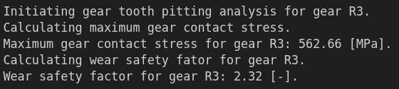
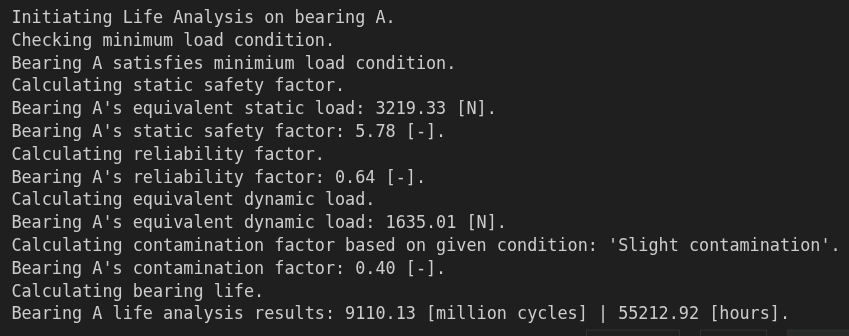

## Outline
In this third and final part of this tutorial series, you will learn how to use **PyGRITbx** to:
1) perform gear tooth *bending* analysis on gears **R1** and **R3**
2) perform gear tooth *pitting* analysis on gears **R1** and **R3**
3) perform bearing life analysis on all the bearings inside the gearbox

These analyses are based on the forces calculated in [**Part 1**](https://ragheedhuneineh.com/posts/pygrtibx_tutorial1/ "PyGRITbx - Tutorial Series Part 1: May The Forces Resolve for You") of this tutorial series. Therefore, make sure the code blocks from that part are present in a currently active **Jupyter** session and have already been executed before you try to run any of the code blocks in this part.

## Gear Tooth Verification

Gears transfer a given power from one rotating shaft to another, with the purpose of cotrolling either the **torque** or the **rotational speed** to a desired value. This is achieved by exchanging forces between 2 (or more) gears with different number of teeth.

Within the process, the teeth bends due to the load they need to support. Moreover, the contact between 2 teeth belonging to 2 different gears is dynamic; that is, there's relative motion between the teeth.

These two phenomena cause the gear tooth to fail in 2 different modes:
- bending
- pitting (wear)

To verify whether the gears present in our gearbox can sustain the loads imposed by the operating point for a desired duration, we need to calculate a safety factor corresponding to each failure mode.

### Gear Tooth Bending (Fatigue) Failure Mode

To calculate the bending safety factor, the following equation is used:

$$
S_F = \frac{\sigma_{FP}}{\sigma_{max,bending}} \frac{Y_N}{Y_\theta Y_Z}
$$

Where:
- $\bold{Y_N}$: stress cycle factor
- $\bold{Y_\theta}$: temperature factor
- $\bold{Y_Z}$: reliability factor
- $\boldsymbol{\sigma}_{\bold{FP}}$: bending fatigue strength

And $\boldsymbol{\sigma}_{\bold{max,bending}}$, the maximum tooth gear gending stress, is calculated according to the following equation:

$$
\sigma_{max,bending} = F_t K_O K_B K_v K_H K_S \frac{1}{b.m_t Y_J}
$$

Where:
- $\bold{F_t}$: tangential force on gear
- $\bold{K_O}$: overload factor
- $\bold{K_B}$: rim-thickness factor
- $\bold{K_v}$: dynamic factor
- $\bold{K_H}$: load distribution factor
- $\bold{K_S}$: size factor
- $\bold{b}$: minimum tooth width between driver and driven gears
- $\bold{m_t}$: transverse module
- $\bold{Y_J}$: bending strength geometry factor

Obviously, obtaining all these factors to eventually calculate the safety factor is indeed an arduous endeavor. **PyGRITbx** demands mainly the given information and it will calculate all these factors, the maximum tooth gear bending stress, as well as the bending safety factor.

For gear **R1**, we know:
- it exchanges forces through gear mesh **M1**
- the power source is **Uniform**
- the driven machine is **Uniform**
- the shaft diameter is **35 [mm]**
- load distribution factor coefficient $\bold{C_e}$ is equal to **1**
- teeth condition is **uncrowned teeth**
- suspended shaft length is $\bold{a_1 + b_1}$
- use condition is for **Commercial, enclosed units**
- bending fatigue strength is equal to **320 [MPa]**
- stress cycle factor model: $\bold{Y_N = 1.3558.N^{-0.0178}}$
- number of cycles is equal to $10^8$
- temperature is equal to **60 [$\bold{\degree C}$]**
- reliability is equal to **99%**

Given this information, we can calculate the bending safety factor by executing the following code:

```python
# Gear R1: Gear Tooth Bending Safety Factor
R1.analyseGearToothBending(mesh=M1, powerSource="Uniform", drivenMachine="Uniform", 
                           dShaft=35, Ce=1, teethCond="uncrowned teeth", lShaft=a1+b1, 
                           useCond="Commercial, enclosed units", sigma_FP=320, b_YN=1.3558, 
                           e_YN=-0.0178, N=1e8, temp=60, rel=0.99)
```

This should produce the output shown in [**Figure 1**](#figure-1).

<figure id="figure-1">
    
    <figcaption>Figure 1 - R1 Gear Tooth Bending Analysis Output</figcaption>
</figure>

We can then print out all the calculated factors using the following code block:

```python
# Print Calculated Factors
# Overload Factor
print(f"Overload factor: {R1.K_0:.2f}")

# Output: Overload factor: 1.00

#----------------------------------------------------------

# Rim-Thickness Factor
print(f"Rim-Thickness Factors: {R1.K_B:.2f}")

# Output: Rim-Thickness Factors: 2.14

#----------------------------------------------------------

# Dynamic Factor
print(f"Dynamic Factor: {R1.K_v:.2f}")

# Output: Dynamic Factor: 1.54

#----------------------------------------------------------

# Load Distribution Factor
print(f"Load Distribution Factor: {R1.K_H:.2f}")

# Output: Load Distribution Factor: 1.19

#----------------------------------------------------------

# Size Factor
print(f"Size Factor: {R1.K_S:.2f}")

# Output: Size Factor: 1.03

#----------------------------------------------------------

# Bending Strength Geometry Factor
print(f"Geometry Factor J': {R1.J_p:.2f}")
print(f"Geometry Factor J'': {R1.J_pp:.2f}")
print(f"Bending Strength Geometry Factor Y_J: {R1.Y_J:.2f}")

# Output:
# Geometry Factor J': 0.53
# Geometry Factor J'': 0.95
# Bending Strength Geometry Factor J': 0.50

#----------------------------------------------------------

# Stress Cycle Life Factor
print(f"Stress Cycle Life Factor: {R1.Y_N:.2f}")

# Output: Stress Cycle Life Factor: 0.98

#----------------------------------------------------------

# Temperature Factor
print(f"Temperature Factor: {R1.Y_theta:.2f}")

# Output: Temperature Factor: 1.00

#----------------------------------------------------------

# Reliability Factor
print(f"Reliability Factor: {R1.Y_Z:.2f}")

# Output: Reliability Factor: 1.00
```

Would you be up for the challenge to perform the same analysis on gear **R3**? I'll leave to you as a practice!

### Gear Tooth Pitting (Wear) Failure Mode

Calculating the wear safety factor is as hectic an endeavor as that of calculating the bending safety factor. It includes a similar equation relying on several factors that need to be either calculated or obtained from reference graphs.

To avoid fitting too many equations, I will simply present the code required to calculate the wear safety factor, a brief description of the parameters involved, and the output of the code execution, all performed on gear **R3**.

```python
# Gear R3: Gear Tooth Wear Safety Factor
R3.analyseGearToothPitting(mesh=M2, Z_R=1, sigma_HP=1360, b_ZN=1.4488, e_ZN=-0.023, N=1e8)
```

The output of executing the code is shown in [**Figure 2**](#figure-2).

<figure id="figure-2">
    
    <figcaption>Figure 2 - R3 Gear Tooth Pitting Analysis Output</figcaption>
</figure>

The parameters involved are:
- gear mesh **M2**, through which gear **R3** exchanges forces
- surface condition factor $\bold{Z_R}$ is equal to **1**
- contact fatigue strength is equal to **1360 [MPa]**
- stress cycle factor model: $\bold{Z_N = 1.4488.N^{-0.023}}$
- number of cycles is equal to $10^8$

To print out the calculated factors involved in the gear tooth pitting analysis, use the same logic as that shown for the gear tooth bending analysis performed on gear **R1** in the previous section.

At this point, we conclude the section dedicated to the verification of gear design. In the next section, we'll verify the choice of bearings!

## Bearing Choice Verification
Similar to shaft design verification analysis, bearing choice verification consists of a **static analysis** and **fatigue analysis**. Contrary to shaft design verification analysis, we don't need to calculate the internal loads and stresses to go through the analyses. We only need to rely on the components of the reaction force produced by the bearing, a step we already performed in the [**1st Part**](https://ragheedhuneineh.com/posts/pygrtibx_tutorial1/ "PyGRITbx - Tutorial Series Part 1: May The Forces Resolve for You") of this tutorial series.

### Static Analysis
The static analysis for bearings consists of 2 parts:
1) verification of the minimum load requisite
2) calculation of the static safety factor

The *requisite minimum load* derives from the fact that in certain applications, the bearing choice is determined by factors other than load. These factors can be related to a shaft diameter constraint, or a critical speed constraint. In applications where the bearing is subjected to light loads, failure mechanisms such as **skidding and smearing of raceways** or **cage damage** can prevail over fatigue.

In general, the minimum load should follow the set of rules defined by the following simple equations:

$$
F_{rm} \ge 0.01C \text{ for ball bearings}
$$

$$
F_{rm} \ge 0.02C \text{ for roller bearings}
$$

Where **C** is the dynamic basic load rating of the bearing.

To calculate the static safety factor, we us the following formula:

$$
s_0 = \frac{C_0}{P_0}
$$

where:
- $\bold{C_0}$: required basic static load rating
- $\bold{P_0}$: equivalent static bearing load

The required basic static load bearing is reported in the **SKF Catalogue** and is a property that we passed to the toolbox when defining the bearings. The equivalent static bearing load instead is calculated based on the radial and axial components of the reaction force produced by the bearing. The catalogue offers different possibilities for calculating this hypothetical load based on the bearing type and bearing arrangement. However, you don't need to deal with that as the toolbox will figure out this for you!

### Fatigue Analysis: Bearing Life Estimation
Contrary to the static analysis, the fatigue analysis does NOT deal with a safety factor calculation. Instead, it produces the estimated life of the bearing either in:
- ***millions of cycles***
$$
L_{nm} = a_1 a_{SKF} \left( {\frac{C}{P}} \right)^p
$$ 

- ***operating hours***
$$
L_{nmh} = \frac{10^6}{60.n} L_{nm}
$$

Where:
- $\bold{a_1}$: life adjustment factor for reliability
- $\bold{a_{SKF}}$: coefficient based on contamination level, equivalent dynamic load, and viscosity ratio
- $\bold{P}$: equivalent dynamic load
- $\bold{p}$: exponent of the life equation

**PyGRITbx** requires information about the reliability, contamination condition, oil of choice, and the $\bold{a_{SKF}}$ coefficient to calculate the estimated life of the bearing.

Once the oil is chosen, we can define it as a python object as shown in the following code block:

```python
# Define Oil of Choice
oil = pgt.Oil(name="ISO VG 100", temp=60, v1=15, v=45)
```

For the SKF coefficient, we need the contamination factor, the equivalent dynamic load, and the oil viscosity ratio as shown in [**Figure 3**](#figure-3).

<figure id="figure-3">
    
    <figcaption>Figure 3 - SKF Coefficient Reference Graph</figcaption>
</figure>

We can obtain this information by executing the following code:

```python
# Bearing A
# Contamination Factor
A.calculateEtaC(condition="Slight contamination")
print(f"Bearing A Contamination Factor: {A.eta_c:.2f}")

# Output: Bearing A Contamination Factor: 0.40

#-------------------------------------------------------

# Equivalent Dynamic Load
A.calculateEquivalentDynamicLoad()
print(f"Bearing A Equivalent Dynamic Load: {A.P:.2f} [N]")

# Output: Bearing A Equivalent Dynamic Load: 1635.01 [N]

#-------------------------------------------------------

# Oil Viscosity Ratio
print(f"Oil '{oil.name}' Viscosity Ratio: {oil.k:.2f}")

# Output: Oil 'ISO VG 100' Viscosity Ratio: 3.00
```

Once we obtain the SKF coefficient, we can then run the following code block on bearing **A** to perform the static and fatigue analysis and confirm the bearing choice.

```python
# Bearing A: Life Analysis
A.performLifeAnalysis(rel=95, condition="Slight contamination", a_skf=2, oil=oil)
```

The output should look like [**Figure 4**](#figure-4).

<figure id="figure-4">
    
    <figcaption>Figure 4 - Bearing $\bold{A}$ Life Analysis Output</figcaption>
</figure>

For bearings **B**, **C**, and **D**, we can execute a similar code and obtain the corresponding results. I'll leave it to you as a challenge!

## Final Words
We can finally conclude this tutorial series with some final words. If you've made it this far, thanks for following along. I would like to stress that **PyGRITbx** is just a tool that can help you perform the analysis faster. This doesn't mean that you shouldn't understand the concepts and the theory behind the analyses. If anything, the tool can be properly used only if the user understands the concepts and the theory behind it, but doesn't want to waste time performing tedious calculations.

Finally, I would like to ask for your kind feedback. Please reach out if you think I should change my writing style or the way I tend to explain things. If you find any bugs in the toolbox, I would really appreciate feedback so I (or we) can work on fixing it. If you have an idea that can be transformed into a feature, let me know so we can discuss it and work on adding it.

Thank you!

## References
- Richard G. Budynas and J. Keith Nisbett, *Shigley's Mechanical Engineering Design*, McGraw-Hill, 2006.
- SKF Group, *SKF Rolling Bearings Catalogue*, SKF. [SKF Rolling Bearings](https://www.skf.com/group/products/rolling-bearings)