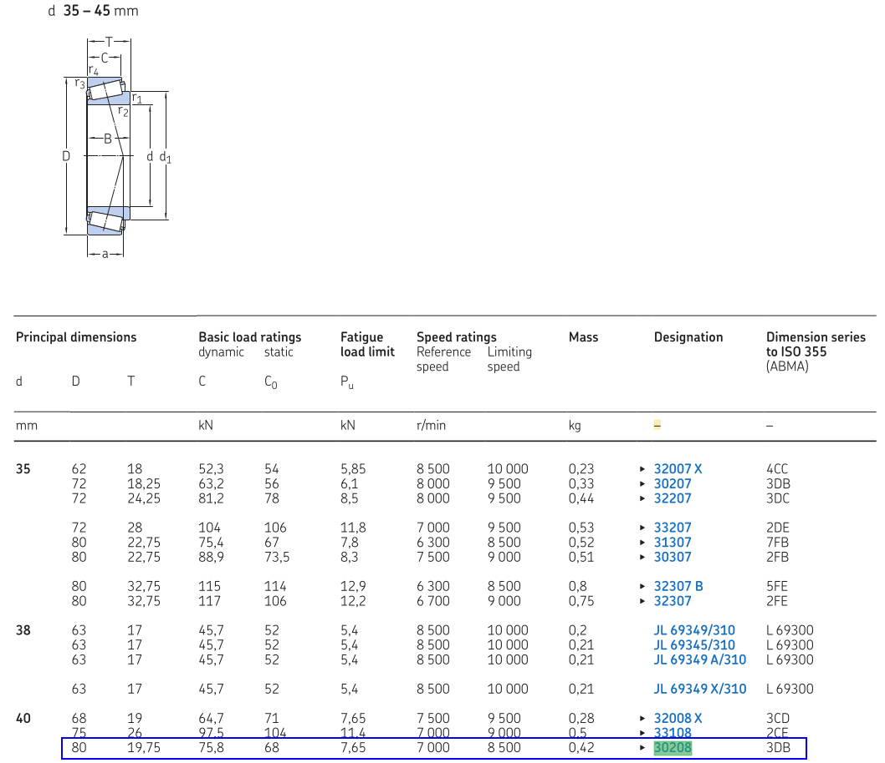
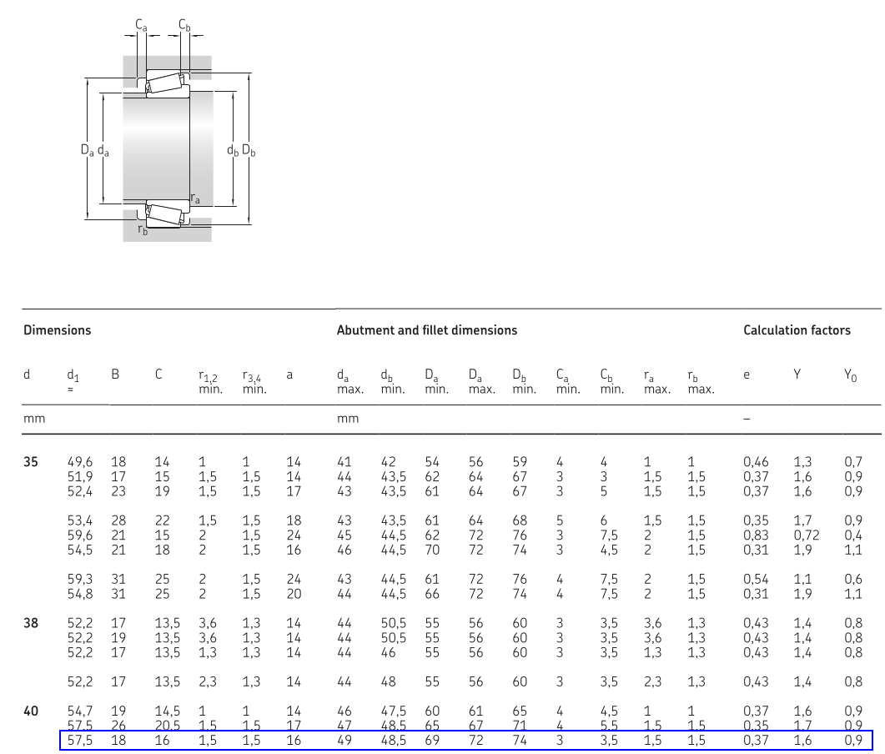
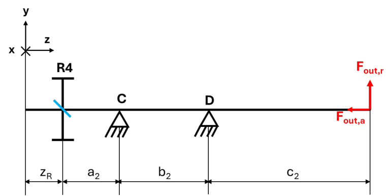
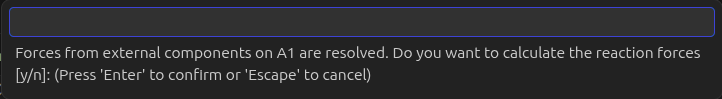
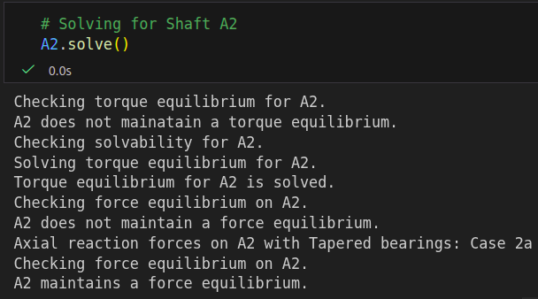

## Outline
This blog post is the first part of a 3-part series. In this series, I would like to introduce you to my python toolbox with a tutorial based on a project given to mechanical engineering students following the course **"02SXJJM - Fundamentals of Machine Design"** at **Politecnico di Torino**. My best hope is that this series would serve as a guide for the reader in future projects concerning geargbox design validation. 

In this part, you will learn how to:
1) Install the toolbox along with the necessary tools.
2) Define the components inside the gearbox as python objects.
3) Configure the interactions between different components via shafts and meshes.
4) Calculate the reaction forces on the bearings based on the given operating point.

Please feel free to contribute by sharing your thoughts regarding either the tutorial itself, the toolbox, or both.

### Prerequisites
To follow this series, it's expected that the reader:
- has studied applied mechanics (or the like)
- has basic programming skills (python is used here)
- is aware of engineering terms like: *stress*, *static and fatigue verification*, *safety factor*, *stress concentration factors*, *Haigh diagram*
- is using **Visual Studio Code** with **Jupyter** and **Pylance** extensions installed 

## What is PyGRITbx?
[***Python-based Gearbox Realiability and Integriy Toolbox***](https://pypi.org/project/pygritbx/ "PyGritbx") assists mechanical engineering students (or even engineers) working on the design verification of a gearbox. Given an operating point as a boundary condition, the toolbox calculates the loads on the components constituting the gearbox (gears, shafts, and bearings), and verifies the design/choice of each component based on its defined properties. The toolbox is built and can only be used with python.

## How do I use it?
It's recommended to use the **Jupyter** extension within **Visual Studio Code** to define and analyze a specific gearbox configuration, as well as perform all the required analyses. The reason is that with **Jupyter**, the user can write the code in a series of blocks and run each block separately. In this specific context, this allows the user to perform step-by-step definitions and calculations in order to perform all the required analyses sequentially.

Having **Pylance** as yet another **Visual Studio Code** extension helps the user with recommendations while coding the problem at hand. For example, when defining components by their corresponding characteristics, **Pylance** will give recommendations on the characteristics that need to be defined based on the *Class* to which the specific component belongs. More on that in the next sections.

### Installation
To install the toolbox:
1) Install [**Python**](https://www.python.org/downloads/ "Python").
2) Open the ***Command Prompt*** (Windows) or ***Terminal*** (MacOS) (addressed as ***cmd*** in the rest of the tutorial).
3) If you don't use environments in your python devlepment, proceed to step **4**. If you use environments in your python development, either activate a desired environment or create a new one and activate it.
4) Type `pip install pygritbx` then hit the enter key.
5) Note that the toolbox relies on [**Numpy**](https://numpy.org/ "Numpy"), [**Matplotlib**](https://matplotlib.org/ "Matplotlib") and [**Scipy**](https://scipy.org/ "Scipy"). Therefore, make sure they are installed before proceeding to use the toolbox. In theory, these libraries will be installed automatically with the toolbox but it's better to make sure they're there before starting any project.
6) Make sure you have the latest version of the toolbox by first typing `python` into your ***cmd*** then hit enter. Once python is activated, type `import pygritbx as pgt` then hit enter. After that type `print(pgt.__version__)` and hit enter. This will print the version number of the toolbox that you have currently installed. Make sure it's the same version number as the one shown following this [**link**](https://pypi.org/project/pygritbx/ "PyGritbx").

To install **Visual Studio Code**, choose the right one based on your computer's operating system: [**VS Code**](https://code.visualstudio.com/download "VS Code")

### First Lines of Code as a Check
Create an empty folder and open it with **VS Code**. Create a new file and, for simplicity, let's call it **"project.ipynb"**. Open the file and add a new code block by pressing on **"+ Code"**. Inside the block, type the following:

```python
import numpy as np
import pygritbx as pgt
print(pgt.__version__)

# output example:
# 1.1.2
```
Making sure the block is selected you can press **Shift+Enter** to execute the code and show the output which in this case is the version number of the toolbox you have installed. In this block, we also import **Numpy** which we will use in the next block.

Add another block to define the reference frame that we will use in the project:
```python
i = np.array([1, 0, 0])
j = np.array([0, 1, 0])
k = np.array([0, 0, 1])
RF = np.array([i, j, k])
```
Make sure to press **Shift+Enter** to run the code in the block.

The unit vectors **'i'**, **'j'**, and **'k'**, correspond to the **'x'**, **'y'**, and **'z'** axes, respectively. You can think of **'RF'** as the reference frame holding the three unit vectors together.

To proceed with our project, we must first understand the characteristics of its underlying components. Therefore, in the next section, we will check how to define the necessary objects one by one.

## Gearbox Configuration
The gearbox we will attempt to analyze in this tutorial can be seen in [**Figure 1**](#figure-1). This is taken from the project of the academic year **2024/2025**. The gearbox is composed of:
1) Input shaft **A1** transmitting power from the input motor via key **L1** to gear **R1**. The shaft is supported by bearings **A** and **B**.
2) Gear mesh transmitting power from gear **R1** to gear **R2**. Denote it by **M1**.
3) Intermediate shaft transmitting power from gear **R2** to gear **R3** by spinning around the spindle **P**.
4) Gear mesh transmitting power from gear **R3** to gear **R4**. Denote it by **M2**.
5) Output shaft **A2** transmitting power from gear **R4** via key **L2** to the output user via the key **L3**. The shaft is supported by bearings **C** and **D**.

<figure id="figure-1">
    
    <figcaption>Figure 1 - Gearbox Assembly</figcaption>
</figure>

A simplified scheme can be seen in [**Figure 2**](#figure-2). In this scheme, we can see the orientation of the:
1) input angluar velocity
2) input torque
3) output load (forces and torque)
4) gear tooth inclination

with respect to the given reference frame.

<figure id="figure-2">
    
    <figcaption>Figure 2 - Gearbox Scheme</figcaption>
</figure>

### Input Motor
Starting with the input motor, the given characteristics are shown in [**Table 1**](#table-1).

<table id="table-1"
       style="margin: 1.5rem auto; border-collapse: collapse;">
  <caption style="
      caption-side: bottom;
      text-align: center;
      font-size: 0.9rem;
      color: #666;
      margin-top: 0.5rem;">
    Table 1 - Input Motor Operating Point
  </caption>

  <thead>
    <tr>
      <th style="text-align: center;">Power [W]</th>
      <th style="text-align: center;">Speed [rpm]</th>
    </tr>
  </thead>

  <tbody>
    <tr>
      <td style="text-align: center;">6000</td>
      <td style="text-align: center;">2750</td>
    </tr>
  </tbody>
</table>

To define the input motor in our code:

```python
# Input Motor
input_motor = pgt.Motor(name="Input Motor", power=6e3, n=2750, axis=+k)
```

This defines the input motor object **input_motor** with the label **"Input Motor"**, power set to **"6000 [W]"**, rotational speed set to **"2750 [rpm]"**, and rotating around the **"z-axis"** in the positive direction.

Note that a **Motor** object is represented by the power equation which is the product of torque and rotational speed: 

$$
Power = Torque * Speed
$$

Therefore when defining a **Motor** object, it's necessary to provide at least 2 out of these 3 values and the toolbox will calculate the third.

In this particular case, we provide the object definition with **power** and **speed**; hence, the toolbox will automatically calculate the torque vector. This can be checked by executing the following:

```python
print(input_motor.ETs[0].torque)

# output
# [ 0.          0.         20.83482891]
```

By first converting the rotational speed unit to **[rad/s]**, the toolbox then divides the power by the converted speed value to get the torque as a vector acting in the same direction as the rotational speed.

### Gears

Next, we are the given the gears' characteristics which can be seen in [**Table 2**](#table-2).

<table id="table-2"
       style="margin: 1.5rem auto; border-collapse: collapse;">
  <caption style="
      caption-side: bottom;
      text-align: center;
      font-size: 0.9rem;
      color: #666;
      margin-top: 0.5rem;">
    Table 2 - Gears Characteristics
  </caption>

  <thead>
    <tr>
      <th style="text-align: center;">Property</th>
      <th style="text-align: center;">R1</th>
      <th style="text-align: center;">R2</th>
      <th style="text-align: center;">R3</th>
      <th style="text-align: center;">R4</th>
    </tr>
  </thead>

  <tbody>
    <tr>
      <td style="text-align: center;">Normal Module (m<sub>n</sub>) [mm]</td>
      <td style="text-align: center;">2.5</td>
      <td style="text-align: center;">2.5</td>
      <td style="text-align: center;">2.5</td>
      <td style="text-align: center;">2.5</td>
    </tr>
    <tr>
      <td style="text-align: center;">Number of teeth (z) [-]</td>
      <td style="text-align: center;">18</td>
      <td style="text-align: center;">73</td>
      <td style="text-align: center;">19</td>
      <td style="text-align: center;">51</td>
    </tr>
    <tr>
      <td style="text-align: center;">Helix Angle (&psi;) [&deg]</td>
      <td style="text-align: center;">20</td>
      <td style="text-align: center;">20</td>
      <td style="text-align: center;">20</td>
      <td style="text-align: center;">20</td>
    </tr>
    <tr>
      <td style="text-align: center;">Normal Pressure Angle (&Phi;<sub>n</sub>) [&deg]</td>
      <td style="text-align: center;">20</td>
      <td style="text-align: center;">20</td>
      <td style="text-align: center;">20</td>
      <td style="text-align: center;">20</td>
    </tr>
    <tr>
      <td style="text-align: center;">Transmission Accuracy Level (Q<sub>v</sub>) [-]</td>
      <td style="text-align: center;">7</td>
      <td style="text-align: center;">7</td>
      <td style="text-align: center;">7</td>
      <td style="text-align: center;">7</td>
    </tr>
    <tr>
      <td style="text-align: center;">Tooth Face Width [mm]</td>
      <td style="text-align: center;">30</td>
      <td style="text-align: center;">30</td>
      <td style="text-align: center;">30</td>
      <td style="text-align: center;">30</td>
    </tr>
    <tr>
      <td style="text-align: center;">Ultimate Strength (&sigma;<sub>u</sub>) [MPa]</td>
      <td style="text-align: center;">1060</td>
      <td style="text-align: center;">1950</td>
      <td style="text-align: center;">1950</td>
      <td style="text-align: center;">1060</td>
    </tr>
    <tr>
      <td style="text-align: center;">Yield Strength (&sigma;<sub>y</sub>) [MPa]</td>
      <td style="text-align: center;">950</td>
      <td style="text-align: center;">1400</td>
      <td style="text-align: center;">1400</td>
      <td style="text-align: center;">950</td>
    </tr>
        <tr>
      <td style="text-align: center;">Surface Hardness [HB]</td>
      <td style="text-align: center;">335</td>
      <td style="text-align: center;">560</td>
      <td style="text-align: center;">560</td>
      <td style="text-align: center;">335</td>
    </tr>
        <tr>
      <td style="text-align: center;">Bending Fatigue Strength (&sigma;<sub>FP</sub>) [MPa]</td>
      <td style="text-align: center;">320</td>
      <td style="text-align: center;">450</td>
      <td style="text-align: center;">450</td>
      <td style="text-align: center;">320</td>
    </tr>
        <tr>
      <td style="text-align: center;">Contact Fatigue Strength (&sigma;<sub>HP</sub>) [MPa]</td>
      <td style="text-align: center;">860</td>
      <td style="text-align: center;">1360</td>
      <td style="text-align: center;">1360</td>
      <td style="text-align: center;">860</td>
    </tr>
  </tbody>
</table>

Note that these properties can be classified into:
1) Gear Material Properties
2) Gear Physical Properties

In our definition, we will separate these 2 sets of properties. We can also see that gears **R1** and **R4** share the same material properties, while gear **R2** material properties match that of gear **R3**.

```python
# Gear Material Properties
R1R4_material = pgt.Material(name='Steel', sigma_u=1060, sigma_y=950, HB=335)
R2R3_material = pgt.Material(name='Steel', sigma_u=1950, sigma_y=1400, HB=560)
```

At this point, the object **R1R4_material** holds material properties for gears **R1** and **R4**, while **R2R3_material** holds material properties for gears **R2** and **R3**. These material objects will be used during the defintion of the gear objects as follows.

***NOTE: DO NOT RUN THE FOLLOWING CODE BLOCK JUST YET. THERE'S ONE MORE PARAMETER THAT WILL BE DISCUSSED SHORTLY.***

```python
# Gears
# R1
R1 = pgt.Gear(name="R1", axis=k, m_n=2.5, z=18, psi=20, phi_n=20, Q_v=7, FW=30, material=R1R4_material)
# R2
R2 = pgt.Gear(name="R2", axis=k, m_n=2.5, z=73, psi=-20, phi_n=20, Q_v=7, FW=30, material=R2R3_material)
# R3
R3 = pgt.Gear(name="R3", axis=k, m_n=2.5, z=19, psi=-20, phi_n=20, Q_v=7, FW=30, material=R2R3_material)
# R4
R4 = pgt.Gear(name="R4", axis=k, m_n=2.5, z=51, psi=20, phi_n=20, Q_v=7, FW=30, material=R1R4_material)
```

At this point, each gear object has a label, axis of rotation, normal module, number of teeth, helix angle, normal pressure angle, transmission accuracy level, tooth face width, and material properties defined.

### Bearings
Defining bearing objects isn't as straightforward as the previous definitions unfortunately. This is because bearings come in different types, each type with its own set of properties. However, some of these properties are shared across different types of bearings *(e.g. bearing width, internal diameter, reference speed, etc.)*. **PyGRITbx** supports only SKF bearings, and luckily, the [**SKF Rolling Bearings**](https://www.skf.com/group/products/rolling-bearings "SKF Roller Bearigns Catalogue") catalogue is freely available for anyone to download.

Using the catalogue, we will define bearing objects by their properties. Some additional properties related to the specific configuration of the gearbox will also be defined and explained in the following.

Bearings **A** and **B** are given as **SKF 30203 (Explorer)** bearings. By searching through the **SKF Catalogue**, we find their characteristics as shown in [**Figure 3**](#figure-3) and [**Figure 4**](#figure-4), in the row enclosed in the blue rectangle. 

<figure id="figure-3">
    
    <figcaption>Figure 3 - SKF 30203 (Explorer) Specs 1</figcaption>
</figure>

<figure id="figure-4">
    
    <figcaption>Figure 4 - SKF 30203 (Explorer) Specs 2</figcaption>
</figure>

Similarly, we can find bearings **C** and **D** which are designated by **SKF 30208 (Explorer)**. Their characteristics are shown in [**Figure 5**](#figure-5) and [**Figure 6**](#figure-6) in the row enclosed in the blue rectangle.

<figure id="figure-5">
    
    <figcaption>Figure 5 - SKF 30208 (Explorer) Specs 1</figcaption>
</figure>

<figure id="figure-6">
    
    <figcaption>Figure 6 - SKF 30208 (Explorer) Specs 2</figcaption>
</figure>

Based on the information from the catalogue, we can then define the bearing objects in python as follows.

***NOTE: DO NOT RUN THE FOLLOWING CODE BLOCK JUST YET. THERE'S ONE MORE PARAMETER THAT WILL BE DISCUSSED SHORTLY.***

```python
# Supports
# A (roller 30203)
A = pgt.Support(name="A", type="Roller", bearingType="Tapered", catalogueName="30203", 
                catalogueType="Explorer", d=17, D=40, B=13.25, C=23.4e3, C0=18.6e3, Pu=1.83e3, 
                nr=15e3, a=9, e=0.35, X=0, Y=1.7, Y0=0.9, Y1=0, Y2=0, A=0, kr=0, shoulder=-1, 
                arr="B2B", axis=k)

# B (roller 30203)
B = pgt.Support(name="B", type="Pin", bearingType="Tapered", catalogueName="30203", 
                catalogueType="Explorer", d=17, D=40, B=13.25, C=23.4e3, C0=18.6e3, Pu=1.83e3, 
                nr=15e3, a=9, e=0.35, X=0, Y=1.7,Y0=0.9, Y1=0, Y2=0, A=0, kr=0, shoulder=1,
                arr="B2B", axis=k)

# C (roller 30208)
C = pgt.Support(name="C", type="Roller", bearingType="Tapered", catalogueName="30208", 
                catalogueType="Explorer", d=40, D=80, B=19.75, C=75.8e3, C0=68e3, Pu=7.65e3, 
                nr=7e3, a=16, e=0.37, X=0, Y=1.6, Y0=0.9, Y1=0, Y2=0, A=0, kr=0, shoulder=-1, 
                arr="B2B", axis=k)

# D (roller 30208)
D = pgt.Support(name="D", type="Pin", bearingType="Tapered", catalogueName="30208", 
                catalogueType="Explorer", d=40, D=80, B=19.75, C=75.8e3, C0=68e3, Pu=7.65e3, 
                nr=7e3, a=16, e=0.37, X=0, Y=1.6, Y0=0.9, Y1=0, Y2=0, A=0, kr=0, shoulder=1, 
                arr="B2B", axis=k)

# F
F = pgt.Support(axis=k) # Generic bearing for the spindle. Characteristics are irrelevant.
```
It's worth spending a couple of words regarding the properties defined which are *NOT* present in the SKF Catalogue:
1) **name**: this is simply a label that you are free to choose or simply leave empty.
2) **type**: this can be either **Roller** or **Pin**, depending on the support type. Each shaft is supported by at least 2 supports and it's **necessary** to define one of the supports as **Roller** and the other as **Pin**. Sometimes this is given in the scheme in [**Figure 2**](#figure-2). In this specific example and by looking at shaft **A1**, we can see that both bearings, **A** and **B**, are **Pins**; therefore, how do we choose which to define as **Roller** and which as **Pin**? The answer: *it doesn't matter*. This is because the SKF catalogue provides a way to calculate the axial forces as shown in [**Figure 7**](#figure-7). But don't worry, **PyGRITbx** will do this calculation for you.
3) **bearingType**: depending on the bearing type, this could be **Ball**, **Tapered**, or **Contact Ball** bearing.
4) **catalogueType**: based on the SKF Catalogue, the bearing could be a **Standard** or **Explorer** bearing.
5) **shoulder**: this parameter is set to **1** if the axial shoulder is located in the positive sense of the shaft's axis with respect to the bearing and **-1** otherwise. Example: if the shaft's axis is pointing to the right and the shoulder is to the right of the bearing, the parameter must be set to **1**. If the shaft's axis is pointing to the right and the shoulder is to the left of the bearing, the parameter must be set to **-1**.
6) **arr**: this is the arrangement the bearing is currently in. It could be **Single**, **F2F**, **B2B**, **Tandem**, or **Double row**, depending on the given arrangement.
7) **axis**: the unit vector corresponding to the axis around which the bearing rotates.


<figure id="figure-7">
    
    <figcaption>Figure 7 - Bearings Axial Loading</figcaption>
</figure>

At this stage, one might think that we should move on to defining **shafts** and **meshes**. However, there's a specific reason as to why I asked you not to run the code blocks regarding gears and bearings. The reason is that with our current definition, the components will be simply floating in the air without any specific location! Therefore, the next section will be dedicated to explaining how to find the locations of the components and how to define them.

### Components' Locations
In this section, you'll learn how to easily define your components' locations. Locations of components belonging to the same shaft is an essential part of calculating the reaction forces produced by the bearings. **PyGRITbx** gives you the possibility to define the:
1) Absolute location of the component relative to a chosen reference frame defined as a vector.
2) Relative location of the comopnent relative to the rotation axis of the shaft it belongs to defined as a scalar.

Depending on the given, one way or the other might be convenient for you. In our example, relative distances between components are given as shown in [**Figure 8**](#figure-8). Let's break it down one shaft at a time.

<figure id="figure-8">
    
    <figcaption>Figure 8 - Relative Axial Distances</figcaption>
</figure>

**- Shaft A1**

For this shaft, we have to locate the following components:
1) Bearing **A** at its pressure center
2) Bearing **B** at its pressure center
3) Gear **R1** at its midplane

Bearing **A** will be located at the origin as shown in [**Figure 9**](#figure-9). Our mission is to calculate $\mathbf{a_1}$ and $\mathbf{b_1}$ to locate bearing **B** and gear **R1**.

<figure id="figure-9">
    
    <figcaption>Figure 9 - Shaft A1 Scheme</figcaption>
</figure>

However, given that the bearing is a tapered roller bearing, we're actually saying that the bearing's pressure center, which has an offset from the bearing's center point, is located at the origin (point in red circle in [**Figure 10**](#figure-10)).

<figure id="figure-10">
    
    <figcaption>Figure 10 - Tapered Roller Bearing Center</figcaption>
</figure>

To calculate $\mathbf{a_1}$ and $\mathbf{b_1}$, we will refer to shaft **A1**'s zoomed-in scheme in [**Figure 11**](#figure-11).

<figure id="figure-11">
    
    <figcaption>Figure 11 - Shaft A1 Relative Axial Distances</figcaption>
</figure>

The distance between the faces of the bearings **A** and **B** is reported as ***28.75 [mm]***. The pressure center of bearing **A** is offset to the left and that of bearing **B** is offset to the right. Therefore, to calculate $\mathbf{a_1}$, we simply have to follow the equation:

$$
a_1 = a_A + 28.75 + a_B = 9 + 28.75 + 9 = 46.75 [mm]
$$

To calculate $\mathbf{b_1}$, we have that the distance from the right side of bearing **B** to the left side of gear **R1** is ***24.25 [mm]***. To that, we have to add the distance from the pressure center of bearing **B** to the rightmost side of bearing **B**, and half of the width of gear **R1** so as to locate it at its middle plane.

To calculate the distance between bearing **B**'s pressure center and its rightmost side, we simply subtract the offset distance of the pressure center from the width of the bearing. Therefore, to calculate $\mathbf{b_1}$, we follow the equation:

$$
b_1 = (B_B - a_B) + 24.25 + (FW_{R1}/2) = (13.25 - 9) + 24.25 + (30/2) = 43.5 [mm]
$$

At this point, we can define the location of all the components on shaft **A1** as shown in the following code block:

```python
# Shaft A1 Components' Locations
a1 = 46.75 # [mm]
b1 = 43.5 # [mm]

zA = 0 # [mm]
zB = a1
zR1 = a1 + b1 # [mm]
```

Note that since these locations are defined as scalars, they are **NOT** the absolute locations of the components. They actually represent the relative locations of the components with respect to shaft **A1**'s rotational axis! The aboslute locations of the components will be calculated automatically by the toolbox once we define **shafts** and **meshes**.

Now let's switch our focus to the spindle.

**- Spindle P**

Locating the components on this spindle is unnecessary for the purpose of the project. In fact, it's impossible to accurately locate the components on the spindle relative to each other due to missing information. However, we can still make some assumptions so as to portray the locations of the subsequent components in the global reference frame.

Components that need to be located are:
1) Gear **R2** at its midplane
2) Gear **R3** at its midplane

For simplicity, we will assume that the location of gear **R2** is at the origin of the spindle and that the location of gear **R3** is represented by a scalar which is bigger than the sum of half the widths of both gears. That is:

$$
z_{R3} > (FW_{R2}/2) + (FW_{R3}/2) = (30/2) + (30/2) = 30 [mm]
$$

We will assume it as ***55 [mm]***. Therefore, the locations are defined as follows:

```python
# Spindle P Components' Locations
zR2 = 0 # [mm]
zR3 = 55 # [mm]
```

Now let's switch to the final set of locations on shaft **A2**.

**- Shaft A2**

For this shaft, we have to locate the following components:
1) Gear **R4** at its midplane in the center of key **L2**
2) Bearing **C** at its pressure center
3) Bearing **D** at its pressure center
4) Output load by user via key **L3**

Similar to shaft **A1**, we'll refer to the scheme shown in [**Figure 12**](#figure-12). Similarly, we'd need to calculate $\mathbf{z_R}$, $\mathbf{a_2}$, $\mathbf{b_2}$, and $\mathbf{c_2}$.

<figure id="figure-12">
    
    <figcaption>Figure 12 - Shaft A2 Scheme</figcaption>
</figure>

To calculate these locations, we'd need to refer to the zoomed in scheme of shaft **A2** ([**Figure 13**](#figure-13)) as well as the technical drawing of the shaft ([**Figure 14**](#figure-14)).

<figure id="figure-13">
    
    <figcaption>Figure 13 - Shaft A2 Relative Axial Distances</figcaption>
</figure>

<figure id="figure-14">
    
    <figcaption>Figure 14 - Shaft A2 Technical Drawing</figcaption>
</figure>

From the technical drawing, we can directly calculate $\mathbf{z_R}$ as:

$$
z_R = 17 + (18/2) = 26 [mm]
$$

To calculate $\mathbf{a_2}$, we must first calculate bearing **C**'s pressure center, $\mathbf{z_C}$. We can see from the technical drawing that the leftmost side of bearing **C** must be located at ***46 [mm]*** from the leftmost side of shaft **A2**. This means that bearing **C**'s pressure center can be located by adding the bearing's width to that value, then subtracting the center's offset as shown in the following equation:

$$
z_C = 46 + B_C - a_C = 46 + 19.75 - 16 = 49.75 [mm]
$$

Then, we can calculate $\mathbf{a_2}$:

$$
a_2 = z_C - z_R = 49.75 - 26 = 23.75 [mm]
$$

Similar to $\mathbf{a_1}$, we can calculate $\mathbf{b_2}$ by adding the offsets of bearings **C** and **D** to the given value of ***25 [mm]***:

$$
b_2 = a_C + 25 + a_D = 16 + 26 + 16 = 58 [mm]
$$

Finally, we can calculate $\mathbf{c_2}$ as follows (as practice, try to figure out why by using [**Figure 13**](#figure-13)):

$$
c_2 = (58.5 - a_D) + 35 = (58.5 - 16) + 35 = 77.5 [mm]
$$

At this point, we can define the location of all the components on shaft **A2** as shown in the following code block:

```python
# Shaft A1 Components' Locations
a2 = 23.75 # [mm]
b2 = 58 # [mm]
c2 = 77.5 # [mm]

zR4 = 26 # [mm]
zC = zR4 + a2
zD = zC + b2
zOut = zD + c2 # [mm]
```

After having located all the components, we can finally rewrite the blocks defining the gears and bearings with one additional parameter: **loc**.

**NOTE: ONLY AFTER RUNNING THE CODE BLOCKS FOR DEFINING THE LOCATIONS CAN YOU RUN THE FOLLOWING BLOCKS FOR GEARS AND BEARINGS!**

```python
# Gears
# R1
R1 = pgt.Gear(name="R1", loc=zR1, axis=k, m_n=2.5, z=18, psi=20, phi_n=20, Q_v=7, FW=30, material=R1R4_material)
# R2
R2 = pgt.Gear(name="R2", loc=zR2, axis=k, m_n=2.5, z=73, psi=-20, phi_n=20, Q_v=7, FW=30, material=R2R3_material)
# R3
R3 = pgt.Gear(name="R3", loc=zR3, axis=k, m_n=2.5, z=19, psi=-20, phi_n=20, Q_v=7, FW=30, material=R2R3_material)
# R4
R4 = pgt.Gear(name="R4", loc=zR4, axis=k, m_n=2.5, z=51, psi=20, phi_n=20, Q_v=7, FW=30, material=R1R4_material)
```

```python
# Supports
# A (roller 30203)
A = pgt.Support(name="A", type="Roller", bearingType="Tapered", catalogueName="30203", 
                catalogueType="Explorer", d=17, D=40, B=13.25, C=23.4e3, C0=18.6e3, Pu=1.83e3, 
                nr=15e3, a=9, e=0.35, X=0, Y=1.7, Y0=0.9, Y1=0, Y2=0, A=0, kr=0, shoulder=-1, 
                arr="B2B", axis=k, loc=zA)

# B (roller 30203)
B = pgt.Support(name="B", type="Pin", bearingType="Tapered", catalogueName="30203", 
                catalogueType="Explorer", d=17, D=40, B=13.25, C=23.4e3, C0=18.6e3, Pu=1.83e3, 
                nr=15e3, a=9, e=0.35, X=0, Y=1.7,Y0=0.9, Y1=0, Y2=0, A=0, kr=0, shoulder=1,
                arr="B2B", axis=k, loc=zB)

# C (roller 30208)
C = pgt.Support(name="C", type="Roller", bearingType="Tapered", catalogueName="30208", 
                catalogueType="Explorer", d=40, D=80, B=19.75, C=75.8e3, C0=68e3, Pu=7.65e3, 
                nr=7e3, a=16, e=0.37, X=0, Y=1.6, Y0=0.9, Y1=0, Y2=0, A=0, kr=0, shoulder=-1, 
                arr="B2B", axis=k, loc=zC)

# D (roller 30208)
D = pgt.Support(name="D", type="Pin", bearingType="Tapered", catalogueName="30208", 
                catalogueType="Explorer", d=40, D=80, B=19.75, C=75.8e3, C0=68e3, Pu=7.65e3, 
                nr=7e3, a=16, e=0.37, X=0, Y=1.6, Y0=0.9, Y1=0, Y2=0, A=0, kr=0, shoulder=1, 
                arr="B2B", axis=k, loc=zD)

# F
F = pgt.Support(axis=k) # Generic bearing for the spindle. Characteristics are irrelevant.
```

### Output / User / Load
One more step remains before we start defining how all these components interact with each other via **shafts** and **meshes**. This is a relatively simple step where we define a generic compnent that represents the output load produced by the user. If you paid close attention to the locations defined in the previous section, you'll realize there's a $\mathbf{z_{Out}}$ defined which I haven't mentioned before. This is indeed the relative location of the load with respect to shaft **A2**.

From [**Figure 2**](#figure-2), we know how this output load is oriented but we don't know its magnitude. It's given as a set of equations ([**Figure 15**](#figure-15)) with respect to other loads that need to be calculated first.


<figure id="figure-15">
    
    <figcaption>Figure 15 - Output Load Equations</figcaption>
</figure>

Therefore, for the time being, we will only define the component and then update its forces after we perform some initial calculations:

```python
# Output Component
output = pgt.Component(name="Output", axis=k, loc=zOut)
```

### Shafts & Meshes
In this section, we will define our last components. **Shafts** and **Meshes** are special components in **PyGRITbx** because they allow us to define how all the other *regular* components interact with each other. Moreover, the toolbox calculates the absolute locations of all components (if not already defined) using these special components. So without waiting further, let's start defining these special components.

**- Shaft A1**

I think by now, you got a hint of how the toolbox works: if you want to define a certain component, let's say a shaft, then you'd need to type something like ```pgt.Shaft(...)``` and identify its characteristics in the parantheses. You wouldn't be wrong to think that; hence, the definition of **A1**:

```python
# Shaft A1 definition
A1 = pgt.Shaft(name="A1", inputs=[input_motor], outputs=[R1], sups=np.array([A, B]), axis=k, 
              loc=[0, 0, 0], material=shaftMaterial)
```
Some words regarding the shaft's defined parameters:
1) **name**:  this is simply a label that you are free to choose or simply leave empty.
2) **inputs**: an array of defined objects that represent the input load(s) from the shaft's perspective.
3) **outputs**: an array of defined objects that represent the output load(s) from the shaft's perspective.
4) **sups**: an array of defined supports that are supposed to hold the shaft.
5) **axis**: the unit vector corresponding to the axis around which the shaft rotates.
6) **loc**: a vector that represents the absolute location of the shaft with respect to the global reference frame.
7) **material**: a defined material object that holds the material characteristics of the shaft.

When we execute the code in the previous block, **PyGRITbx** calculates the absolute locations of all the components involed in the definiion: input(s), output(s), and supports.

Now we can move to our first **mesh** definition.

**- Mesh M1**

To define a mesh, we need to understand which is the driving gear and which is the driven gear. For the mesh between gears **R1** and **R2**, the former is the driving and the latter is the driven. Moreover, we need to understand a property called ***radiality***. Imagine putting your finger on the center of the driving gear, **R1**, then try to move your finger along one axis or two axes to reach the center of the driven gear, **R2**, in the shortest way possible. Which axis or axes did you have to follow? The answer to this question is the radiality array. In our case, to go from gear **R1** to gear **R2**, along the shortest path, you need to move along the **y-axis** in the negative sense; therefore, the radiality is set to **-j**. One last thing to note is that this is an ***external*** gear mesh and not an ***internal*** gear mesh. Hence, the definition of the mesh can be seen in the following block:

```python
# Mesh M1 definition
M1 = pgt.GearMesh(name="M1", drivingGear=R1, drivenGear=R2, radiality=[-j], type="External")
```

Given that the definition of shaft **A1** calculated the absolute location of gear **R1**, with the defintion of mesh **M1** we actually just calculated the absolute location of gear **R2**. This is because **PyGRITbx** already calculated all the necessary properties of the gears (e.g. pitch radius), and using the radiality property, it knows in which direction to go to locate the center of gear **R2** from gear **R1**.

Now we can define the spindle as another shaft.

**- Spindle P**

Similar to shaft **A1**, spindle **P** would have a **name**, **inputs**, **outputs**, and **sups** properties. For the location? Well, given that we know gear **R2**'s relative location with respect to the spindle and that gear **R2**'s absolute location has just been calculated by the definition of mesh **M1**, the toolbox will calculate the absolute location of the spindle automatically. As a result, we can define the spindle as follows:

```python
# Spindle P definition
spindleP = pgt.Shaft(name="P", inputs=[R2], outputs=[R3], sups=np.array([F, F]))
```

Note that from the spindle's perspective, it receives an input load from gear **R2** (input) and transfers that through gear **R3** (output). The supports are there but we're not required to calculate any reaction forces on them so it doesn't really matter.

**- Mesh M2**

Can you already define mesh **M2** on your own? It's very similar to that of **M1**. I'll give it to you without further explanation and I suggest you try implementing it on your own first:

```python
# Mesh M2 definition
M2 = pgt.GearMesh(name="M2", drivingGear=R3, drivenGear=R4, radiality=[j], type="External")
```

**- Shaft A2**

Finally, we come to the last component definition. Similar to **A1**, we will use the ```pgt.Shaft(...)``` definition; however, we'd only need to define the shaft's material beforehand, similar to how we defined that of the gears:

```python
shaftMaterial = pgt.Material(name='34NiCrMo6', sigma_u=1050, sigma_y=950, sigma_Dm1=520)
```

The difference is that the shaft's material doesn't have a *surface hardness* property, and that it has the fatigue limit stress '$\boldsymbol{\sigma_{D-1}}$' property.

After that, we can define the shaft as follows:

```python
A2 = pgt.Shaft(name="A2", inputs=[R4], outputs=[output], sups=np.array([C, D]), axis=k, 
              material=shaftMaterial)
```

If you reached this point, ***CONGRATULATIONS***! You've completed the hardest part of the project and now you can sit there and see the toolbox do its magic calculating all the required forces as we will discover in the next section.

## May the Forces Resolve For You
In the previous section, we learnt how to define the components a gearbox is composed of (gears, bearings, shafts, users). We also learnt how to define the interactions between these components using shafts and meshes. Now is the time to harvest some fruits in return: solving for the exchanged forces between components and the reactions produced by the bearings.

It's important to note that approaching such problems is a sequential process. In other words, if you're solving this project by hand, you would start by the torque equilibrium condition on shaft **A1** around the **z-axis** to get the torque on gear **R1** (in this case, it's the same as the torque produced by the input motor but in the opposite sense). Through the torque, you would then calculate the tangential force acting on gear **R1** by dividing this calculated torque by the pitch radius of the gear. After that, you can use the pressure and helix angles to calculate the resultant force acting on gear **R1** which you can then resolve into the axial and radial directions. From there, you can apply equilibrium equations and equations given by the SKF catalogue to calculate all the reaction forces produced by the bearings.

Sounds hideous? *Yes*. How many times did I have to do it in my life? *Countless*. Hence, the toolbox!

### Shaft A1

Using **PyGRITbx**, you only need to call the function ```.solve()``` on shaft **A1** and it will do all of this for you! Through the process, the toolbox will prompt you with some questions. Let's see an example by solving for shaft **A1**:

```python
# Solving for shaft A1
A1.solve()
```

Once you run the previous block, you'll get the output shown in [**Figure 16**](#figure-16). **PyGRITbx** first checks the torque equilibrium on the shaft around its rotational axis and, if that's not satisfied, it attempts to resolve it by setting the output torque equal to the input torque but in the opposite sense. If that is done successfully, you'll get the prompt in [**Figure 17**](#figure-17) telling you that a torque has been detected on the output (in this case gear **R1**); therefore, would you like to solve for the torque equilibrium of that component around its rotational axis? In other words, would you like to calculate the forces on gear **R1**? These are the tangential, radial, and axial forces since **R1** is a gear. Therefore, our answer should be **y**.

<figure id="figure-16">
     Output 1"
    style="max-width: 100%; height: auto;">
    <figcaption>Figure 16 - Solving for A1 --> Output 1</figcaption>
</figure>

<figure id="figure-17">
     Detected Torque Prompt"
    style="max-width: 100%; height: auto;">
    <figcaption>Figure 17 - Solving for A1 --> Detected Toruqe Prompt</figcaption>
</figure>

Once you hit enter after inserting **y**, you'll get additional messages informing you that the toolbox is attempting to solve the forces on gear **R1** ([**Figure 18**](#figure-18)). Once an equilibrium is reached on gear **R1**, the toolbox switches its focus back to shaft **A1** and checks its force equilibrium. If the force equilibrium isn't satisfied then you'll get the prompt shown in [**Figure 19**](#figure-19) asking you to solve the reaction forces on the bearings that support the shaft. If you're interested in the reaction forces, then you should enter **y** and hit enter. Otherwise, enter **n** and hit enter. In this case, we are interested so we must enter **y** and hit enter.

<figure id="figure-18">
     Output 2"
    style="max-width: 100%; height: auto;">
    <figcaption>Figure 18 - Solving for A1 --> Output 2</figcaption>
</figure>

<figure id="figure-19">
     Reaction Forces Prompt"
    style="max-width: 100%; height: auto;">
    <figcaption>Figure 19 - Solving for A1 --> Reaction Forces Prompt</figcaption>
</figure>

Eventually, the toolbox will calculate the reaction forces produced by the bearings, and it will output the relevant messages to confirm that. Furthermore, in case of tapered roller bearings, it will inform you of the specific case it found to solve the axial forces based on the SKF Catalogue.

<figure id="figure-20">
     Final Output"
    style="max-width: 100%; height: auto;">
    <figcaption>Figure 20 - Solving for A1 --> Final Prompt</figcaption>
</figure>

To see the reaction forces, run the following blocks:

```python
# Reaction Forces on Bearing A
print(A.F_tot.force)

# output
# [-809.65663399  475.8122391  -865.57152262]
```

```python
# Reaction Forces on Bearing B
print(B.F_tot.force)

# output
# [1679.80485557 -812.84590846  548.86347056]
```

### Gear R2

For gear **R2**, we would like to transmit the forces from gear **R1** to it. Again, we simply use the ```.solve()``` function but this time on the gear object **R2**:

```python
# Solving for Gear R2
R2.solve()
```

Running this block will produce the messages shown in [**Figure 21**](#figure-21). The toolbox checks the torque equilibrium of gear **R2** around its rotational axis. If that's not satisfied, it checks for the solvability. Particularly, the toolbox goes and looks at the meshes in which gear **R2** is included. If there are torques/forces already resolved in those meshes, then the toolbox will pass them onto the gear.

Given that we already solved for gear **R1** when we answered yes on the first prompt while solving for shaft **A1**, the toolbox resolved the torque and forces in mesh **M1** in hindsight. Now that we call ```.solve()``` on **R2**, the toolbox finds those torque and forces and applies them onto gear **R2**.

<figure id="figure-21">
    
    <figcaption>Figure 21 - Solving for R2</figcaption>
</figure>

### Spindle P

For spindle **P**, we only care about transmitting the load from gear **R2** to gear **R3**. So let's run the following code block:

```python
# Solving for Spindle P
spindleP.solve()
```

When prompted with solving the equilibrium for gear **R3**, we should answer **y**. However, when prompted with calculating the reaction forces on the spindle, we should answer **n**. The output messages are shown in [**Figure 22**](#figure-22).

<figure id="figure-22">
    
    <figcaption>Figure 22 - Solving for Spindle P</figcaption>
</figure>

### Gear R4
Now that we solved for gear **R3** via the spindle **P**, we can directly jump to solve for gear **R4** just like we did for gear **R2** after solving shaft **A1**.

```python
# Solving for Gear R4
R4.solve()
```

### Output
Now that we solved for gear **R4**, we actually have the torque applied on shaft **A2**. Recalling the equations to calculate the forces exerted by output user from [**Figure 15**](#figure-15), we can actually now set the forces of the output user via the following block:

```python
# Calculating the Forces on Output User
Fout_r = np.abs(np.sum(R4.ETs[0].torque)) / 0.1 * j
Fout_a = 0.25 * np.abs(np.sum(Fout_r)) * (-k)
Fout = pgt.Force(force=Fout_a+Fout_r, loc=output.abs_loc)
A2.outputs[0].updateEFs([Fout])
```

First, we calculate the radial force. This is equal to the torque on **R4** (equal to torque on **A2**) in the positive **y-axis** direction; hence, the multiplication with the unit vector **j**.

Second, we calculate the axial force. This is ***0.25*** multplied by the radial force but directed in the negatice **z-axis** direction; hence, the multiplication with the unit vector **-k**.

Third, we define a **Force** via the toolbox whose vector is the sum of the radial and axial forces and location coincides with the absolute location of the output component we defined earlier.

Finally, we update the forces on the first, and only, output of the shaft **A2**.

### Shaft A2
At this point, we can resolve the forces on shaft **A2** and answer **y** on the prompt regarding the calculation of the reaction forces. We will not get the prompt for solving the equilibrium on the output because in this case the output is NOT a gear but a generic component.

```python
# Solving for Shaft A2
A2.solve()
```

<figure id="figure-23">
    
    <figcaption>Figure 23 - Solving for Shaft A2</figcaption>
</figure>

To check the reaction forces on the bearings **C** and **D**, we can run the following blocks:

```python
# Reaction Forces on Bearing C
print(C.F_tot.force)

# output
# [-4712.18425533  1205.44789724 -1519.97716269]
```

```python
# Reaction Forces on Bearing D
print(D.F_tot.force)

# output
# [ 1368.98319344 -4768.43889726  2086.99520397]
```

## Final Words
If you made it to this point, then you survived my attempt to portray my experience in explaining this exercise that I had taught for several years. Congratulations, mastering this part will help you save time solving this project.

In short, we analysed the configuration of a given gearbox composed of an input, intermediate, and output shaft. Power is transmitted from the input motor to the output user thanks to the gears mounted on the shafts. All the loads exchanged during the power transfer are supported by the SKF bearings that hold the shafts in place.

Through this analysis, we were able to define objects representing these components. We also configured the interaction between said components. This allowed us to model the power flow by calculating the loads exhanged between them as well as the reaction forces produced by the bearings.

With this, we conclude the first part of the gearbox components design verification process via a simple toolbox: **PyGRITbx**. For the next part, we will perform the static and fatigue verification on shaft **A2**. So stay tuned =)

## References
- Richard G. Budynas and J. Keith Nisbett, *Shigley's Mechanical Engineering Design*, McGraw-Hill, 2006.
- SKF Group, *SKF Rolling Bearings Catalogue*, SKF. [SKF Rolling Bearings](https://www.skf.com/group/products/rolling-bearings)