---
title: "Torsional Vibrations - Modeling and Analysis (Part 1)"
date: 2026-05-07T20:31:13+02:00
author: "Ragheed"
excerpt: ""
description: "This post covers the fundamentals of torsional vibrations, including the derivation of equations of motion and the use of Python for numerical analysis. The application is specific to gearbox testing bench setups."
draft: true
math: true
toc: true
categories: ["Mechanical Engineering", "Programming Tutorial"]
tags: ["Machine Design"]
---

***This post covers the fundamentals of torsional vibrations, including the derivation of equations of motion and the use of Python for modeling and analysis. The application is specific to gearbox testing bench setups.***


## Introduction
The subject of torsional vibrations is crucial in the design and analysis of rotating machinery, particularly in applications such as gearboxes. This stems from the fact that the rotating components in these systems (e.g., shafts) transmit power under twisting conditions due to their finite stiffness; thus, variations in the transmitted power may lead to torsional vibrations given by the coiling-uncoiling behavior of the shafts. In this series, the aim is to provide a comprehensive overview of torsional vibrations, including the derivation of equations of motion and the use of Python for modeling and analysis. Along the way, we will build our own solver for the equations of motion, which will allow us to simulate the system's response under various conditions and to gain insights into the dynamics of torsional vibrations in the context of gearbox testing bench setups.

Unlike linear vibrations, torsional vibrations involve the twisting of a shaft or a system of shafts. This type of vibration can lead to significant issues such as fatigue failure, noise, and reduced performance if not properly analyzed and mitigated. On test bench setups in particular, understanding torsional vibrations is essential for accurate testing and validation of gearbox designs, for the test bench itself introduces additional dynamics that may affect the results.

A typical example of how the test bench can introduce additional dynamics is through the use of adaption transmissions. Adaption transmissions are often used to connect the input and/or output of the gearbox being tested to the dynos, with the aim of matching the speed and torque requirements that otherwise would not be met by connecting the gearbox directly to the dynos. However, these adaption transmissions introduce modes of excitation that are not present in the actual application, and may lead to inaccurate results, such as premature failure of the gearbox or inaccurate estimation of its performance, if not properly accounted for in the analysis. Hence, it is but imperative to understand the dynamics of torsional vibrations in the context of test bench setups, and to use appropriate modeling and analysis techniques to ensure accurate results. Note that sometimes adaption tranmissions are used for packaging purposes only, where a very compact test unit denies one from the possibility to connect the gearbox directly to the dynos.

More often than not, the analysis of torsional vibrations is performed following a systematic approach including the following steps:
1. **Undamped Free Vibration Analysis**: This step involves deriving the equations of motion for the system under the assumption of no damping and no external forces. The goal is to determine the natural frequencies and mode shapes of the system, which are fundamental properties that characterize its vibrational behavior.
2. **Identification of Excitation Sources**: Once the natural frequencies and mode shapes are known, the next step is to identify potential sources of excitation within the operating speed range of the system. This involves analyzing the system's components and their interactions to determine if any of them can excite the natural frequencies, leading to resonance conditions.
3. **Campbell Diagram Analysis**: The Campbell diagram is a powerful tool for visualizing the relationship between the natural frequencies of the system and the excitation frequencies. By plotting the natural frequencies against the operating speed, we can identify potential resonance conditions and take appropriate measures to mitigate them.
4. **Forced Vibration Analysis**: In this step, we analyze the system's response to known, external forces, such as those generated by the dynos, gears, etc. This involves solving the equations of motion with the inclusion of forcing terms, which can be done either numerically or analytically, depending on the complexity of the system and the nature of the forces involved. The goal is to predict the system's response under realistic operating conditions and to identify any potential issues that may arise due to the forcing.

In this part, we will focus on applying the systematic approach on a single degree of freedom (SDOF) torsional system. However, given that rigid body modes (e.g. free rotation) are not present in SDOF torsional systems, we will not bother identifying any sources of excitation or plot the Campbell diagram. Therefore, our analysis will be limited to the first and last steps of the systematic approach, which are the undamped free vibration analysis and the forced vibration analysis. The aim is to provide a solid foundation for understanding the dynamics of torsional vibrations in SDOF torsional systems and develop a mini-solver for such systems, which will be essential for analyzing more complex multi-degree of freedom (MDOF) systems in the next part(s).

## Single Degree of Freedom (SDOF) Torsional System

### Free Body Diagram
Let's start with the simplest case of a single degree of freedom (SDOF) torsional system. Consider an ideal rotating body with finite inertia (**I**) and negligible torsional stiffness, connected to an ideal shaft with finite torsional stiffness (**c**) and negligible inertia. The other end of the shaft is connected to the wall as depicted in [**Figure 1**](#fig:sdof).

<figure id="fig:sdof">
    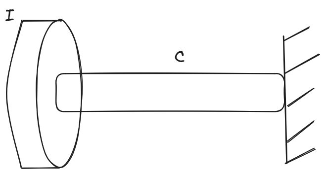
    <figcaption>Figure 1 - SDOF Torsional System</figcaption>
</figure>

The system is analogous to a mass-spring system in linear vibrations, where the inertia (**I**) plays the role of the mass and the torsional stiffness (**c**) plays the role of the spring constant. Just like a mass-spring system would exhibit oscillatory motion along a *linear path*, this torsional system will exhibit oscillatory motion in the form of *angular displacements* around the shaft's axis of rotation; <u>thus, the single degree of freedom in this case is the angular displacement of the rotating body.</u>

Therefore, to derive the equation of motion of the rotating body, we rely on the free body diagram shown in [**Figure 2**](#fig:free_body).

<figure id="fig:free_body">
    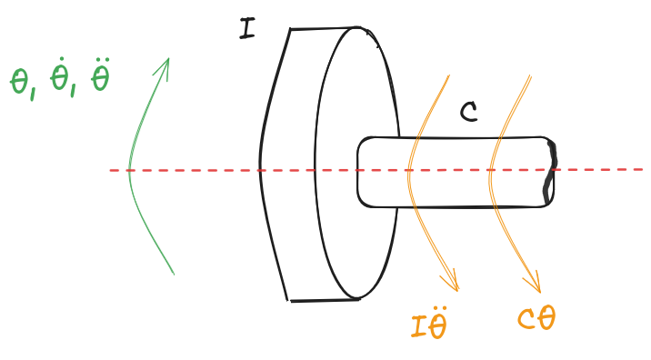
    <figcaption>Figure 2 - Free Body Diagram of SDOF Torsional System</figcaption>
</figure>

Where:
- $\theta$ is the angular displacement of the rotating body expressed in $\bold{[rad]}$,
- $\dot{\theta}$ is the angular velocity of the rotating body expressed in $\bold{[rad/s]}$, and
- $\ddot{\theta}$ is the angular acceleration of the rotating body expressed in $\bold{[rad/s^2]}$

around the shaft's axis of rotation.

Note that the free body diagram concerns the rotating body only, and not the shaft. Here, the shaft is represented by its torsional stiffness which produces a restoring torque on the rotating body that opposes its angular displacement. The inertia of the rotating body resists changes in its angular velocity, and thus, it's represented as a torque that opposes the angular acceleration.

### Equation of Motion

We can now apply Newton's second law for rotational motion to the free body diagram, which states that the sum of the external torques acting on the rotating body is equal to the product of its inertia and angular acceleration. Mathematically, this can be expressed as:
$$\sum \tau = I \ddot{\theta}$$

Recalling that we're analyzing the case of undamped free vibration, the only external torque acting on the rotating body is the restoring torque produced by the torsional stiffness of the shaft, which can be expressed as:
$$\tau = -c \theta$$

Substituting this expression for the torque into Newton's second law gives us the equation of motion for the SDOF torsional system:
$$-c \theta = I \ddot{\theta}$$

Rearranging this equation, we can express it in the standard form of a second-order ordinary differential equation:
$$I \ddot{\theta} + c \theta = 0$$

This is the equation of motion for the SDOF torsional system. It describes how the angular displacement of the rotating body evolves over time under the influence of the restoring torque from the shaft's torsional stiffness, given a set of initial conditions. The solution to this equation will allow us to determine the natural frequency of the system and its mode shape, which are essential for understanding its vibrational behavior.

To solve this equation means to find a function $\bold{\theta(t)}$ that satisfies the equation for all time $\bold{t}$. Therefore, one must search for a mathematical function that, when substituted into the equation, yields a true statement. In other words, we need to find a function whose second derivative with respect to time is proportional to the negative of the function itself.

### Trigonometry for The Rescue

What first comes to mind is the sine and cosine functions, as they are well-known for their oscillatory behavior and their second derivatives are indeed proportional to the negative of the original function. Therefore, we can propose a solution of the form:
$$\theta(t) = A \cos(\omega t) + B \sin(\omega t)$$

Where:
- $\bold{A}$ is the initial angular displacement, expressed in $\bold{[rad]}$.
- $\bold{B}$ is the initial angular velocity divided by $\bold{\omega}$.
- $\bold{\omega}$ is the angular frequency of the oscillation, which we will determine by substituting this proposed solution into the equation of motion, expressed in $\bold{[rad/s]}$.

Substituting the proposed solution into the equation of motion requires us first to compute the second derivative of $\theta(t)$ with respect to time:
$$\dot{\theta}(t) = -A \omega \sin(\omega t) + B \omega \cos(\omega t)$$
$$\ddot{\theta}(t) = -A \omega^2 \cos(\omega t) - B \omega^2 \sin(\omega t)$$

Now, we can substitute $\theta(t)$ and $\ddot{\theta}(t)$ into the equation of motion:
$$I (-A \omega^2 \cos(\omega t) - B \omega^2 \sin(\omega t)) + c (A \cos(\omega t) + B \sin(\omega t)) = 0$$

Rearranging this equation, we can group the terms involving $\cos(\omega t)$ and $\sin(\omega t)$ together:
$$(-I A \omega^2 + c A) \cos(\omega t) + (-I B \omega^2 + c B) \sin(\omega t) = 0$$

For this equation to hold true for all time $\bold{t}$, the coefficients of both $\cos(\omega t)$ and $\sin(\omega t)$ must be equal to zero. This gives us two equations:
$$-I A \omega^2 + c A = 0$$
$$-I B \omega^2 + c B = 0$$

From either of these equations, we can factor out $A$ or $B$:
$$A(-I \omega^2 + c) = 0$$
$$B(-I \omega^2 + c) = 0$$

For non-trivial solutions (where $\bold{A}$ and $\bold{B}$ are not both zero), we must have:
$$-I \omega^2 + c = 0$$

Rearranging this equation gives us the expression for the natural frequency of the system:
$$\omega_n = \sqrt{\frac{c}{I}}$$

This natural frequency $\mathbf{\omega_n}$ represents the frequency at which the system will oscillate when it is undergoing undamped free vibration. To obtain the final form of $\mathbf{\theta(t)}$, we should calculate $\bold{A}$ and $\bold{B}$ in terms of the initial conditions.

By substituting $t=0$ into the proposed solution, we can express $\bold{A}$ in terms of the initial angular displacement $\bold{\theta(0)}$:
$$\theta(0) = A \cos(0) + B \sin(0) = A$$
Thus, we have:
$$A = \theta(0)$$

To express $\bold{B}$ in terms of the initial angular velocity $\bold{\dot{\theta}(0)}$, we can differentiate the proposed solution with respect to time and then substitute $t=0$:
$$\dot{\theta}(t) = -A \omega_n \sin(\omega_n t) + B \omega_n \cos(\omega_n t)$$
$$\dot{\theta}(0) = -A \omega_n \sin(0) + B \omega_n \cos(0) = B \omega_n$$
Thus, we have:
$$B = \frac{\dot{\theta}(0)}{\omega_n}$$

 The corresponding mode shape for this SDOF system is simply the angular displacement $\theta(t)$, which can be expressed as:
$$\theta(t) = \theta(0) \cos(\sqrt{\frac{c}{I}} t) + \frac{\dot{\theta}(0)}{\sqrt{\frac{c}{I}}} \sin(\sqrt{\frac{c}{I}} t)$$

### Exponentials: I Know You Love Them

Another mathematical function that isn't so easy to intuit is the exponential function. Yes, the exponential function isn't periodic and its second derivative isn't proportional to the negative of the original function, but one form of it exhibits both of these properties. This form is the complex exponential function, which can be expressed as:
$$\theta(t) = C e^{j \omega t} + D e^{-j \omega t}$$

Where:
- $\bold{C}$ is the initial angular displacement, expressed in $\bold{[rad]}$.
- $\bold{D}$ is the initial angular velocity divided by $\bold{\omega}$.
- $\bold{j}$ is the imaginary unit, defined as: $\bold{j}^2 = -1$.
- $\bold{\omega}$ is the angular frequency of the oscillation, which we will determine by substituting this proposed solution into the equation of motion, expressed in $\bold{[rad/s]}$.

Substituting the proposed solution into the equation of motion requires us first to compute the second derivative of $\theta(t)$ with respect to time:
$$\dot{\theta}(t) = j \omega C e^{j \omega t} - j \omega D e^{-j \omega t}$$
$$\ddot{\theta}(t) = -\omega^2 C e^{j \omega t} - \omega^2 D e^{-j \omega t}$$

Now, we can substitute $\theta(t)$ and $\ddot{\theta}(t)$ into the equation of motion:
$$I (-\omega^2 C e^{j \omega t} - \omega^2 D e^{-j \omega t}) + c (C e^{j \omega t} + D e^{-j \omega t}) = 0$$

Rearranging this equation, we can group the terms involving $e^{j \omega t}$ and $e^{-j \omega t}$ together:
$$(-I \omega^2 C + c C) e^{j \omega t} + (-I \omega^2 D + c D) e^{-j \omega t} = 0$$

For this equation to hold true for all time $\bold{t}$, the coefficients of both $e^{j \omega t}$ and $e^{-j \omega t}$ must be equal to zero. This gives us two equations:
$$-I \omega^2 C + c C = 0$$
$$-I \omega^2 D + c D = 0$$

From either of these equations, we can factor out $C$ or $D$:
$$C(-I \omega^2 + c) = 0$$
$$D(-I \omega^2 + c) = 0$$

For non-trivial solutions (where $\bold{C}$ and $\bold{D}$ are not both zero), we must have:
$$-I \omega^2 + c = 0$$

Rearranging this equation gives us the same expression for the natural frequency of the system:
$$\omega_n = \sqrt{\frac{c}{I}}$$

The corresponding mode shape for this SDOF system can be expressed in terms of the complex exponential function as:
$$\theta(t) = C e^{j \sqrt{\frac{c}{I}} t} + D e^{-j \sqrt{\frac{c}{I}} t}$$

To calculate the constants $\bold{C}$ and $\bold{D}$ in terms of the initial conditions, we follow the same procedure as before and eventually end up with the following expressions:
$$C = \frac{1}{2} \left( \theta(0) - j \frac{\dot{\theta}(0)}{\omega_n} \right)$$
$$D = \frac{1}{2} \left( \theta(0) + j \frac{\dot{\theta}(0)}{\omega_n} \right)$$

Clearly, the solution expressed in terms of complex exponentials is more complicated to grasp. Hence, we will adopt the solution expressed in terms of sine and cosine functions for the rest of this series, as it is easier to understand and visualize. However, keep in mind that these two solutions are coherent and equivalent, and you can use either of them to analyze the system's behavior as long as you are consistent in your choice.

### Python Code: Undamped Free Vibration Analysis

To illustrate the concepts we've discussed and get a hint of the coding style we will use to implement them in Python, we'll write a simple code snippet that calculates the natural frequency of a SDOF torsional system given its inertia and torsional stiffness. Moreover, we will simulate the time response of the system for a given set of initial conditions.

First, we will start by importing the necessary libraries:

```python
# Importing necessary libraries
import numpy as np
import matplotlib.pyplot as plt
```

Second, we will define the parameters of our SDOF torsional system:

```python
# Parameters of the SDOF torsional system
I = 0.1  # Inertia in [kg*m^2]
c = 10   # Torsional stiffness in [N*m/rad]
```

Next, we will define a python Class to represent our SDOF torsional system, which will include methods to calculate the natural frequency and to simulate the time response:

```python
class SDOFTorsionalSystem:

    # Constructor to initialize the system parameters
    def __init__(self, inertia=0, stiffness=0):
        self.I = inertia
        self.c = stiffness
        if self.I > 0 and self.c > 0:
            self.omega_n = self.calculate_natural_frequency()
        else:
            self.omega_n = None

    # Method to calculate the natural frequency of the system
    def calculate_natural_frequency(self):
        return np.sqrt(self.c / self.I)

    # Method to simulate the time response of the system
    def simulate_time_response(self, initial_angle=0, initial_velocity=0, time_span=10):
        if self.omega_n is None:
            raise ValueError("Natural frequency is not defined. Please set inertia and stiffness.")
        
        # Time array
        t = np.linspace(0, time_span, 1000)
        # Natural frequency
        omega_n = self.omega_n
        # Calculate the constants A and B based on initial conditions
        A = initial_angle
        B = initial_velocity / omega_n
        # Time response using the analytical solution
        theta_t = (A * np.cos(omega_n * t) + B * np.sin(omega_n * t))
        return t, theta_t
```

Now, we can create an instance of our SDOF torsional system and simulate its time response for given initial conditions:

```python
# Create an instance of the SDOF torsional system
S = SDOFTorsionalSystem(inertia=I, stiffness=c)

# Initial conditions
initial_angle = 0.1  # Initial angular displacement in [rad]
initial_velocity = 0.0  # Initial angular velocity in [rad/s]

# Simulate time response
time_span = 10  # Time span for simulation in [s]
t, theta_t = S.simulate_time_response(initial_angle, initial_velocity, time_span)

# Plotting the time response
fig, axes = plt.subplots(3, 1, figsize=(10, 8))
fig.suptitle('Time Response of SDOF Torsional System', fontsize=16)
# Angular Displacement vs Time
axes[0].plot(t, theta_t, label='Angular Displacement')
axes[0].set_xlabel('Time [s]')
axes[0].set_ylabel('Angular Displacement [rad]')
axes[0].set_title('Angular Displacement vs Time')
axes[0].grid(True)

# Angular Velocity vs Time
angular_velocity = np.gradient(theta_t, t)
axes[1].plot(t, angular_velocity, label='Angular Velocity', color='orange')
axes[1].set_xlabel('Time [s]')
axes[1].set_ylabel('Angular Velocity [rad/s]')
axes[1].set_title('Angular Velocity vs Time')
axes[1].grid(True)

# Angular Acceleration vs Time
angular_acceleration = np.gradient(angular_velocity, t)
axes[2].plot(t, angular_acceleration, label='Angular Acceleration', color='green')
axes[2].set_xlabel('Time [s]')
axes[2].set_ylabel('Angular Acceleration [rad/s^2]')
axes[2].set_title('Angular Acceleration vs Time')
axes[2].grid(True)
plt.tight_layout(rect=[0, 0.03, 1, 0.95])
```

The above code will create the plot shown in [**Figure 3**](#fig:time_response), which illustrates the time response of the SDOF torsional system in terms of angular displacement, angular velocity, and angular acceleration.

<figure id="fig:time_response">
    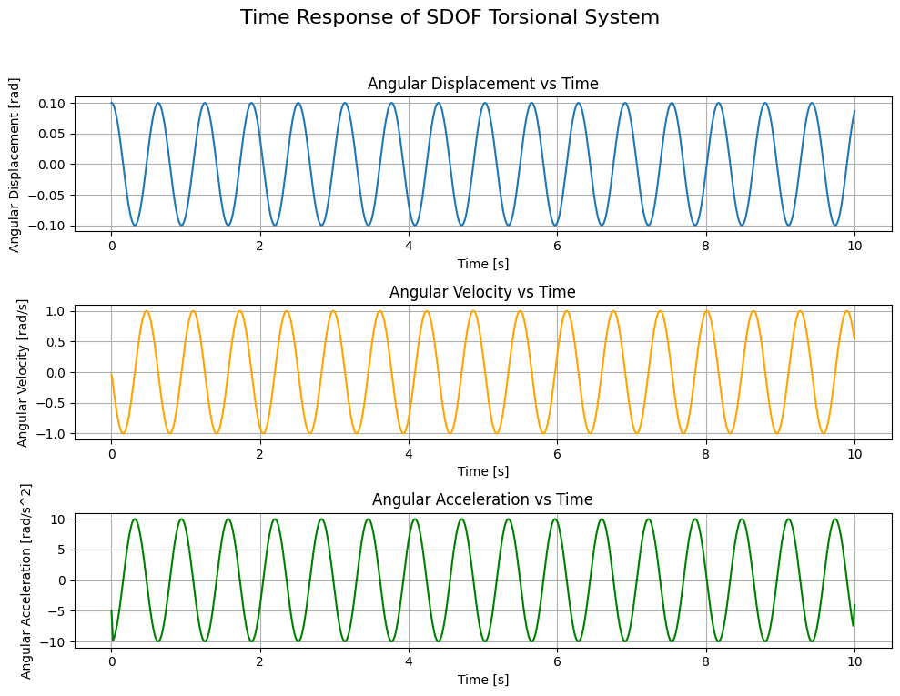
    <figcaption>Figure 3 - Time Response of SDOF Torsional System Under Free Undamped Vibrations</figcaption>
</figure>

## Forced Vibration Analysis: Theory

In forced vibration analysis, we consider the presence of an external torque acting on the system $\mathbf{\tau_{ext}(t)}$. Therefore the summation of external torques becomes:
$$\sum \tau = - c \theta + \tau_{ext}(t) = I \ddot{\theta}$$

Hence, the equation of motion for the SDOF torsional system under forced vibration can be expressed as:
$$I \ddot{\theta} + c \theta = \tau_{ext}(t)$$

This equation describes how the angular displacement of the rotating body evolves over time under the influence of both the restoring torque from the shaft's torsional stiffness and the external torque. The solution to this equation will allow us to predict the system's response under quasi-realistic operating conditions, which is essential for identifying any potential issues that may arise due to the forcing. I use the term "quasi-realistic" because the actual operating conditions involve additional complexities such as damping.

#### Mathematical Trick

Before solving the forced vibration equation, I'd like to present you with a mathematical trick that will come in handy when solving this kind of equations. Let's assume that the solution has the following form:
$$\theta(t) = \theta_G(t) + \theta_P(t)$$

Where $\bold{\theta_G(t)}$ is the solution we derived earlier for the undamped free vibration case::
$$ \theta_G(t) = A \cos(\omega_n t) + B \sin(\omega_n t)$$

and $\bold{\theta_P(t)}$ is another part of the solution that accounts for the presence of external forcing (we don't care about its form for now).

Substituting this proposed solution into the forced vibration equation yields:
$$I (\ddot{\theta}\_G(t) + \ddot{\theta}\_P(t)) + c (\theta_G(t) + \theta_P(t)) = \tau_{ext}(t)$$

Rearranging this equation gives us:
$$I \ddot{\theta}\_G(t) + c \theta_G(t) + I \ddot{\theta}\_P(t) + c \theta_P(t) = \tau_{ext}(t)$$

Now, we can use the fact that $\bold{\theta_G(t)}$ is a solution to the undamped free vibration equation, which means that it satisfies the following equation:
$$I \ddot{\theta}\_G(t) + c \theta_G(t) = 0$$

Substituting this into the rearranged equation gives us:
$$I \ddot{\theta}\_P(t) + c \theta_P(t) = \tau_{ext}(t)$$

One could argue that the proposed solution doesn't change much as the equation we dervied differs from the original equation only by the subscript $\bold{P}$. I understand the confusion as I suffered from it myself; however, the proposed solution derives from measurements performed and documented in literature. In those measurements, it has been shown that no matter the excitation form, the natural frequency derived from free undamped vibrations is always present in the system's response. This means that the solution $\bold{\theta_G(t)}$ **must** be present in the complete solution regardless of the form of excitation. Given that this solution doesn't account for the external forcing, another solution added to it is hence proposed, offering the possibility to account for the external forcing without affecting the presence of the natural frequency in the system's response. This is the mathematical trick that allows us to solve the forced vibration equation by breaking it down into two simpler equations.

In fact, the choice of subscripts $\bold{G}$ and $\bold{P}$ is not arbitrary. The subscript $\bold{G}$ stands for "general" or "homogeneous" solution, which represents the natural response of the system without any external forcing. The subscript $\bold{P}$ stands for "particular" solution, which represents the specific response of the system to the external forcing. This distinction is important because it allows us to separate the effects of the system's inherent dynamics from the effects of the external forces, making it easier to analyze and understand the behavior of the system under different conditions.

#### The Particular Solution

When solving for the general solution, we saw that it takes the form of sinusoidal functions or complex exponentials. However, the particular solution will depend on the form of the external forcing $\bold{\tau_{ext}(t)}$. Hence, to solve the system *analytically*, we must know the form of the external forcing, a priori, in order to propose an appropriate form for the particular solution accordingly. In the case where the form of the external forcing is complicated enough to deny us from the pleasure of finding an analytical solution, numerical methods may be required to solve for the particular solution!

In the following sections of this part of the series, we will focus on finding the solution for different forms of external forcing, analytically when possible and numerically when not.

## Forced Vibration Analysis: Constant Torque

The simplest form of forced excitation is a constant torque, which can be expressed as:
$$\tau_{ext}(t) = \tau_0$$

Substituting this into the equation for the particular solution gives us:
$$I \ddot{\theta}\_P(t) + c \theta_P(t) = \tau_0$$

The easiest function $\bold{\theta_P(t)}$ to propose in this case is a constant function, which can be expressed as:
$$\theta_P(t) = \theta_{P}^{0}$$

Substituting this into the equation for the particular solution gives us:
$$I \cdot 0 + c \theta_{P}^{0} = \tau_0$$

Solving for $\theta_{P}^{0}$:
$$\theta_{P}^{0} = \frac{\tau_0}{c}$$
Therefore, the particular solution for the case of a constant external torque is:
$$\theta_P(t) = \theta_{P}^{0} = \frac{\tau_0}{c}$$

The complete solution for the forced vibration case with a constant external torque can be expressed as:
$$\theta(t) = A \cos(\omega_n t) + B \sin(\omega_n t) + \frac{\tau_0}{c}$$

This solution is very similar to that of the undamped free vibration case, with the addition of a constant term that represents an offset in the angular displacement due to the constant external torque applied. Thus, the system will oscillate around this new equilibrium position.

Note that without accounting for the general solution, oscillation around the new equilibrium position would not be modeled and the response would be inaccurately represented as a constant angular displacement equal to $\mathbf{\theta_{P}^{0}}$, which is not the case in reality according to the measurements documented in the literature.

The calculation of the constants $\bold{A}$ and $\bold{B}$ in terms of the initial conditions follows the same procedure as before, but with the adjustment for the particular solution:
$$A = \theta(0) - \frac{\tau_0}{c} = \theta(0) - \theta_{P}^{0}$$
$$B = \frac{\dot{\theta}(0)}{\omega_n}$$

The calculation of the constants reveals that the ***amplitude*** of oscillation is affected by the presence of the constant external torque, shifting it by an amount that is proportional to the magnitude of the constant external torque.

Now, we can modify our Python code to simulate the time response of the system under a constant external torque. We will specifically modify the `simulate_time_response` method of our `SDOFTorsionalSystem`class to account for an external torque and implement the analytical solution for the constant torque case.

```python
class SDOFTorsionalSystem:

    # ... (previous code remains unchanged)

    # Method to simulate the time response of the system
    # NOTE: modified to account for constant external torque
    def simulate_time_response(self, initial_angle=0, initial_velocity=0, time_span=10, load_type="constant", tau_ext=0):
        if self.omega_n is None:
            raise ValueError("Natural frequency is not defined. Please set inertia and stiffness.")
        
        # Time array
        t = np.linspace(0, time_span, 1000)
        # Natural frequency
        omega_n = self.omega_n
        if load_type == "constant":
             tau_0 = tau_ext
             thetaP_0 = tau_0 / self.c
             thetaP_t = thetaP_0 * np.ones_like(t)  # Particular solution for constant torque
        else:
            raise ValueError("Unsupported load type. Please specify 'constant' for constant external torque.")
        # Calculate the constants A and B based on initial conditions
        A = initial_angle - thetaP_0  # Adjusting for the particular solution
        B = initial_velocity / omega_n
        # General solution for the homogeneous part
        thetaG_t = A * np.cos(omega_n * t) + B * np.sin(omega_n * t)
        # Time response using the analytical solution for constant torque
        theta_t = thetaG_t + thetaP_t
        return t, theta_t
```
We introduced 2 new parameters, `load_type` and `tau_ext`, to the `simulate_time_response` method, which account for the *type* and *profile* of the external torque, respectively. We have also adjusted the calculation of the constant `A` and the solution `theta_t` so as to include the particular solution corresponding to the constant torque.

Note that the `if load_type == "constant"` check raises a ValueError in case the load type is not `"constant"`. This will be modified in the next sections as we introduce more types of external forcing, but for now, it serves as a safeguard to ensure that the method is used correctly.

We can now modify a copy of the code block corresponding to the simulation of the time response to include a constant external torque:

```python
# Simulate time response with a constant external torque
tau_ext = 5  # Constant external torque in [N*m]
t, theta_t = S.simulate_time_response(initial_angle=0, initial_velocity=0, time_span=10,
                                        load_type="constant", tau_ext=tau_ext)

# Plotting code remains the same as before
```

This will produce the graph shown in [**Figure 4**](#fig:time_response_constant_torque), which illustrates the time response of the SDOF torsional system under a constant external torque. It is evident straight away that the system oscillates around a new equilibrium position, which is shifted from the original equilibrium position (the one corresponding to the undamped free vibration case) by an amount equal to $\frac{\tau_0}{c} = \frac{5}{10} = 0.5 [rad]$.

<figure id="fig:time_response_constant_torque">
    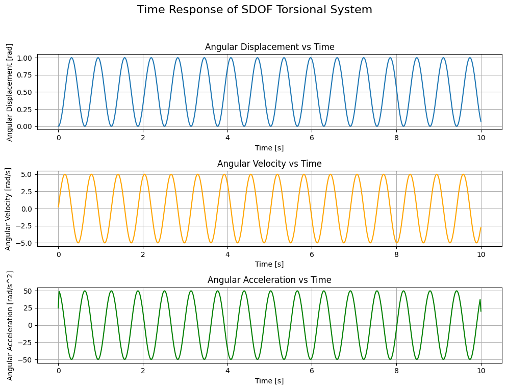
    <figcaption>Figure 4 - Time Response of SDOF Torsional System with Constant External Torque</figcaption>
</figure>

I suggest you to play around with initial conditions and the value of the constant external torque to see how they affect the time response of the system (you can use negative values as well for a response in the opposite direction).

## Forced Vibration Analysis: Linear Torque Ramp

Another common form of external excitation is a linear torque ramp, which can be expressed as:
$$\tau_{ext}(t) = r t$$

Where $\bold{r}$ is the rate of change of the torque with respect to time, expressed in $\bold{[N*m/s]}$. Substituting this into the equation for the particular solution gives us:
$$I \ddot{\theta}\_P(t) + c \theta_P(t) = r t$$

The easiest function $\bold{\theta_P(t)}$ to propose in this case is a first-order polynomial function, which can be expressed as:
$$\theta_P(t) = \alpha t + \beta$$

Substituting this into the equation for the particular solution gives us:
$$I \cdot 0 + c (\alpha t + \beta) = r t$$

Rearranging this equation gives us:
$$c \alpha t + c \beta = r t$$

Equating the coefficients of $t$ and the constant terms gives us two equations:
$$c \alpha = r$$
$$c \beta = 0$$

Solving for $\alpha$ and $\beta$ gives us:
$$\alpha = \frac{r}{c}$$
$$\beta = 0$$

Therefore, the particular solution for the case of a linear torque ramp is:
$$\theta_P(t) = \frac{r}{c} t$$

Hence, the complete solution for the forced vibration case with a linear torque ramp can be expressed as:
$$\theta(t) = A \cos(\omega_n t) + B \sin(\omega_n t) + \frac{r}{c} t$$

Can you already picture the response of the system subjected to this type of load? The system will exhibit oscillatory behavior around a linearly increasing equilibrium position, which is determined by the term $\frac{r}{c} t$. As time progresses, the equilibrium position will continue to increase, and the system will oscillate around this moving equilibrium position.

For the calculation of the constants $\bold{A}$ and $\bold{B}$ in terms of the initial conditions, we follow the same procedure as before, but with the adjustment for the particular solution:
$$A = \theta(0) - \frac{r}{c} \cdot 0 = \theta(0)$$
$$B = \frac{\dot{\theta}(0) - \frac{r}{c}}{\omega_n}$$

To view this, we can modify, again, the `simulate_time_response` method to account for the linear torque ramp and implement the analytical solution for this case. Specifically, we will introduce a new load type, "linear", and modify the calculation of the particular solution accordingly.

```python
class SDOFTorsionalSystem:

    # ... (previous code remains unchanged)

    # Method to simulate the time response of the system
    # NOTE: modified to account for linear torque ramp
    def simulate_time_response(self, initial_angle=0, initial_velocity=0, time_span=10, load_type="constant", tau_ext=0):
        if self.omega_n is None:
            raise ValueError("Natural frequency is not defined. Please set inertia and stiffness.")
        
        # Time array
        t = np.linspace(0, time_span, 1000)
        # Natural frequency
        omega_n = self.omega_n
        if load_type == "constant":
             tau_0 = tau_ext
             thetaP_0 = tau_0 / self.c
             thetaP_t = thetaP_0 * np.ones_like(t)  # Particular solution for constant torque
             thetaPdot_0 = 0
        elif load_type == "linear":
            r = tau_ext
            alpha = r / self.c
            beta = 0
            thetaP_t = alpha * t + beta  # Particular solution for linear torque ramp
            thetaP_0 = thetaP_t[0]  # Initial value of the particular solution at t=0
            thetaPdot_0 = r / self.c  # Initial value of the derivative of the particular solution at t=0
        else:
            raise ValueError("Unsupported load type. Please specify 'constant' for constant external torque or 'linear' for linear torque ramp.")
        
        # Calculate the constants A and B based on initial conditions
        A = initial_angle - thetaP_0  # Adjusting for the particular solution at t=0
        B = (initial_velocity - thetaPdot_0) / omega_n
        # General solution for the homogeneous part
        thetaG_t = A * np.cos(omega_n * t) + B * np.sin(omega_n * t)
        # Time response using the analytical solution for the specified load type
        theta_t = thetaG_t + thetaP_t
        return t, theta_t
```

Now, we can simulate the time response of the system under a linear torque ramp by calling the `simulate_time_response` method with the appropriate parameters:

```python
# Simulate time response with a linear torque ramp
r = 50  # Rate of change of the torque in [N*m/s]
t, theta_t = S.simulate_time_response(initial_angle=0, initial_velocity=0, time_span=10,
                                        load_type="linear", tau_ext=r)

# Plotting code remains the same as before
```

This will produce the graph shown in [**Figure 5**](#fig:time_response_linear_torque), which illustrates the time response of the SDOF torsional system under a linear torque ramp. As expected, the system exhibits oscillatory behavior around a linearly increasing equilibrium position, which is determined by the term $\frac{r}{c} t$.

<figure id="fig:time_response_linear_torque">
    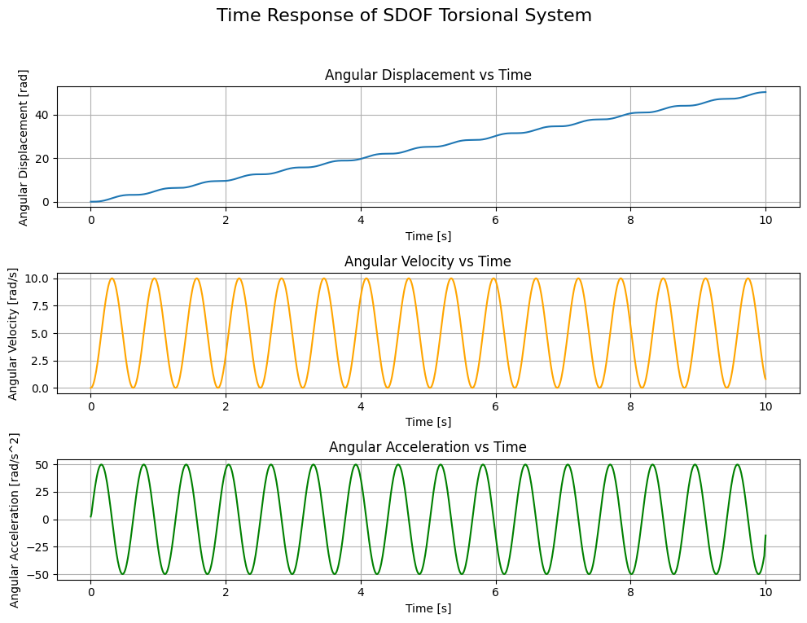
    <figcaption>Figure 5 - Time Response of SDOF Torsional System with Linear Torque Ramp</figcaption>
</figure>

Consider that this result is unrealistic in practice, as it assumes that the angular displacement increases indefinitely with time. However, it serves as a useful theoretical case to understand the behavior of the system under a linearly increasing external torque. In reality, there would be physical limitations that would prevent the angular displacement from increasing indefinitely, such as material yielding or failure, or the presence of damping that would eventually bring the system to a stop.

Note also that the angular velocity of the system oscillates around a new equilibrium value offset from zero by an amount equal to $\frac{r}{c}$, which contributes to the unbounded increase in the angular displacement over time.

Can you tell how the time response would look like if we have a combined load condition where both, a constant external torque and a linear torque ramp, are applied to the system simultaneously? I'll leave this as an exercise for you to solve!

## Forced Vibration Analysis: Harmonic Excitation

In the previous two sections, we analyzed the response of the system to a constant external torque and a linear torque ramp. Now, let's consider a more complex form of external excitation, which is a harmonic excitation. This type of excitation is very common in practice, as it can represent various real-world scenarios such as unbalanced rotating machinery or periodic forces. A harmonic excitation can be expressed as:
$$\tau_{ext}(t) = \tau_0 \sin(\omega_f t)$$

Where:
- $\bold{\tau_0}$ is the amplitude of the harmonic excitation, expressed in $\bold{[N*m]}$.
- $\bold{\omega_f}$ is the frequency of the harmonic excitation, expressed in $\bold{[rad/s]}$.

Substituting this into the equation for the particular solution gives us:
$$I \ddot{\theta}\_P(t) + c \theta_P(t) = \tau_0 \sin(\omega_f t)$$

The easiest function $\bold{\theta_P(t)}$ to propose in this case is a sinusoidal function with the same frequency as the excitation, which can be expressed as:
$$\theta_P(t) = A_P \sin(\omega_f t) + B_P \cos(\omega_f t)$$

Substituting this into the equation for the particular solution gives us:
$$I (-A_P \omega_f^2 \sin(\omega_f t) - B_P \omega_f^2 \cos(\omega_f t)) + c (A_P \sin(\omega_f t) + B_P \cos(\omega_f t)) = \tau_0 \sin(\omega_f t)$$

Rearranging this equation gives us:
$$(-I A_P \omega_f^2 + c A_P) \sin(\omega_f t) + (-I B_P \omega_f^2 + c B_P) \cos(\omega_f t) = \tau_0 \sin(\omega_f t)$$

Equating the coefficients of $\sin(\omega_f t)$ and $\cos(\omega_f t)$ gives us two equations:
$$-I A_P \omega_f^2 + c A_P = \tau_0$$
$$-I B_P \omega_f^2 + c B_P = 0$$

Solving for $A_P$ and $B_P$ gives us:
$$A_P = \frac{\tau_0}{c - I \omega_f^2}$$
$$B_P = 0$$

Therefore, the particular solution for the case of a harmonic excitation is:
$$\theta_P(t) = \frac{\tau_0}{c - I \omega_f^2} \sin(\omega_f t)$$

Hence, the complete solution for the forced vibration case with a harmonic excitation can be expressed as:
$$\theta(t) = A \cos(\omega_n t) + B \sin(\omega_n t) + \frac{\tau_0}{c - I \omega_f^2} \sin(\omega_f t)$$

Notice now that the complete solution contains two frequency components:
1. The natural frequency $\bold{\omega_n}$, which is associated with the homogeneous part of the solution and represents the system's inherent oscillatory behavior.
2. The excitation frequency $\bold{\omega_f}$, which is associated with the particular solution and represents the response of the system to the external harmonic excitation.

The presence of these two frequency components begs for the question: what happens when the excitation frequency $\bold{\omega_f}$ approaches the natural frequency $\bold{\omega_n}$? Well, by simply substituting $\bold{\omega_f}$ with the expression for $\bold{\omega_n} = \sqrt{\frac{c}{I}}$ in the expression for the particular solution, we get:
$$\theta_P(t) = \frac{\tau_0}{c - I \left( \sqrt{\frac{c}{I}} \right)^2} \sin\left( \sqrt{\frac{c}{I}} t \right) = \frac{\tau_0}{c - c} \sin\left( \sqrt{\frac{c}{I}} t \right)$$

The division by zero renders the particular solution undefined. Hence, it would be better to analyze the limit of the particular solution as $\bold{\omega_f}$ approaches $\bold{\omega_n}$:
$$\lim_{\omega_f \to \omega_n} \theta_P(t) = \lim_{\omega_f \to \omega_n} \frac{\tau_0}{c - I \omega_f^2} \sin(\omega_f t) = \pm \infty$$

As a conclusion, the particular solution becomes unbounded as the excitation frequency approaches the natural frequency. This phenomenon is known as **resonance**. At resonance, the system experiences a dramatic increase in amplitude, which can lead to catastrophic failure if not properly accounted for in the design and analysis of the system. Therefore, it is crucial to understand the conditions under which resonance occurs and to take appropriate measures to mitigate its effects, such as adding damping or designing the system to have a natural frequency that is different from the excitation frequency.

The calculation of the constants $\bold{A}$ and $\bold{B}$ in terms of the initial conditions follows the same procedure as before, but with the adjustment for the particular solution:
$$A = \theta(0) - \frac{\tau_0}{c - I \omega_f^2} \sin(0) = \theta(0)$$
$$B = \frac{\dot{\theta}(0) - \frac{\tau_0}{c - I \omega_f^2} \omega_f \cos(0)}{\omega_n} = \frac{\dot{\theta}(0) - \frac{\tau_0 \omega_f}{c - I \omega_f^2}}{\omega_n}$$

To simulate the time response of the system under a harmonic excitation, we can modify the `simulate_time_response` method to account for this type of load and implement the analytical solution for the harmonic excitation case. Specifically, we will introduce a new load type, "harmonic", pass in a dictionary containing the excitation parameters $\tau_0$ and $\omega_f$ as `tau_ext`, and modify the calculation of the particular solution accordingly.

```python
class SDOFTorsionalSystem:

    # ... (previous code remains unchanged)

    # Method to simulate the time response of the system
    # NOTE: modified to account for harmonic excitation
    def simulate_time_response(self, initial_angle=0, initial_velocity=0, time_span=10, load_type="constant", tau_ext=0):
        if self.omega_n is None:
            raise ValueError("Natural frequency is not defined. Please set inertia and stiffness.")
        
        # Time array
        t = np.linspace(0, time_span, 1000)
        # Natural frequency
        omega_n = self.omega_n
        if load_type == "constant":
             tau_0 = tau_ext
             thetaP_0 = tau_0 / self.c
             thetaP_t = thetaP_0 * np.ones_like(t)  # Particular solution for constant torque
             thetaPdot_0 = 0
        elif load_type == "linear":
            r = tau_ext
            alpha = r / self.c
            beta = 0
            thetaP_t = alpha * t + beta  # Particular solution for linear torque ramp
            thetaP_0 = thetaP_t[0]  # Initial value of the particular solution at t=0
            thetaPdot_0 = r / self.c  # Initial value of the derivative of the particular solution at t=0
        elif load_type == "harmonic":
            tau_0 = tau_ext['amplitude']
            omega_f = tau_ext['frequency'] * 2 * np.pi  # Convert frequency from Hz to rad/s
            A_P = tau_0 / (self.c - self.I * omega_f**2)
            B_P = 0
            thetaP_t = A_P * np.sin(omega_f * t) + B_P * np.cos(omega_f * t)  # Particular solution for harmonic excitation
            thetaP_0 = thetaP_t[0]  # Initial value of the particular solution at t=0
            thetaPdot_0 = A_P * omega_f * np.cos(omega_f * t)[0]  # Initial value of the derivative of the particular solution at t=0
        else:
            raise ValueError("Unsupported load type. Please specify 'constant' for constant external torque, 'linear' for linear torque ramp, or 'harmonic' for harmonic excitation.")
        
        # Calculate the constants A and B based on initial conditions
        A = initial_angle - thetaP_0  # Adjusting for the particular solution at t=0
        B = (initial_velocity - thetaPdot_0) / omega_n  # Adjusting for the derivative of the particular solution at t=0
        # General solution for the homogeneous part
        thetaG_t = A * np.cos(omega_n * t) + B * np.sin(omega_n * t)
        # Time response using the analytical solution for the specified load type
        theta_t = thetaG_t + thetaP_t
        return t, theta_t
```

Now, we can simulate the time response of the system under a harmonic excitation by calling the `simulate_time_response` method with the appropriate parameters:

```python
# Simulate time response with a harmonic excitation
tau_0 = 5  # Amplitude of the harmonic excitation in [N*m]
f_excitation = 1  # Frequency of the harmonic excitation in [Hz]
tau_ext = {'amplitude': tau_0, 'frequency': f_excitation}
t, theta_t = S.simulate_time_response(initial_angle=0, initial_velocity=0, time_span=10,
                                        load_type="harmonic", tau_ext=tau_ext)
# Plotting code remains the same as before
```

This will produce the graph shown in [**Figure 6**](#fig:time_response_harmonic_excitation), which illustrates the time response of the SDOF torsional system under a harmonic excitation. The response exhibits oscillatory behavior with two frequency components: the natural frequency $\bold{\omega_n}$ and the excitation frequency $\bold{\omega_f}$.

<figure id="fig:time_response_harmonic_excitation">
    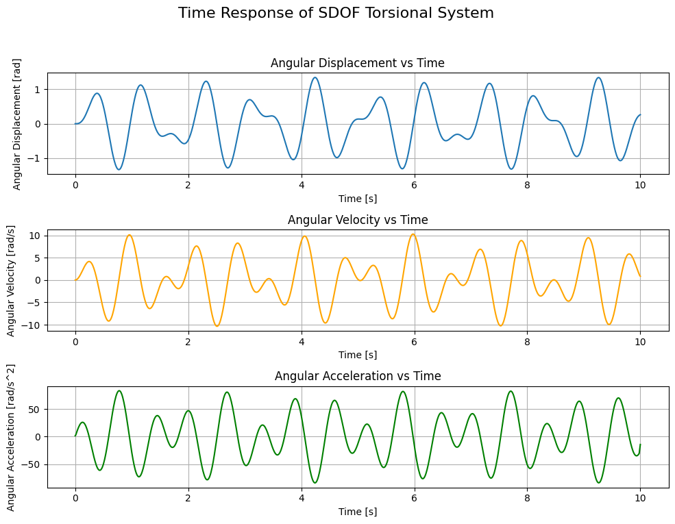
    <figcaption>Figure 6 - Time Response of SDOF Torsional System with Harmonic Excitation</figcaption>
</figure>

I think this is the most interesting plot in this part of the series as it is not so easy to predict the behavior of the system just by looking at the equation of motion. The interplay between the natural frequency and the excitation frequency can lead to a wide range of responses, from simple oscillations to complex patterns. For example, changing the excitation frequency to $7 [Hz]$ will result in a completely different response, as shown in [**Figure 7**](#fig:time_response_harmonic_excitation_7Hz).

<figure id="fig:time_response_harmonic_excitation_7Hz">
    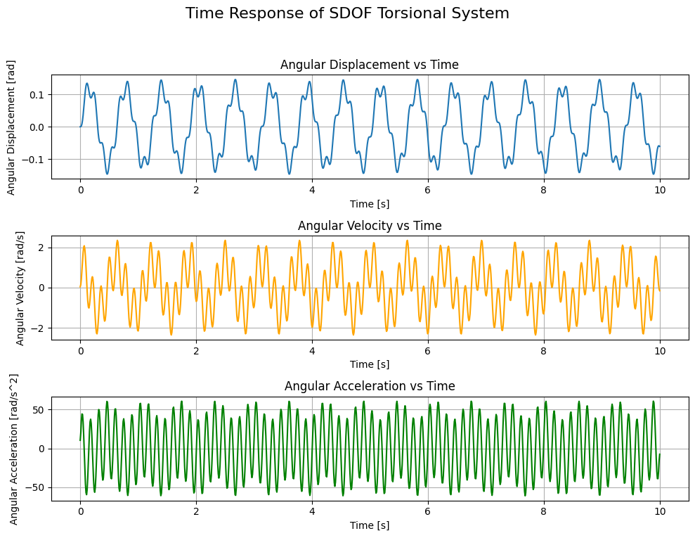
    <figcaption>Figure 7 - Time Response of SDOF Torsional System with Harmonic Excitation at 7 [Hz]</figcaption>
</figure>

Mind that it's not just the frequency of the response that changes, but also the maximum amplitude, eventhough that characteristic remained unaltered in the excitation signal! This is a clear indication of the complex dynamics of the system and how sensitive it can be to changes in the excitation frequency. However, we should've expected a change in the amplitude of the response since the constant $\bold{B}$ in the general solution depends on the excitation frequency, as has been demonstrated earlier.

To visualize the effect of resonance, we can simulate the time response of the system for a an excitation frequency in the vicinity of the natural frequency. For example, if we set the excitation frequency to `f_excitation = 10/2/np.pi-1e-3`, which is close to the natural frequency of the system, we will observe a significant increase in amplitude, as shown in [**Figure 8**](#fig:time_response_harmonic_excitation_resonance).

<figure id="fig:time_response_harmonic_excitation_resonance">
    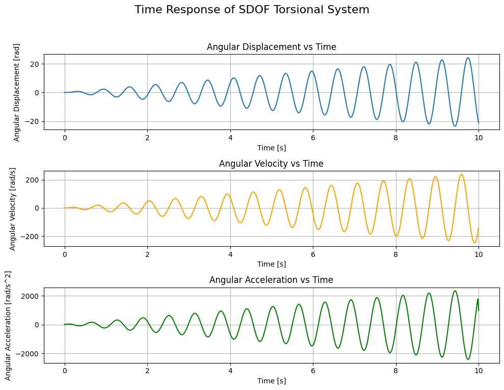
    <figcaption>Figure 8 - Time Response of SDOF Torsional System with Harmonic Excitation at 9.999 [rad/s]</figcaption>
</figure>

Obviously, the amplitude of the response is continuously increasing with time, which is a clear indication of resonance. This highlights the importance of understanding the natural frequency of the system and how it interacts with the excitation frequency to avoid potential issues that may arise due to resonance.

Try to play around with the excitation frequency and observe how it affects the time response of the system. We analyzed 2 generic cases and 1 specific case around the natural frequency of the system, but what happens at extremes? What happens when the excitation frequency is infintesimal or extremely high? (*spoiler alert: a shaft behaves as a low-pass filter*)

## Forced Vibration Analysis: Arbitrary Excitation

In the previous sections, we analyzed the response of the system to specific types of external excitation: constant torque, linear torque ramp, and harmonic excitation. However, in real-world scenarios, the external excitation may not always conform to these specific forms. Therefore, it is important to be able to analyze the response of the system to arbitrary external excitation. 

In this case, the external excitation would be given to us in the form of a measurement coming from a torque meter, instead of an analytical expression. Hence, we would have a discrete set of data points representing the external torque as a function of time, which can be denoted as $\bold{\tau_{ext}(t_i)}$ for $i = 0, 1, ..., N-1$, where $\bold{N}$ is the number of data points.

One could think of applying curve-fitting techniques to find an analytical expression that approximates the measured data, and then use that expression to solve for the particular solution. Another potential solution is the change of basis approach like Fourier transform (via FFT), which allows us to express the arbitrary excitation as a sum of harmonic excitations, and then calculate the particular solution for each harmonic component and sum them up to get the complete particular solution. However, these approaches may not always be feasible or accurate, especially if the measured data is noisy or has a complex structure. Therefore, a more practical approach to analyze the response of the system to arbitrary external excitation is to use numerical methods to solve the equation of motion directly, without the need for an analytical expression for the particular solution.

### Finite Difference Method

The simplest numerical method to solve the equation of motion is the finite difference method, which involves discretizing the time domain and approximating the derivatives in the equation of motion using finite differences. This allows us to iteratively calculate the angular displacement, velocity, and acceleration at each time step based on the previous values and the external excitation at that time step.

Put simply, whether the external excitation is given by an analytical expression or a discrete set of data points, initial conditions are required to solve the equation of motion as we've seen in the previous sections in the case of analytical solutions. In case of numerical solutions, the initial angular displacement is used in the equation of motion to calculate the angular acceleration at the first time step as follows:
$$\ddot{\theta}(t_0) = \frac{\tau_{ext}(t_0) - c \theta(t_0)}{I}$$

Then, the angular velocity and displacement at the next time step can be calculated using finite difference approximations:
$$\dot{\theta}(t_1) = \dot{\theta}(t_0) + \ddot{\theta}(t_0) \Delta t$$
$$\theta(t_1) = \theta(t_0) + \dot{\theta}(t_0) \Delta t$$

Where: $\bold{\Delta t} = t_1 - t_0$ is the time step.

This process can be repeated iteratively for each subsequent time step to calculate the angular displacement, velocity and acceleration, thus obtaining an approximation of the time response of the system to the arbitrary external excitation.

Let's see how sharp you are: have you noticed that the equations for the finite difference method don't contain any subscripts in regards to $\bold{\theta(t_i)}$? This means that we're solving for the complete solution, $\bold{\theta(t)}$, and **NOT** just the particular solution, $\bold{\theta_P(t)}$. This is because the excitation is a measurement signal, and as already mentioned, measurements have shown the frequency contribution related to the natural frequency of the system as well as the frequency contribution of any other source of excitation belonging to the system. Hence, we will be solving for the complete solution and the separation between the general and particular solutions would require a Fourier transform to quantify the contribution of each frequency separately.


The code modification required to implement this approach urges to first check whether `load_type` is `"measurement"`. In case it is, then we would expect `tau_ext` to be a dictionary containing the `time` array $\bold{t_i}$ and the corresponding `load` array $\bold{\tau_{ext}(t_i)}$

```python
class SDOFTorsionalSystem:

    # ... (previous code remains unchanged)
    
    # Method to simulate the time response of the system
    # NOTE: modified to account for arbitrary "measurement" excitation
    def simulate_time_response(self, initial_angle=0, initial_velocity=0, time_span=10, load_type="constant", tau_ext=0):
        if self.omega_n is None:
            raise ValueError("Natural frequency is not defined. Please set inertia and stiffness.")
        
        if load_type == "measurement":
            # Time array
            t = tau_ext['time']
            # Torque array
            tau_ti = tau_ext['load']
            # Initialize array for angular displacement to zeros
            theta = np.zeros_like(t)
            # Initial conditions
            theta[0] = initial_angle
            theta_dot_i = initial_velocity
            # Iteratively calculate the angular displacement at each time step
            for i in range(len(t)-1):
                # Calculate the angular acceleration using the equation of motion
                theta_double_dot = (tau_ti[i] - self.c * theta[i]) / self.I
                # Update angular velocity and displacement using finite difference approximation
                dt = t[i+1] - t[i]
                theta_dot_i = theta_dot_i + theta_double_dot * dt
                theta[i+1] = theta[i] + theta_dot_i * dt
        else:
            # Time array
            t = np.linspace(0, time_span, 1000)
            # Natural frequency
            omega_n = self.omega_n
            if load_type == "constant":
                 tau_0 = tau_ext
                 thetaP_0 = tau_0 / self.c
                 thetaP_t = thetaP_0 * np.ones_like(t)  # Particular solution for constant torque
                 thetaPdot_0 = 0
            elif load_type == "linear":
                r = tau_ext
                alpha = r / self.c
                beta = 0
                thetaP_t = alpha * t + beta  # Particular solution for linear torque ramp
                thetaP_0 = thetaP_t[0]  # Initial value of the particular solution at t=0
                thetaPdot_0 = r / self.c  # Initial value of the derivative of the particular solution at t=0
            elif load_type == "harmonic":
                tau_0 = tau_ext['amplitude']
                omega_f = tau_ext['frequency'] * 2 * np.pi  # Convert frequency from Hz to rad/s
                A_P = tau_0 / (self.c - self.I * omega_f**2)
                B_P = 0
                thetaP_t = A_P * np.sin(omega_f * t) + B_P * np.cos(omega_f * t)  # Particular solution for harmonic excitation
                thetaP_0 = thetaP_t[0]  # Initial value of the particular solution at t=0
                thetaPdot_0 = A_P * omega_f * np.cos(omega_f * t)[0]  # Initial value of the derivative of the particular solution at t=0
            else:
                raise ValueError("Unsupported load type. Please specify 'constant' for constant external torque, 'linear' for linear torque ramp, or 'harmonic' for harmonic excitation.")

            # Calculate the constants A and B based on initial conditions
            A = initial_angle - thetaP_0  # Adjusting for the particular solution at t=0
            B = (initial_velocity - thetaPdot_0) / omega_n  # Adjusting for the derivative of the particular solution at t=0
            # General solution for the homogeneous part
            thetaG_t = A * np.cos(omega_n * t) + B * np.sin(omega_n * t)
            # Time response using the analytical solution for the specified load type
            theta_t = thetaG_t + thetaP_t
        return t, theta_t
```

To make use of our simple numerical solver and to check whether it's working properly, we can generate a *pseudo-measurement* of a constant external torque, linear torque ramp, and even harmonic excitation and pass it to our solver. Then, we can compare the time response generated by the numerical solver with its corresponding result from the analytical solver.

In the following block, an example of this comparison for a constant external torque is presented.

```python
# Simulate time response with a arbitrary excitation: constant
time_array = np.linspace(0, 10, 1000) # Time array [s]
load_array = 5 * np.ones_like(time_array) # Load array [Nm]
tau_ext = {'time': time_array, 'load': load_array}
# Numerical solution
t, theta_t = S.simulate_time_response(initial_angle=0, initial_velocity=0, time_span=10, load_type="measurement", tau_ext=tau_ext)
# Analytical solution
t_an, theta_t_an = S.simulate_time_response(initial_angle=0, initial_velocity=0, time_span=10, load_type="constant", tau_ext=5)

# Plotting the time response
fig, axes = plt.subplots(3, 1, figsize=(15, 8))
fig.suptitle('Time Response of SDOF Torsional System', fontsize=16)
# Angular Displacement vs Time
axes[0].plot(t, theta_t, label='Measurement')
axes[0].plot(t_an, theta_t_an, linestyle='--', color="red", label='Analytical')
axes[0].set_xlabel('Time [s]')
axes[0].set_ylabel('Angular Displacement [rad]')
axes[0].set_title('Angular Displacement vs Time')
axes[0].grid(True)

# Angular Velocity vs Time
angular_velocity = np.gradient(theta_t, t)
angular_velocity_an = np.gradient(theta_t_an, t_an)
axes[1].plot(t, angular_velocity, label='Measurement', color='orange')
axes[1].plot(t_an, angular_velocity_an, linestyle='--', color='red', label='Analytical')
axes[1].set_xlabel('Time [s]')
axes[1].set_ylabel('Angular Velocity [rad/s]')
axes[1].set_title('Angular Velocity vs Time')
axes[1].grid(True)

# Angular Acceleration vs Time
angular_acceleration = np.gradient(angular_velocity, t)
angular_acceleration_an = np.gradient(angular_velocity_an, t_an)
axes[2].plot(t, angular_acceleration, label='Measurement', color='green')
axes[2].plot(t_an, angular_acceleration_an, linestyle='--', color='red', label='Analytical')
axes[2].set_xlabel('Time [s]')
axes[2].set_ylabel('Angular Acceleration [rad/s^2]')
axes[2].set_title('Angular Acceleration vs Time')
axes[2].grid(True)
plt.tight_layout(rect=[0, 0.03, 1, 0.95])

fig.legend()
```

This code snippet will produce the graph in [**Figure 9**](#fig:time_response_numerical_vs_analytical_constant), showing the time response due to constant external load as produced by the numerical solver (solid line) along with the one produced by the analytical solver (dashed line).

<figure id="fig:time_response_numerical_vs_analytical_constant">
    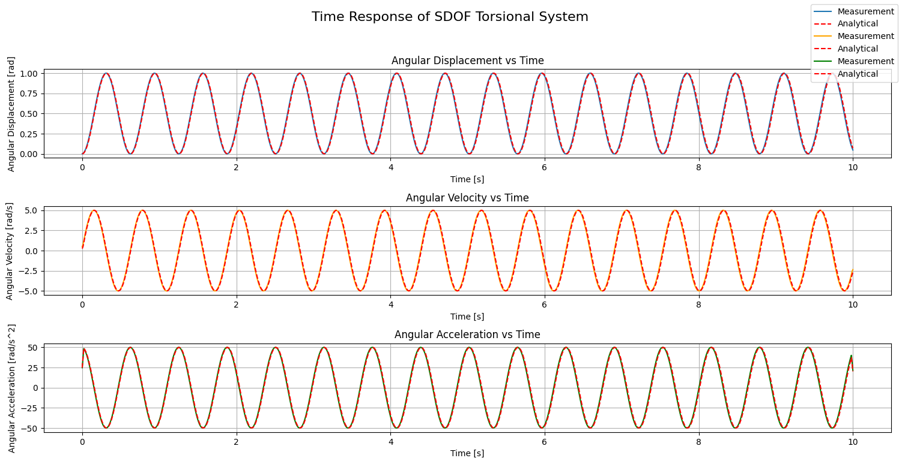
    <figcaption>Figure 9 - Time Response Comparison of SDOF Torsional System Under Constant External Load - Numerical vs Analytical</figcaption>
</figure>

Clearly, the two solutions are inseparable from one another; however, it must be noted that this is because our choice of the time array dictates the quality of our *pseudo-measurement* and, thus, the quality of the solution. From the measurement's perspective, $\bold{\frac{1}{\Delta t}}$ is known as the ***sampling rate***. Measured in $\bold{[Hz]}$, the sampling rate is a measure of the number of data points present in a time duration equal to 1 second within a measurement. From the solver's perspective, $\bold{\Delta t}$ is known as the ***step size***. The step size dictates how many iterations the numerical solver has to go through in order to numerically calculate the complete solution across the whole measurement. Hence, the numerical solver adds a layer of time complexity related to the total number of data points present in the measurement; the analytical solver on the other hand performs the same number of operations regardless of the data size!

Try to modify the last code snippet to compare the analytical and numerical solvers' solutions for the different forms of external torque analyzed. We can also try completely different new forms of external load. In [**Figure 10**](#fig:time_response_numerical_hammer), you can see the time response of the SDOF torsional system subjected to the equivalent of the *hammer test* for linear vibrations. This is represented by a peak in the load at an instant in time, representing the impact of a hammer, while for the rest of the time there's no load at all. Mathematically, this load is a form of the [**Dirac delta function**](https://en.wikipedia.org/wiki/Dirac_delta_function), which is normally used to measure the impulse response of a system.

<figure id="fig:time_response_numerical_hammer">
    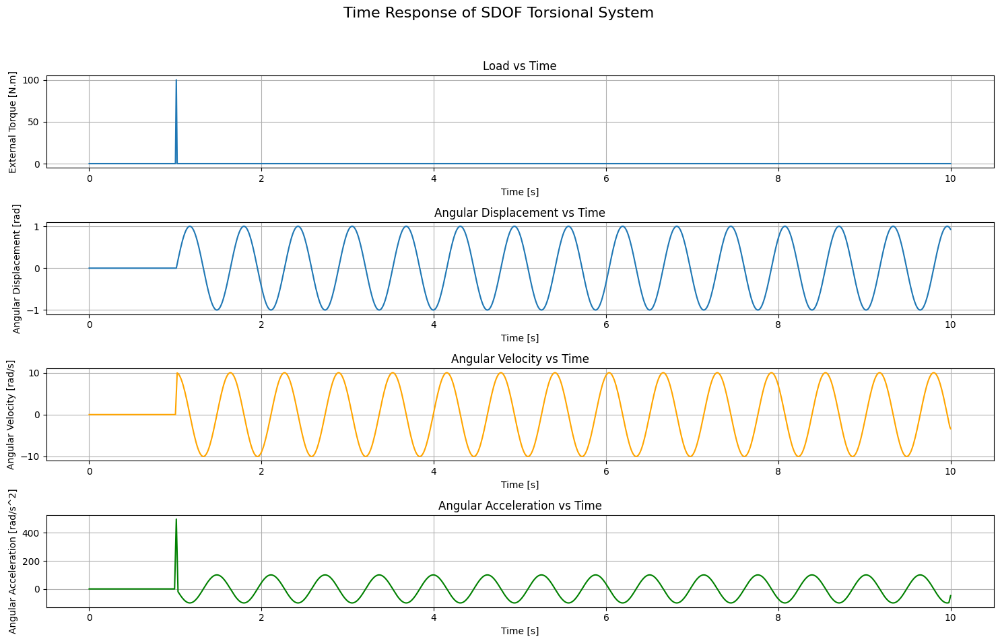
    <figcaption>Figure 10 - Time Response of SDOF Torsional System Subjected to Hammer Test</figcaption>
</figure>

## Conclusion

To sum it up, in this part of the series, we introduced a systematic approach to model and analyze torsional systems. We started with the single degree of freedom (SDOF) system and represented it with a rotating component characterized by its intertia, and a torsional spring (shaft) characterized by its torsional stiffness.

Using these characteristics, we drew the free body diagram of the rotating component and, following Newton's second law, derived the equation of motion of the system without any external load beyond the restoring torque from the shaft. This allowed us to discover the general solution of the system, which describes the motion of the system as a function of time when undergoing undamped free vibrations.

Moreover, the solution presented to us a characteristic frequency of the SDOF torsional system: *the natural frequency*. This is the frequency the system will oscillate at when subjected to undamped free vibrations, always.

We then moved our analysis from free vibrations to forced vibrations. There, we derived a new form of the complete solution where an additional term, called the *particular solution*, appeared along with the general solution to account for the external forces. We solved for the particular solution under different external load conditions: constant external torque, linear torque ramp, harmonic torque excitation, and arbitrary measurement torque.

We ended up developing our own mini-solver which solves the system analytically for first 3 forms and numerically for the last.

In the next parts, we will see how to **fully** apply the same systematic approach for multi-degree of freedom (MDOF) torsional systems. Along the way, we will build a similar mini-solver for MDOF torsional systems subjected to forced vibrations!

For now, I leave you with the appendix where we refactor the code and generalize the analytical solver to account for any polynomial excitation and any harmonic exitation.

Stay tuned =)

## References
- Mark A. Corbo & Stanley B. Malansoki, 1996, [**"Practical Design Against Torsional Vibration"**](https://dyrobes.com/paper/practical-design-against-torsional-vibration/ "Practical Design Against Torsional Vibration")
- Ewins, D.J., "Modal Testing: Theory, Practice and Application (Mechanical Engineering Research Studies: Engineering Dynamics Series)"
- [**Jupyter Notebook With Code**](https://github.com/Rmhuneineh/my-website/blob/main/content/posts/torsional_vibrations_1/00_torVib.ipynb "Jupyter Notebook")

## Appendix

### All Polynomials

Throughout the article, the main focus is understanding the fundamentals of torsional vibrations, with the sole application being on single degree of freedom (SDOF) systems. It was also very important to portray how to translate that knowledge into coding. This allowed us to develop the mini-solver which can calculate the complete solution given a set of initial conditions and external torque.

For constant external torque, linear torque ramp, and sinusoidal harmonic torque, we obtain the solution analytically. For any other type of load, the solver offers the possibility to calculate the complete solution numerically. In the latter case, the load is provided as a *"measurement"* with its time array.

The constant external torque and the linear torque ramp belong to the family of polynomials, whereby the former is a *0th* order polynomial and the latter is a *1st* order polynomial. As a refresher, a polynomial of the ***"nth"*** order having ***"x"*** as its variable looks like this:
$$p_n(x) = \sum_{i=0}^{i=n}{a_i \cdot x^{n-i}} = a_0 \cdot x^n + a_1 \cdot x^{n-1} + ...$$

One could see that for the *0th* order polynomial, we have $\bold{n=0}$ and thus the polynomial is simply the constant $\bold{a_0}$. For the *1st* order polynomial, we have $\bold{n=1}$ and the polynomial is $\bold{a_0 \cdot x + a_1}$. This means that we can find a unique representation for the these two load types and avoid separating them in two different `if-statements` in our code!

Adopting this representation, we could modify our solver so that it calculates the complete solution for any polynomial, instead of having to derive every single case and adding a special `if-statement` for it. In this case, the external load will look like this:
$$\tau_{ext}(t) = \sum_{i=0}^{i=n} \tau_i \cdot t^{n-i}$$

Substituting this in the equation of the particular solution:
$$I \cdot \ddot{\theta}\_{P} + c \cdot \theta_P = \sum_{i=0}^{i=n} \tau_i \cdot t^{n-i}$$

We already estasblished that the particular solution has the same form as that of the external force; therefore:
$$\theta_P(t) = \sum_{i=0}^{i=n}\theta_i \cdot t^{n-i}$$

Calculating the complete solution in this case translates to calculating all the values of $\bold{\theta_i}$. We can do that by substituting this form of the solution into the equation of motion and comparing the coefficients of the terms on the left-hand with those on the right-hand side.

To substitute this representation into the equation of motion, we have to calculate the second derivative:
$$\dot{\theta}\_{P}(t) = \sum_{i=0}^{i=n-1}(n-i) \cdot \theta_i \cdot t^{n-i-1}$$
$$\ddot{\theta}\_{P}(t) = \sum_{i=0}^{i=n-2}(n-i) \cdot (n-i-1) \cdot \theta_i \cdot t^{n-i-2}$$

Notice that with each derivative, the upper bounday of the summation decreases by 1. This is because the derivative of the last constant term is null, thus decreasing the total number of terms and the order of the polynomial!

Before substituting this representation in the equation of motion, there's one more trick we have to apply. It would be very helpful to have the same exponent of $\bold{t}$ across all the terms in the equation. Currently this is true for $\bold{\theta_P}$ and $\bold{\tau_{ext}}$ but not for $\bold{\ddot{\theta}\_P}$. To achieve this, we must add $\bold{2}$ to the boundaries of the summation and substitute $\bold{i}$ by $\bold{i-2}$. The final form of $\bold{\ddot{\theta}\_P}$ becomes:
$$\ddot{\theta}\_P(t) = \sum_{i=2}^{i=n}(n-i+2) \cdot (n-i+1) \cdot \theta_{i-2} \cdot t^{n-i}$$

Substituting the final form in the equation of motion yields the following:
$$I \cdot \sum_{i=2}^{i=n}{(n-i+2) \cdot (n-i+1) \cdot \theta_{i-2} \cdot t^{n-i}} + c \cdot \sum_{i=0}^{i=n}{\theta_i \cdot t^{n-i}} = \sum_{i=0}^{i=n} {\tau_i \cdot t^{n-i}}$$

For comparison, we have to separate the terms in 2 ranges of $\bold{i}$:
1. $i \in [0, 1]$
$$c \cdot {\theta_i \cdot t^{n-i}} = \tau_i \cdot t^{n-i}$$
for $\bold{t>0}$:
$$\theta_i = \frac{\tau_i}{c}$$

2. $i \in [2, n]$
$$I \cdot (n-i+2) \cdot (n-i+1) \cdot \theta_{i-2} \cdot t^{n-i} + c \cdot \theta_i \cdot t^{n-i} = \tau_i \cdot t^{n-i}$$

for $t>0$:
$$\theta_i = \frac{\tau_i - I \cdot (n-i+2) \cdot (n-i+1) \cdot \theta_{i-2}}{c}$$

Based on this, we will modify the code so that it takes in `load_type` as `"poly"` and the corresponding `tau_ext` will be an array of the coefficients $\bold{\tau_i}$. Hence, the code will now look like this:

```python
class SDOFTorsionalSystem:

    # ... (previous code remains unchanged)

        else:
            # Time array
            t = np.linspace(0, time_span, 1000)
            # Natural frequency
            omega_n = self.omega_n
            if load_type == "poly":
                n = len(tau_ext) - 1 # Polynomial Order
                thetaP_i = np.zeros_like(tau_ext)
                thetaP_t = np.zeros_like(t)
                for i, tau_i in enumerate(tau_ext):
                    if i < 2:
                        thetaP_i[i] = tau_i / self.c # Equation of coefficient for i in [0, 1]
                    else:
                        thetaP_i[i] = (tau_i - self.I*(n-i+2)*(n-i+1)*thetaP_i[i-2]) / self.c # Equation of coefficient for i in [2, n]
                    thetaP_t = thetaP_t + thetaP_i[i] * t ** (n-i) # Equation of particular solution as summation of
                thetaP_0 = thetaP_i[-1] # Constant term yields initital condition of theta
                if n > 0:
                    thetaPdot_0 = thetaP_i[-2] # Linear term yields initial condition of theta_dot
                else:
                    thetaPdot_0 = 0 # For free vibrations or constant external load
    
    # ... (previous code remains unchanged)
            
```

We can now excite the system with the following 6th order polynomial as shown in the code block that follows it:
$$\tau_{ext}(t) = 0.0009 \cdot t^6 + 0.002 \cdot t^5 + 0.07 \cdot t^4 + 0.3 \cdot t^3 + 5 \cdot t^2 + 12 \cdot t + 100$$

```python
# Simulate time response for 6th order polynomial
time_span = 10  # Time span for simulation in [s]
t, theta_t = S.simulate_time_response(time_span=time_span, load_type="poly", tau_ext=np.array([9e-4, 2e-3, 0.07, 0.3, 5, 12, 100], dtype=np.float16))
```

And the time response of the system subjected to this load is shown in [**Figure 11**](#fig:time_response_polynomial_6thOrder).

<figure id="fig:time_response_polynomial_6thOrder">
    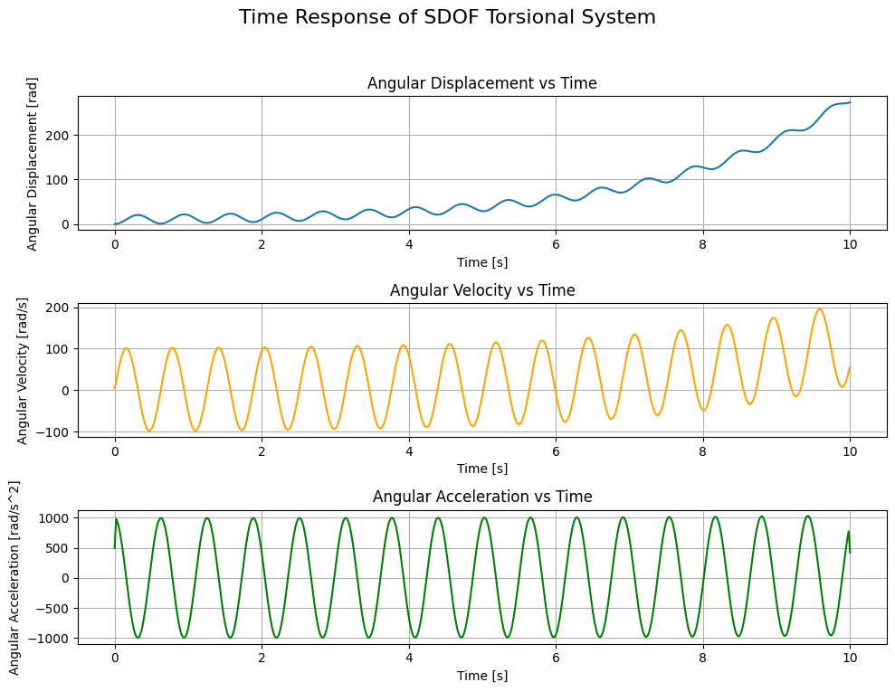
    <figcaption>Figure 11 - Time Response of SDOF Torsional System Subjected to 6th Order Polynomial Load</figcaption>
</figure>

With this feature, our mini-solver is capable of analytically calculating the complete solution of the system subjected under a load of the form of a polynomial of any order. Reckon we can do the same for the harmonic excitation?

### All Harmonics

Similar to the polynomials, we can define harmonic excitations as summations of different frequencies, one on top of another. An external load governed by harmonic excitations takes the general form shown in the following formula:
$$\tau_{ext}(t) = \sum_{i=0}^{i=n}A_i \cdot sin(\omega_i \cdot t) + \sum_{j=0}^{j=m}B_j \cdot cos(\omega_j \cdot t)$$

Therefore, the particular solution will take the same form and will be represented as:
$$\theta_P(t) = \sum_{i=0}^{i=n}\theta_{s,i} \cdot sin(\omega_i \cdot t) + \sum_{j=0}^{j=m}\theta_{c,j} \cdot cos(\omega_j \cdot t)$$

Calculating the complete solution practically means calculating all the values of $\bold{\theta_{s,i}}$ and $\bold{\theta_{c,i}}$.

The second derivative is:
$$\ddot{\theta}\_P(t) = -\sum_{i=0}^{i=n}\theta_{s,i} \cdot \omega_i^2 \cdot sin(\omega_i \cdot t) - \sum_{j=0}^{j=m}\theta_{c,j} \cdot \omega_j^2 \cdot cos(\omega_j \cdot t)$$

Substitution in the equation of motion yields:
$$\sum_{i=0}^{i=n}(c - I \cdot \omega_i^2) \cdot \theta_{s,i} \cdot sin(\omega_i \cdot t) + \sum_{j=0}^{j=m}(c - I \cdot \omega_j^2) \cdot \theta_{c,j} \cdot cos(\omega_j \cdot t) = \sum_{i=0}^{i=n}A_i \cdot sin(\omega_i \cdot t) + \sum_{j=0}^{j=m}B_j \cdot cos(\omega_j \cdot t)$$

By comparing both sides, we get:
$$\theta_{s,i} = \frac{A_i}{c - I \cdot \omega_i^2}$$
$$\theta_{c,j} = \frac{B_j}{c - I \cdot \omega_j^2}$$

For sinusoidal harmonic excitation, we had previously agreed that `tau_ext` would be a dictionary with an `"amplitude"` and a `"frequency"` key. Each of these keys contained one value corresponding to one sinusoidal term. Now, we will modify this so that we accept two differnt keys `"sin"` and `"cos"`. The value of each of those keys is yet another dictionary with the keys `"amplitude"` and `"frequency"` as before; however, the values of each of those latter keys will be an array containing the amplitudes and frequencies of all sinusoidal or cosinusoidal terms.

```python
class SDOFTorsionalSystem:

    # ... (previous code remains unchanged)

            elif load_type == "harmonic":
                # Initialize Particular Solution
                thetaP_t = np.zeros_like(t)
                # Sin terms
                if 'sin' in tau_ext:
                    A_s = tau_ext['sin']['amplitude']
                    omega_s = tau_ext['sin']['frequency'] * 2 * np.pi # Convert frequency from Hz to rad/s
                    if len(A_s) != len(omega_s):
                        raise Exception("Sin terms: amplitudes and freuencies must have the same length.")
                    theta_s_i = np.zeros_like(A_s) # Sin terms of particular solution initialization
                    for i, (A_i, omega_i) in enumerate(zip(A_s, omega_s)):
                        theta_s_i[i] = A_i / (self.c - self.I * omega_i ** 2) # Apply derived formula
                        thetaP_t = thetaP_t + theta_s_i[i] * np.sin(omega_i * t) # Add sin terms
                    thetaPdot_0 = np.sum(theta_s_i)  # Initial value of the derivative of the particular solution at t=0
                else:
                    thetaPdot_0 = 0
                # Cos terms
                if 'cos' in tau_ext:
                    B_c = tau_ext['cos']['amplitude']
                    omega_c = tau_ext['cos']['frequency'] * 2 * np.pi # Convert frequency from Hz to rad/s
                    if len(B_c) != len(omega_c):
                        raise Exception("Cos terms: amplitudes and freuencies must have the same length.")
                    theta_c_j = np.zeros_like(B_c) # Cos terms of particular solution initialization
                    for j, (B_j, omega_j) in enumerate(zip(B_c, omega_c)):
                        theta_c_j[j] = B_j / (self.c - self.I * omega_j ** 2) # Apply derived formula
                        thetaP_t = thetaP_t + theta_c_j[j] * np.cos(omega_j * t) # Add cos terms
                    thetaP_0 = np.sum(theta_c_j)  # Initial value of the particular solution at t=0
                else:
                    thetaP_0 = 0

    # ... (previous code remains unchanged)

```

In the following an example to understand how to use this code producing the graph [**Figure 12**](#fig:time_response_harmonic_combined).

```python
# Simulate time response for mixed harmonics
S = SDOFTorsionalSystem(inertia=I, stiffness=c)
sin_load = {'amplitude': np.linspace(1,2,5), 'frequency': np.linspace(1,4,5)}
cos_load = {'amplitude': np.linspace(0.4, 1.2,10), 'frequency': np.linspace(8,9, 10)}
tau = {'sin': sin_load, 'cos': cos_load}

time_span = 10  # Time span for simulation in [s]
t, theta_t = S.simulate_time_response(time_span=time_span, load_type="harmonic", tau_ext=tau)

# Construct load
load = np.zeros_like(t)
for key in tau:
        for A, om in zip(tau[key]['amplitude'], tau[key]['frequency']):
            if key == 'sin':
                load = load + A * np.sin(om*t)
            elif key == 'cos':
                load = load + A * np.cos(om*t)

# Plotting the time response
fig, axes = plt.subplots(4, 1, figsize=(15, 10))
fig.suptitle('Time Response of SDOF Torsional System', fontsize=16)
# Angular Displacement vs Time
axes[0].plot(t, theta_t, label='Angular Displacement')
axes[0].set_xlabel('Time [s]')
axes[0].set_ylabel('Angular Displacement [rad]')
axes[0].set_title('Angular Displacement vs Time')
axes[0].grid(True)

# Angular Velocity vs Time
angular_velocity = np.gradient(theta_t, t)
axes[1].plot(t, angular_velocity, label='Angular Velocity', color='orange')
axes[1].set_xlabel('Time [s]')
axes[1].set_ylabel('Angular Velocity [rad/s]')
axes[1].set_title('Angular Velocity vs Time')
axes[1].grid(True)

# Angular Acceleration vs Time
angular_acceleration = np.gradient(angular_velocity, t)
axes[2].plot(t, angular_acceleration, label='Angular Acceleration', color='green')
axes[2].set_xlabel('Time [s]')
axes[2].set_ylabel('Angular Acceleration [rad/s^2]')
axes[2].set_title('Angular Acceleration vs Time')
axes[2].grid(True)

# Plot Load
axes[3].plot(t, load, label='Load')
axes[3].set_xlabel('Time [s]')
axes[3].set_ylabel('Load [N.m]')
axes[3].set_title('Load vs Time')
axes[3].grid(True)
plt.tight_layout(rect=[0, 0.03, 1, 0.95])
```

<figure id="fig:time_response_harmonic_combined">
    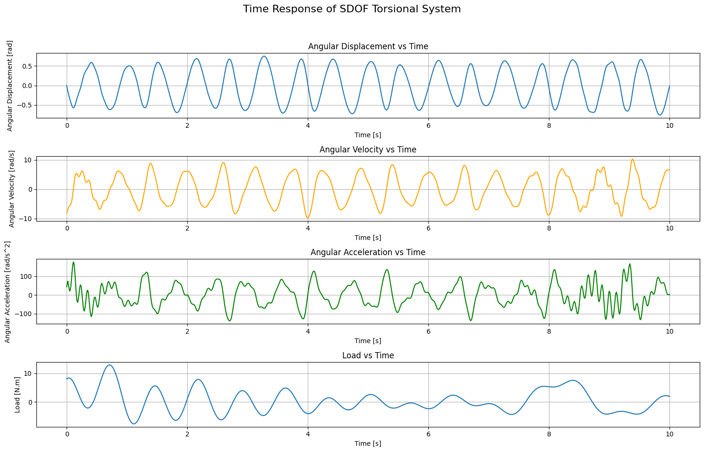
    <figcaption>Figure 12 - Time Response of SDOF Torsional System Subjected to Combined Harmonic Excitation</figcaption>
</figure>