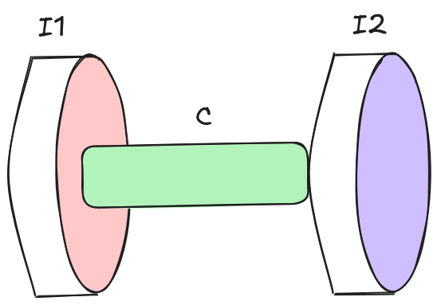
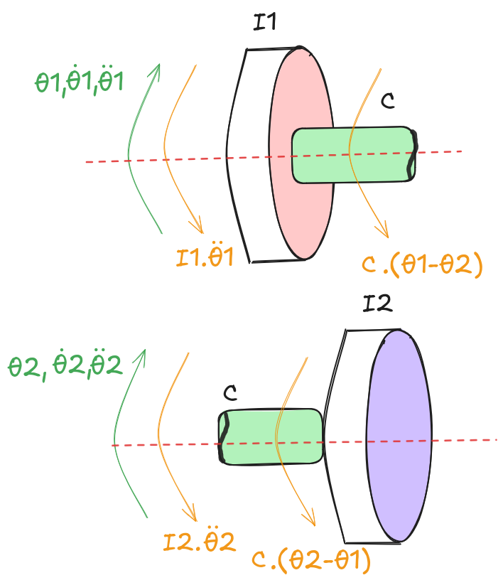
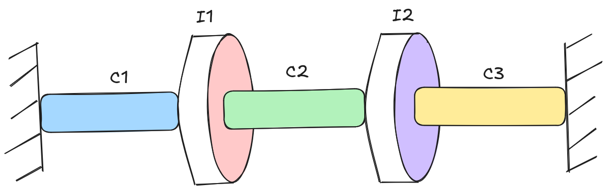
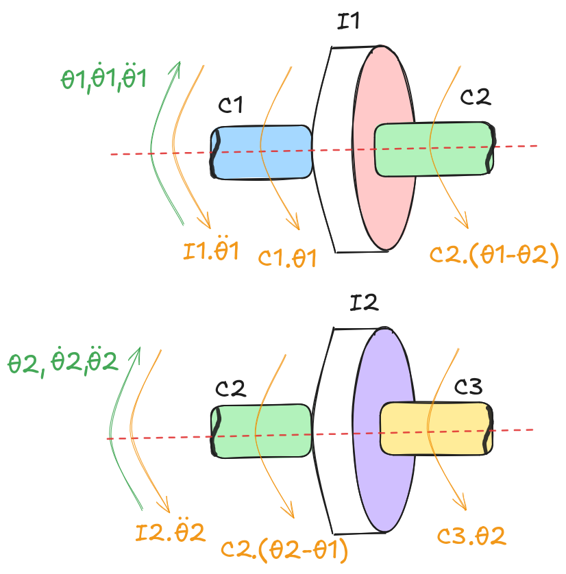

---
title: "Torsional Vibrations - Modeling and Analysis (Part 2)"
date: 2026-05-17T12:54:13+02:00
author: "Ragheed"
excerpt: ""
description: "This series covers the fundamentals of torsional vibrations, including the derivation of equations of motion and the use of Python for numerical analysis. The application is specific to gearbox testing bench setups."
draft: true
math: true
toc: true
categories: ["Mechanical Engineering", "Programming Tutorial"]
tags: ["Machine Design"]
---

***This series covers the fundamentals of torsional vibrations, including the derivation of equations of motion and the use of Python for modeling and analysis. The application is specific to gearbox testing bench setups.***

## Introduction
In [**Part 1**](https://ragheedhuneineh.com/posts/torsional_vibrations_1/ "Part 1"), we introduced a systematic approach for modeling and analyzing torsional systems. We followed this approach to a limited extent by applying it to single degree of freedom (SDOF) torsional systems. This allowed us to study:
1. **Undamped Free Vibrations**: Solving the equation of motion under no load and calculating the natural frequency.
2. **Forced Vibrations**: Calculation of the system response to external excitation.

Using ***Python***, we developed a mini-solver to simulate the response of the SDOF system under various load conditions. The solver calculates the time response analytically for polynomial or harmonic excitations with the possibility to perform the calculation numerically for arbitrary excitation inputs such as measured signals.

The next step is to widen our perspective and apply the systematic approach on multiple degree of freedom (MDOF) torsional systems. In addition to the 2 studies mentioned earlier, we will have 2 more studies to be performed in between:
1. **Identification of Excitation Sources**: Beyond the main load source(s), further excitation sources present in typical test bench setups must be identified (i.e gears, variable frequency drives, etc.).
2. **Campbell Diagram Analysis**: Identifying critical operating zones based on calculated natural frequencies and excitation sources.

In this part, we will start by deriving the equations of motion for a 2-degree of freedom torsional system. The system will **not** be fixed to the wall; therefore, ***rigid motion*** is allowed. We will calculate the natural frequencies (yes, we have more than just one) and their corresponding mode shapes while discussing in depth the insights that can be drawn from those results. We will then take the chance to represent the system in matrix form and use matrix operations to simplify the calculation of the natural frequencies and the mode shapes.

After that, we will shift our focus to ***n-degree*** of freedom torsional systems. We will see how to divide the system into a set of elements, each element being a 2-degree of freedom system with its own matrix representation. This will allow us to then assemble the full matrix for the complete system and solve it accordingly to obtain the natural frequencies and the corresponding mode shapes.

Finally, we will analyze the case where an infinitely-rigid-inertialess adaption transmission is present in between elements. This will serve as an introduction to more complex test bench configurations where certain transformations are required to account for the gear ratio. It will also introduce a new source of excitation beyond the main load source(s) that should be accounted for in the analysis.

## 2 Degrees of Freedom

### Undamped Free Vibrations

Consider the system shown in [**Figure 1**](#fig:2_degree_of_freedom_rigid_motion). It is composed of 2 rotating inertias, $\bold{I_1}$ and $\bold{I_2}$, connected to one another via the shaft with torsional stiffness $\bold{c}$. Assume that the system is supported by bearings allowing for rigid rotation along the shaft's axis and that the mass of the involved bodies isn't significant enough to cause the shaft to bend.

<figure id="fig:2_degree_of_freedom_rigid_motion">
    
    <figcaption>Figure 1 - 2 Degree of Freedom System</figcaption>
</figure>

When rotating under load, the intermediate shaft experiences torsional stress due to its finite stiffness. Similar to SDOF torsional systems, measurements documented in literature prove that 2-degree of freedom systems such as the one depicted indeed do contain a frequency component that persists regardless of the form the external load takes. Therefore, we'd need to find a way to calculate this ***natural frequency*** component to avoid resonance when attempting to excite the system.

The free body diagrams of the two rotating bodies are shown in [**Figure 2**](#fig:2_degree_of_freedom_rigid_motion_fbd). It has to be noted that the restoring torque from the shaft will only be present when the shaft is twisted. Practically, this means that the restoring torque will be present only when the two rotating bodies are oscillating out of phase. As a result, the resoring torque is proportional to the absolute difference between the 2 angular displacements: $\bold{|\theta_1 - \theta_2|}$.

<figure id="fig:2_degree_of_freedom_rigid_motion_fbd">
    
    <figcaption>Figure 1 - 2 Degree of Freedom System: Free Body Diagram</figcaption>
</figure>

The resulting set of equations of motion is:
$$I_1 \cdot \ddot{\theta}\_1 + c \cdot (\theta_1 - \theta_2) = 0$$
$$I_2 \cdot \ddot{\theta}\_2 + c \cdot (\theta_2 - \theta_1) = 0$$

Rearranging the terms so as to serparate $\bold{\theta_1}$ from $\bold{\theta_2}$:
$$I_1 \cdot \ddot{\theta}\_1 + c \cdot \theta_1 - c \cdot \theta_2 = 0$$
$$I_2 \cdot \ddot{\theta}\_2 + c \cdot \theta_2 - c \cdot \theta_1 = 0$$

This is a coupled system: the motion of each body directly influences the motion ofthe other through the terms $\bold{c \cdot \theta_2}$ and $\bold{c \cdot \theta_1}$. One natural instinct would be to  move those  coupling terms to the right-hand side and treat each equation as a SDOF forced vibration problem, as we did in [**Part 1**](https://ragheedhuneineh.com/posts/torsional_vibrations_1/#forced-vibration-analysis-theory "Part 1"). This, however, leads to an ${\infty}$ loop: to solve for $\bold{\theta_1}$ you need $\bold{\theta_2}$, and  to solve for $\bold{\theta_2}$ you need $\bold{\theta_1}$.

We therefore need a smarter approach. As in the SDOF case, we propose a harmonic solution for each degree of freedom:
$$\theta_i(t) = A_i \cdot cos(\omega t) + B_i \cdot sin(\omega t)$$

The second derivative is:
$$\ddot{\theta}_i(t) = -A_i \cdot \omega^2 \cdot cos(\omega t) - B_i \cdot \omega^2 \cdot sin(\omega t)$$

which means the second derivative is simply proportional to the solution itself:
$$\ddot{\theta}_i(t) = - \omega^2 \cdot \theta_i(t)$$

Denoting $\bold{\Theta_i = \theta_i(t)}$ for brevity and substituting this into the equations of motion:
$$-I_1 \cdot \omega_n^2 \cdot \Theta_1 + c \cdot \Theta_1 - c \cdot \Theta_2 = 0$$

$$-I_2 \cdot \omega_n^2 \cdot \Theta_2 + c \cdot \Theta_2 - c \cdot \Theta_1 = 0$$

Rearranging the first equation:
$$\Theta_2 = \frac{c - I_1 \cdot \omega_n^2}{c} \cdot \Theta_1$$

Substituting into the second equation:
$$-I_2 \cdot \omega_n^2 \cdot \left(\frac{c - I_1 \cdot \omega_n^2}{c} \cdot \Theta_1 \right) + c \cdot \left(\frac{c - I_1 \cdot \omega_n^2}{c} \cdot \Theta_1 \right) - c \cdot \Theta_1 = 0$$

For $\bold{\Theta_1 \neq 0}$, rearranging for $\bold{\omega_n}$:
$$\frac{I_1 \cdot I_2}{c} \cdot \omega_n^4 - (I_1 + I_2) \cdot \omega_n^2 = 0$$

Factoring:
$$\omega_n^2 \cdot \left[\frac{I_1 \cdot I_2}{c} \cdot \omega_n^2 - (I_1 + I_2)\right] = 0$$

Since frequency cannot be negative, this yields two solutions:
1. $\bold{\omega_{n,1} = 0} \rarr$ Rigid rotation
2. $\bold{\omega_{n,2} = \sqrt{\frac{c \cdot (I_1 + I_2)}{I_1 \cdot I_2}}} \rarr$ Out-of-phase oscillation

To confirm the physical interpretation of each solution, we substitute back into the expression for $\bold{\Theta_2}$ as a function of $\bold{\Theta_1}$:
$$\Theta_2 = \frac{c - I_1 \cdot \frac{c \cdot (I_1 + I_2)}{I_1 \cdot I_2}}{c} \cdot \Theta_1$$

Leading eventually to:
$$\Theta_2 = - \frac{I_1}{I_2} \cdot \Theta_1$$

The negative sign confirms that the two bodies always rotate in opposite directions; hence, out-of-phase oscillation. The ratio further tells us that the body with the lower inertia will experience the larger angular displacement.

For $\bold{\omega_{n,1} = 0}$:
$$\Theta_2 = \Theta_1$$

Both bodies move identically. Since the system is not fixed to any gournd, this can only correspond to rigid body rotation; the shaft connecting the two bodies does not deform at all.

These two expressions are in fact the **mode shapes** of the system. A mode shape describes the relative amplitude between the degrees of freedom when a given mode is active.

Choosing $\Theta_1$ as reference, the two mode shapes are:
1. **Mode 1: for** $\bold{\omega_{n,1} = 0 \rarr \phi^{(1)} = \\{1, 1\\}}$
2. **Mode 2: for** $\bold{\omega_{n,2} = \sqrt{\frac{c \cdot (I_1 + I_2)}{I_1 \cdot I_2}} \rarr \phi^{(2)} = \\{1, -\frac{I_1}{I_2}\\}}$

<u>**From natural frequencies to the general solution**</u>

In the SDOF case, finding the natural frequency was essentially the finish line: we substituted it back into the proposed solution, applied the initial conditions, and obtained the response. Here, having found two natural frequencies, the situation is slightly more involved.

The key observation is that, in general, the system will not vibrate exclusively in one mode or the other; in fact, it will rather exhibit both simultaneously, with the relative contribution of each mode determined by the initial conditions. The total response is therefore a superposition of both modal contributions.

To see why, recall that a single free oscillator has one natural frequency and its general solution carries two contraints:
$$A \cdot cos(\omega t) + B \cdot sin(\omega t)$$

These two contraints are fixed by the two initial conditions of the SDOF system. By the same logic, a system with two modes requires one such pair of constraints **per mode**, giving four constants in total, which is precisly the number needed to satisfy the four initial conditions of our 2 DOF system:
1. $\bold{\theta_1(0)}$: initial angle of the first degree of freedom,
2. $\bold{\theta_2(0)}$: initial angle of the second degree of freedom,
3. $\bold{\dot{\theta}\_1(t)}$: initial angular velocity of the first degree of freedom, and
4. $\bold{\dot{\theta}\_2(t)}$: initial angular velocity of the second degree of freedom.

However, we have to note that the mode responsible for rigid motion with $\bold{\omega_{n,1} = 0}$ exposes a fundamental limitation in the assumption that the response should be in the form of a harmonic function. To see this limitation, we need to substitute the value of the natural frequency in the proposed solution for one of the degrees of freedom:

$$\theta_i^{(1)}(t) = A_i^{(1)} \cdot cos(0 \cdot t) + B_i^{(1)} \cdot sin(0 \cdot t)$$

$$\theta_i^{(1)}(t) = A_i^{(1)} \cdot 1 + B_i^{(1)} \cdot 0$$

$$\theta_i^{(1)}(t) = A_i^{(1)}$$

(The superscript indicates the mode we're dealing with).

Recalling that a second order linear ordinary differential equation (ODE) **always** requires **exactly** two linearly independent solutions, the general solution must always be a linear combination of these two linearly independent solutions! Clearly, this is not the case for the solution of the first mode, $\bold{\theta_i^{(1)}(t)}$, as it simply results in a constant, $\bold{A_i}$. Therefore, our assumption that the solution must be harmonic is partially correct and, accordingly, it portrays part of the underlying truth concerning the rigid body motion mode.

The assumption tells us that indeed the corresponding motion for that mode is rigid body motion. Moreover, it tells us that our choice of describing the motion as harmonic is no longer sufficient or else the general solution would be incomplete. The standard remedy from ODE theory for exactly this situation (when two solutions of a second order ODE coincide) is to increment the order of the obtained solution by 1 to generate a second linearly independent solution. Applied here, the resulting general solution for the rigid body mode becomes a first order polynomial of the form:

$$\theta_i^{(1)}(t) = A_i^{(1)} + B_i^{(1)} \cdot t$$

This has a clear physical interpretation:
- $\bold{A_i^{(1)}}$: represents the initial angular position
- $\bold{B_i^{(1)}}$: represents the initial angular velocity

both for degree of freedom $\bold{i}$.

Combining this with the harmonic contribution from the second mode, the complete general solution for each degree of freedom is:

$$\theta_i(t) = A_i^{(1)} + B_i^{(1)} \cdot t + A_i^{(2)} \cdot cos(\omega_{n,2} \cdot t) + B_i^{(2)} \cdot sin(\omega_{n,2} \cdot t)$$

This is where the mode shapes prove their worth. For a given mode, the mode shape already fixes the ratio between the responses of the two bodies; hence, once we know how one body moves in that mode, the motion of the other follows directly. This means we do not need four independent functions; we only need one unknown function per mode, which we call the **modal coordinate** $\bold{q_r(t)}$. The physical response of each body is then reconstructed as a weighted sum of modal contributions:

$$\theta_1(t) = \phi^{(1)}_1 \cdot q_1(t) + \phi^{(2)}_1 \cdot q_2(t)$$
$$\theta_2(t) = \phi^{(1)}_2 \cdot q_1(t) + \phi^{(2)}_2 \cdot q_2(t)$$

Where:
- $\bold{\phi^{(r)}_i}$ is the $\bold{r}$-th mode shape of the $\bold{i}$-th degree of freedom.
- $\bold{q_r(t)}$ is the modal coordinate — a scalar function of time that tells us how strongly mode $\bold{r}$ is active at any given moment.

The task now reduces to finding $\bold{q_1(t)}$ and $\bold{q_2(t)}$, which we do by substituting these expressions back into the original equations of motion.

For the substitution, we need first to calculate the second derivatives of the proposed functions:

$$\ddot{\theta}\_1(t) =  \phi^{(1)}_1 \cdot \ddot{q}\_1(t) + \phi^{(2)}_1 \cdot \ddot{q}\_2(t)$$
$$\ddot{\theta}\_2(t) = \phi^{(1)}_2 \cdot \ddot{q}\_1(t) + \phi^{(2)}_2 \cdot \ddot{q}\_2(t)$$

Substituting this form into the set of equations of motion for the coupled system yields:
$$I_1 \cdot [\phi^{(1)}_1 \cdot \ddot{q}\_1(t) + \phi^{(2)}_1 \cdot \ddot{q}\_2(t)] + c \cdot [(\phi^{(1)}_1 - \phi^{(1)}_2) \cdot q_1(t) + (\phi^{(2)}_1 - \phi^{(2)}_2) \cdot q_2(t)] = 0$$
$$I_2 \cdot [\phi^{(1)}_2 \cdot \ddot{q}\_1(t) + \phi^{(2)}_2 \cdot \ddot{q}\_2(t)] + c \cdot [(\phi^{(1)}_2 - \phi^{(1)}_1) \cdot q_1(t) + (\phi^{(2)}_2 - \phi^{(2)}_1) \cdot q_2(t)] = 0$$

---

## Appendix

### 2 Degrees of Freedom: No Rigid Motion

Take 2 single degree of freedom systems, mirror them with respect to each other, and connect the two rotating inertias with a third shaft. You get a simple 2 degree of freedom torsional system, the schematic of which can be seen in [**Figure 98**](#fig:2_degree_of_freedom_no_rigid_motion)

<figure id="fig:2_degree_of_freedom_no_rigid_motion">
    
    <figcaption>Figure 98 - 2 Degree of Freedom System: No Rigid Motion</figcaption>
</figure>

Each rotating body has two shafts connected to it, one on either side. When the 2 bodies are oscillating, the two shafts connected to the wall are guaranteed to undergo twisting and thus, procude a restoring torque. The intermediate shaft with torsional stiffness $\bold{c_2}$ however is twisting only if the two rotating inertias are oscillating out of phase. This means that the restoring torque produced by the intermediate shaft is proportional to the difference between the angular displacements of the two rotating bodies: $\bold{|\theta_1 - \theta_2|}$. Remembering that the torque produced by the shaft's torsional stiffness is a restoring torque that opposes the angular displacement from its equilibrium position, the freebody diagrams of the two rotating bodies are then represented as shown in [**Figure 99**](#fig:2_degree_of_freedom_no_rigid_motion_fbd).

<figure id="fig:2_degree_of_freedom_no_rigid_motion_fbd">
    
    <figcaption>Figure 99 - 2 Degree of Freedom System: No Rigid Motion - Free Body Diagram</figcaption>
</figure>

The resulting set of equations of motion is:

$$I_1 \cdot \ddot{\theta}\_1 + c_1 \cdot \theta_1 + c_2 \cdot (\theta_1 - \theta_2) = 0$$

$$I_2 \cdot \ddot{\theta}\_2 + c_3 \cdot \theta_2 + c_2 \cdot (\theta_2 - \theta_1) = 0$$

Rearranging the terms to separate $\bold{\theta_1}$ from $\bold{\theta_2}$, we get:

$$I_1 \cdot \ddot{\theta}\_1 + (c_1 + c_2) \cdot \theta_1 = c_2 \cdot \theta_2$$

$$I_2 \cdot \ddot{\theta}\_2 + (c_2 + c_3) \cdot \theta_2 = c_2 \cdot \theta_1$$

This set of second order differential equations represents a coupled system, not to be mistaken for the forced vibrations discussed in [**Part 1**](https://ragheedhuneineh.com/posts/torsional_vibrations_1/#forced-vibration-analysis-theory "Part 1") of this series. The two equations are coupled together through the terms $\bold{c_2 \cdot \theta_2}$ and $\bold{c_2 \cdot \theta_1}$. This means that the motion of one body affects the motion of the other body, and vice versa. One could think of solving one of the equations considering it as a SDOF system undergoing forced vibrations, where the forcing term is the motion of the other body. However, this approach does not lead to a closed-form solution. Think of it as attempting to find the particular solution of one of the responses using the particular solution of the other as the external torque, but to get the particular solution of the other you'd need the particular solution of the first as an external torque: $\bold{\infty}$ **loop**.

Thus, for an attempt to solve the system of equations, we'd need to think of 2 functions, one for each response, that would satisfy the conditions presented. Reckon trigonometry or complex exponentials would answer our call this time as well? Opting for the trigonometric form, a solution would look like this:
$$\theta(t) = A \cdot sin(\omega t) + B \cdot cos(\omega t)$$

The second derivative is simply:
$$\ddot{\theta}(t) = -A \cdot \omega^2 \cdot sin(\omega t) - B \cdot \omega^2 \cdot cos(\omega t)$$

In essence, the second derivative is proportional to the solution itself:
$$\ddot{\theta}(t) = - \omega^2 \cdot \theta(t)$$

For simplicity, denote: $\bold{\Theta = \theta(t)}$

Substituting this in the set of equations derived earlier, we get:
$$-I_1 \cdot \omega^2 \cdot \Theta_1 + (c_1 + c_2) \cdot \Theta_1 = c_2 \cdot \Theta_2$$

$$-I_2 \cdot \omega^2 \cdot \Theta_2 + (c_2 + c_3) \cdot \Theta_2 = c_2 \cdot \Theta_1$$

From the first equation, we get:
$$\Theta2 = \frac{c_1 + c_2 - I_1 \cdot \omega^2}{c_2} \cdot \Theta_1 $$

$$\theta(t) = A^{(1)}_1 \cdot cos(\omega_{n,1}t) + A^{(2)}_1 \cdot cos(\omega_{n,2}t) +  B^{(1)}_1 \cdot sin(\omega_{n,1}t) + B^{(2)}_1 \cdot sin(\omega_{n,2}t)$$

$$\theta(t) = A^{(1)}_1 + A^{(2)}_1 \cdot cos \left(\sqrt{\frac{c \cdot (I_1 +I_2)}{I_1 \cdot I_2}} \cdot t \right) + B^{(2)}_1 \cdot sin \left(\sqrt{\frac{c \cdot (I_1 +I_2)}{I_1 \cdot I_2}} \cdot t \right)$$

$$
\begin{bmatrix}
I_1 & 0 \\\
0 & I_2
\end{bmatrix}
$$

---