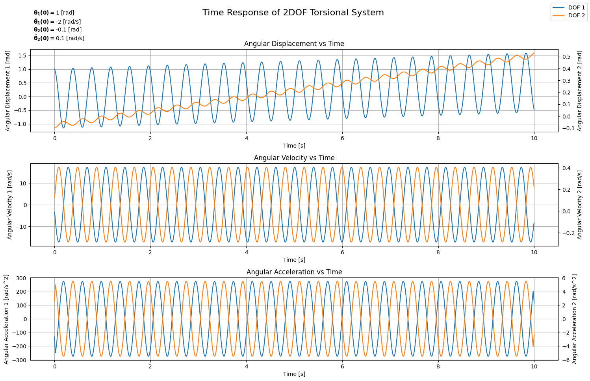
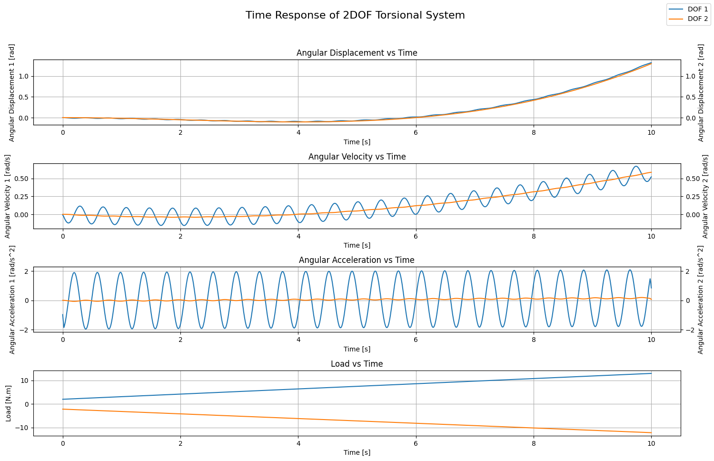
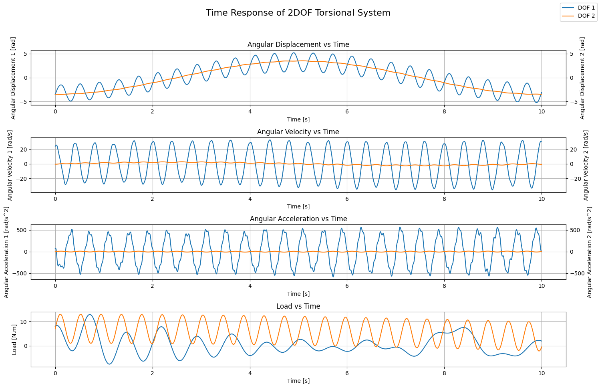
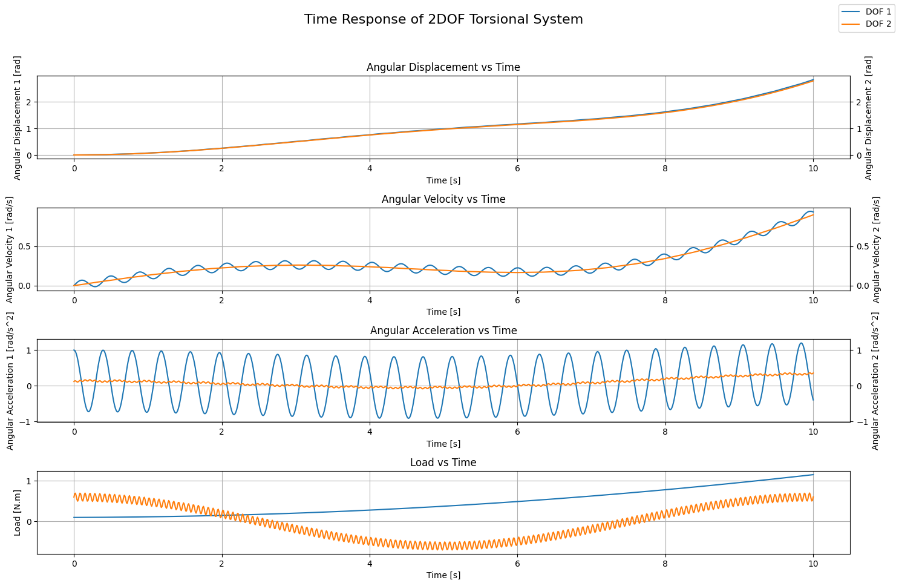
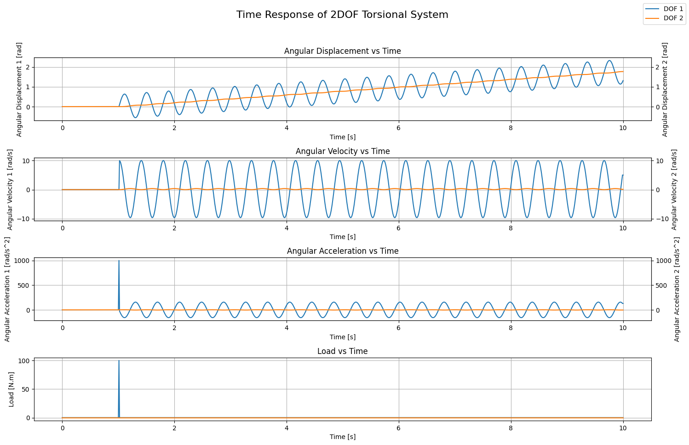

---
title: "Torsional Vibrations - Modeling and Analysis (Part 2)"
date: 2026-05-17T12:54:13+02:00
author: "Ragheed"
excerpt: ""
description: "This series covers the fundamentals of torsional vibrations, including the derivation of equations of motion and the use of Python for numerical analysis. The application is specific to gearbox testing bench setups."
draft: true
math: true
toc: true
categories: ["Mechanical Engineering", "Programming Tutorial"]
tags: ["Machine Design"]
---

***This series covers the fundamentals of torsional vibrations, including the derivation of equations of motion and the use of Python for modeling and analysis. The application is specific to gearbox testing bench setups.***


## Introduction
In [**Part 1**](https://ragheedhuneineh.com/posts/torsional_vibrations_1/ "Part 1"), we introduced a systematic approach for modeling and analyzing torsional systems. We followed this approach to a limited extent by applying it to single degree of freedom (SDOF) torsional systems. This allowed us to study:
1. **Undamped Free Vibrations**: Solving the equation of motion under no load and calculating the natural frequency.
2. **Forced Vibrations**: Calculation of the system response to external excitation.

Using ***Python***, we developed a mini-solver to simulate the response of the SDOF system under various load conditions. The solver calculates the time response analytically for polynomial or harmonic excitations with the possibility to perform the calculation numerically for arbitrary excitation inputs such as measured signals.

The next step is to widen our perspective and apply the systematic approach on multiple degree of freedom (MDOF) torsional systems. In addition to the 2 studies mentioned earlier, we will have 2 more studies to be performed in between:
1. **Identification of Excitation Sources**: Beyond the main load source(s), further excitation sources present in typical test bench setups must be identified (i.e gears, variable frequency drives, etc.).
2. **Campbell Diagram Analysis**: Identifying critical operating zones based on calculated natural frequencies and excitation sources.

In this part, we will start by deriving the equations of motion for a 2-degree of freedom torsional system. The system will **not** be fixed to the wall; therefore, ***rigid motion*** is allowed. We will calculate the natural frequencies (yes, we have more than just one) and their corresponding mode shapes while discussing in depth the insights that can be drawn from those results. We will then take the chance to represent the system in matrix form and use matrix operations to simplify the calculation of the natural frequencies and the mode shapes.

After that, we will shift our focus to ***n-degree*** of freedom torsional systems. We will see how to divide the system into a set of elements, each element being a 2-degree of freedom system with its own matrix representation. This will allow us to then assemble the full matrix for the complete system and solve it accordingly to obtain the natural frequencies and the corresponding mode shapes.

Finally, we will analyze the case where an infinitely-rigid-inertialess adaption transmission is present in between elements. This will serve as an introduction to more complex test bench configurations where certain transformations are required to account for the gear ratio. It will also introduce a new source of excitation beyond the main load source(s) that should be accounted for in the analysis.

## 2 Degrees of Freedom: Undamped Free Vibrations

### Theory

Consider the system shown in [**Figure 1**](#fig:2_degree_of_freedom_rigid_motion). It is composed of 2 rotating inertias, $\bold{I_1}$ and $\bold{I_2}$, connected to one another via the shaft with torsional stiffness $\bold{c}$. Assume that the system is supported by bearings allowing for rigid rotation along the shaft's axis and that the mass of the involved bodies isn't significant enough to cause the shaft to bend.

<figure id="fig:2_degree_of_freedom_rigid_motion">
    
    <figcaption>Figure 1 - 2 Degree of Freedom System</figcaption>
</figure>

When rotating under load, the intermediate shaft experiences torsional stress due to its finite stiffness. Similar to SDOF torsional systems, measurements documented in literature prove that 2-degree of freedom systems such as the one depicted indeed do contain a frequency component that persists regardless of the form the external load takes. Therefore, we'd need to find a way to calculate this ***natural frequency*** component to avoid resonance when attempting to excite the system.

The free body diagrams of the two rotating bodies are shown in [**Figure 2**](#fig:2_degree_of_freedom_rigid_motion_fbd). It has to be noted that the restoring torque from the shaft will only be present when the shaft is twisted. Practically, this means that the restoring torque will be present only when the two rotating bodies are oscillating out of phase. As a result, the resoring torque is proportional to the absolute difference between the 2 angular displacements: $\bold{|\theta_1 - \theta_2|}$.

<figure id="fig:2_degree_of_freedom_rigid_motion_fbd">
    
    <figcaption>Figure 1 - 2 Degree of Freedom System: Free Body Diagram</figcaption>
</figure>

The resulting set of equations of motion is:
$$I_1 \cdot \ddot{\theta}\_1 + c \cdot (\theta_1 - \theta_2) = 0$$
$$I_2 \cdot \ddot{\theta}\_2 + c \cdot (\theta_2 - \theta_1) = 0$$

Rearranging the terms so as to serparate $\bold{\theta_1}$ from $\bold{\theta_2}$:
$$I_1 \cdot \ddot{\theta}\_1 + c \cdot \theta_1 - c \cdot \theta_2 = 0$$
$$I_2 \cdot \ddot{\theta}\_2 + c \cdot \theta_2 - c \cdot \theta_1 = 0$$

This is a coupled system: the motion of each body directly influences the motion ofthe other through the terms $\bold{c \cdot \theta_2}$ and $\bold{c \cdot \theta_1}$. One natural instinct would be to  move those  coupling terms to the right-hand side and treat each equation as a SDOF forced vibration problem, as we did in [**Part 1**](https://ragheedhuneineh.com/posts/torsional_vibrations_1/#forced-vibration-analysis-theory "Part 1"). This, however, leads to an ${\infty}$ loop: to solve for $\bold{\theta_1}$ you need $\bold{\theta_2}$, and  to solve for $\bold{\theta_2}$ you need $\bold{\theta_1}$.

We therefore need a smarter approach. As in the SDOF case, we propose a harmonic solution for each degree of freedom:
$$\theta_i(t) = A_i \cdot cos(\omega t) + B_i \cdot sin(\omega t)$$

The second derivative is:
$$\ddot{\theta}_i(t) = -A_i \cdot \omega^2 \cdot cos(\omega t) - B_i \cdot \omega^2 \cdot sin(\omega t)$$

which means the second derivative is simply proportional to the solution itself:
$$\ddot{\theta}_i(t) = - \omega^2 \cdot \theta_i(t)$$

Denoting $\bold{\Theta_i = \theta_i(t)}$ for brevity and substituting this into the equations of motion:
$$-I_1 \cdot \omega_n^2 \cdot \Theta_1 + c \cdot \Theta_1 - c \cdot \Theta_2 = 0$$

$$-I_2 \cdot \omega_n^2 \cdot \Theta_2 + c \cdot \Theta_2 - c \cdot \Theta_1 = 0$$

Rearranging the first equation:
$$\Theta_2 = \frac{c - I_1 \cdot \omega_n^2}{c} \cdot \Theta_1$$

Substituting into the second equation:
$$-I_2 \cdot \omega_n^2 \cdot \left(\frac{c - I_1 \cdot \omega_n^2}{c} \cdot \Theta_1 \right) + c \cdot \left(\frac{c - I_1 \cdot \omega_n^2}{c} \cdot \Theta_1 \right) - c \cdot \Theta_1 = 0$$

For $\bold{\Theta_1 \neq 0}$, rearranging for $\bold{\omega_n}$:
$$\frac{I_1 \cdot I_2}{c} \cdot \omega_n^4 - (I_1 + I_2) \cdot \omega_n^2 = 0$$

Factoring:
$$\omega_n^2 \cdot \left[\frac{I_1 \cdot I_2}{c} \cdot \omega_n^2 - (I_1 + I_2)\right] = 0$$

Since frequency cannot be negative, this yields two solutions:
1. $\bold{\omega_{n,1} = 0} \rarr$ Rigid rotation
2. $\bold{\omega_{n,2} = \sqrt{\frac{c \cdot (I_1 + I_2)}{I_1 \cdot I_2}}} \rarr$ Out-of-phase oscillation

To confirm the physical interpretation of each solution, we substitute back into the expression for $\bold{\Theta_2}$ as a function of $\bold{\Theta_1}$:
$$\Theta_2 = \frac{c - I_1 \cdot \frac{c \cdot (I_1 + I_2)}{I_1 \cdot I_2}}{c} \cdot \Theta_1$$

Leading eventually to:
$$\Theta_2 = - \frac{I_1}{I_2} \cdot \Theta_1$$

The negative sign confirms that the two bodies always rotate in opposite directions; hence, out-of-phase oscillation. The ratio further tells us that the body with the lower inertia will experience the larger angular displacement.

For $\bold{\omega_{n,1} = 0}$:
$$\Theta_2 = \Theta_1$$

Both bodies move identically. Since the system is not fixed to any gournd, this can only correspond to rigid body rotation; the shaft connecting the two bodies does not deform at all.

These two expressions are in fact the **mode shapes** of the system. A mode shape describes the relative amplitude between the degrees of freedom when a given mode is active.

Choosing $\Theta_1$ as reference, the two mode shapes are:
1. **Mode 1: for** $\bold{\omega_{n,1} = 0 \rarr \phi^{(1)} = \\{1, 1\\}}$
2. **Mode 2: for** $\bold{\omega_{n,2} = \sqrt{\frac{c \cdot (I_1 + I_2)}{I_1 \cdot I_2}} \rarr \phi^{(2)} = \\{1, -\frac{I_1}{I_2}\\}}$

<u>**From natural frequencies to the general solution**</u>

In the SDOF case, finding the natural frequency was essentially the finish line: we substituted it back into the proposed solution, applied the initial conditions, and obtained the response. Here, having found two natural frequencies, the situation is slightly more involved.

The key observation is that, in general, the system will not vibrate exclusively in one mode or the other; in fact, it will rather exhibit both simultaneously, with the relative contribution of each mode determined by the initial conditions. The total response is therefore a superposition of both modal contributions.

To see why, recall that a single free oscillator has one natural frequency and its general solution carries two contraints:
$$A \cdot cos(\omega t) + B \cdot sin(\omega t)$$

These two contraints are fixed by the two initial conditions of the SDOF system. By the same logic, a system with two modes requires one such pair of constraints **per mode**, giving four constants in total, which is precisly the number needed to satisfy the four initial conditions of our 2 DOF system:
1. $\bold{\theta_1(0)}$: initial angle of the first degree of freedom,
2. $\bold{\theta_2(0)}$: initial angle of the second degree of freedom,
3. $\bold{\dot{\theta}\_1(0)}$: initial angular velocity of the first degree of freedom, and
4. $\bold{\dot{\theta}\_2(0)}$: initial angular velocity of the second degree of freedom.

However, we have to note that the mode responsible for rigid motion with $\bold{\omega_{n,1} = 0}$ exposes a fundamental limitation in the assumption that the response should be in the form of a harmonic function. To see this limitation, we need to substitute the value of the natural frequency in the proposed solution for one of the degrees of freedom:

$$\theta_i^{(1)}(t) = A_i^{(1)} \cdot cos(0 \cdot t) + B_i^{(1)} \cdot sin(0 \cdot t)$$

$$\theta_i^{(1)}(t) = A_i^{(1)} \cdot 1 + B_i^{(1)} \cdot 0$$

$$\theta_i^{(1)}(t) = A_i^{(1)}$$

(The superscript indicates the mode we're dealing with).

Recalling that a second order linear ordinary differential equation (ODE) **always** requires **exactly** two linearly independent solutions, the general solution must always be a linear combination of these two linearly independent solutions! Clearly, this is not the case for the solution of the first mode, $\bold{\theta_i^{(1)}(t)}$, as it simply results in a constant, $\bold{A_i}$. Therefore, our assumption that the solution must be harmonic is partially correct and, accordingly, it portrays part of the underlying truth concerning the rigid body motion mode.

The assumption tells us that indeed the corresponding motion for that mode is rigid body motion. Moreover, it tells us that our choice of describing the motion as harmonic is no longer sufficient or else the general solution would be incomplete. The standard remedy from ODE theory for exactly this situation (when two solutions of a second order ODE coincide) is to increment the order of the obtained solution by 1 to generate a second linearly independent solution. Applied here, the resulting general solution for the rigid body mode becomes a first order polynomial of the form:

$$\theta_i^{(1)}(t) = A_i^{(1)} + B_i^{(1)} \cdot t$$

This has a clear physical interpretation:
- $\bold{A_i^{(1)}}$: represents the initial angular position
- $\bold{B_i^{(1)}}$: represents the initial angular velocity

both for degree of freedom $\bold{i}$.

Combining this with the harmonic contribution from the second mode, the complete general solution for each degree of freedom is:

$$\theta_i(t) = A_i^{(1)} + B_i^{(1)} \cdot t + A_i^{(2)} \cdot cos(\omega_{n,2} \cdot t) + B_i^{(2)} \cdot sin(\omega_{n,2} \cdot t)$$

Once the form of the response has been established, the next step is to calculate the constants involved. To do this, we rely on the initial conditions as has been stated earlier. This requires us to calculate the first derivative of the solution which turns out simply to be:

$$\dot{\theta}\_i(t) = B_i^{(1)} - \omega_{n,2} \cdot A_i^{(2)} \cdot sin(\omega_{n,2} \cdot t) + \omega_{n,2} \cdot B_i^{(2)} \cdot cos(\omega_{n,2} \cdot t)$$

Then, for each degree of freedom, we have:

$$\theta_i(0) = A_i^{(1)} + A_i^{(2)}$$

$$\dot{\theta}\_i(0) = B_i^{(1)} + \omega_{n,2} \cdot B_i^{(2)}$$

At this point, each degree of freedom has 4 unknowns but only 2 linearly independent equations; therefore, 2 further linearly independent equations are required per degree of freedom to render the system solvable. This is where the mode shapes prove their worth. For a given mode, the mode shape already fixes the ratio between the responses of the two bodies; hence, once we know how one body moves in that mode, the motion of the other follows directly. Since we took the first degree of freedom as our reference for the mode shapes, this translates to 2 further equations per degree of freedom in the following form:

$$A_i^{(r)} = \phi_i^{(r)} \cdot A_1^{(r)}$$
$$B_i^{(r)} = \phi_i^{(r)} \cdot B_1^{(r)}$$

Obviously, the 2 further equations are useful in cases where $\bold{i}$ is not equal to **1**. This means that there aren't enough equations for the first degree of freedom. At first, one might fall into this trap; however, one must note that for the second degree of freedom, these 2 equations transform into 4 in total: 2 for each mode shape $\bold{r}$.

Hence, the final set of equations needed for the calculation of all the constants is:

<u>**From initial conditions**</u>

$$A_1^{(1)} + A_1^{(2)} = \theta_1(0)$$
$$B_1^{(1)} + \omega_{n,2} \cdot B_1^{(2)} = \dot{\theta}\_1(0)$$
$$A_2^{(1)} + A_2^{(2)} = \theta\_2(0)$$
$$B_2^{(1)} + \omega_{n,2} \cdot B_2^{(2)} = \dot{\theta}\_2(0)$$

<u>**From mode shapes**</u>

$$A_1^{(1)} - A_2^{(1)} = 0$$
$$\frac{I_1}{I_2} \cdot A_1^{(2)} + A_2^{(2)} = 0$$
$$B_1^{(1)} - B_2^{(1)} = 0$$
$$\frac{I_1}{I_2} \cdot B_1^{(2)} + B_2^{(2)} = 0$$

This is a system of 8 linearly independent equations with 8 unknowns. We can transform the system into matrix form and solve it by denoting the following:

- $\bold{\bar{x}}$: Vector holding all the unknowns.
- $\bold{A}$: Matrix of coefficients.
- $\bold{b}$: Vector holding all the terms on the right-hand side of the equal sign.

Accordingly, we have the system represented in matrix form as:

$$A \cdot \bar{x} = b$$

where:

$$A =
\begin{bmatrix}
1 & 1 & 0 & 0 & 0 & 0 & 0 & 0 \\\
0 & 0 & 1 & \omega_{n,2} & 0 & 0 & 0 & 0 \\\
0 & 0 & 0 & 0 & 1 & 1 & 0 & 0 \\\
0 & 0 & 0 & 0 & 0 & 0 & 1 & \omega_{n,2} \\\
1 & 0 & 0 & 0 & -1 & 0 & 0 & 0 & \\\
0 & \frac{I_1}{I_2} & 0 & 0 & 0 & 1 & 0 & 0 \\\
0 & 0 & 1 & 0 & 0 & 0 & -1 & 0 \\\
0 & 0 & 0 & \frac{I_1}{I_2} & 0 & 0 & 0 & 1
\end{bmatrix}
$$

$$\bar{x} =
\begin{Bmatrix}
A_1^{(1)} \\\
A_1^{(2)} \\\
B_1^{(1)} \\\
B_1^{(2)} \\\
A_2^{(1)} \\\
A_2^{(2)} \\\
B_2^{(1)} \\\
B_2^{(2)} \\\
\end{Bmatrix} ;
b= 
\begin{Bmatrix}
\theta_1(0) \\\
\dot{\theta}_1(0) \\\
\theta_2(0) \\\
\dot{\theta}_2(0) \\\
0 \\\
0 \\\
0 \\\
0 \\\
\end{Bmatrix}
$$

**PS: Please note that this is NOT to be confused with the matrix representation of the system (a topic to be handled next). This is simply using linear algebra to solve a system of equations.**

Enough equations at this point, let's get into the code.

### Python Code: Undamped Free Vibrations

Now, we can try to bring our equations to life by writing a piece of code that can calculate the response of the system under free vibrations for a given set of initial conditions. I will be using ***Python*** as a programming language. The code can be written in a *Jupyter Notebook* or a normal script, depending on the reader's preference.

We start by importing the necessary libraries (make sure the libraries are available, otherwise install them):

```Python
# Importing necessary libraries
import numpy as np
import matplotlib.pyplot as plt
```

Then, we will define the parameters governing our system which in this case are the two intertias of the two rotating bodies and the torsional stiffness of the shaft:

```Python
# Parameters of the 2DOF torsional system
I_1 = 0.1 # Intertia of DOF 1 in [kg.m^2]
I_2 = 5 # Intertia of DOF 2 in [kg.m^2]
c = 25 # Torsional stiffness in [N*m/rad]
```

Then, the most important part of the code: **the model**. We define the model as a Python ***Class***. An instance of this class holds the parameters we defined earlier, calculates the natural frequency of the system (out-of-phase mode), and performs all the necessary calculations to obtain the response of the system under free vibrations given a set of initial conditions:

```Python
class TwoDOFTorsionalSystem:
    
    # Constructor to initialize the system parameters
    def __init__(self, I_1=0, I_2=0, c=0):
        self.I_1 = I_1
        self.I_2 = I_2
        self.c = c
        if self.I_1 > 0 and self.I_2 > 0 and self.c > 0:
            self.omega_n = self.calculate_natural_frequency()
        else:
            self.omega_n = None
    
    # Method to calculate the natural frequency of the system: Out-of-phase vibration mode
    def calculate_natural_frequency(self):
        return np.sqrt(self.c * (self.I_1 + self.I_2) / (self.I_1 * self.I_2))
    
    # Method to simulate the time response of the system: Free Vibrations
    def simulate_time_response(self, initial_angle=np.array([0.0, 0.0]), initial_velocity=np.array([0.0, 0.0]), time_span=10):
        if self.omega_n is None:
            raise ValueError("Natural frequency is not defined. Please set inertias and stiffness.")
        self.A = np.array([
            [1, 1, 0, 0, 0, 0, 0, 0],
            [0, 0, 1, self.omega_n, 0, 0, 0, 0],
            [0, 0, 0, 0, 1, 1, 0, 0],
            [0, 0, 0, 0, 0, 0, 1, self.omega_n],
            [1, 0, 0, 0, -1, 0, 0, 0],
            [0, self.I_1/self.I_2, 0, 0, 0, 1, 0, 0],
            [0, 0, 1, 0, 0, 0, -1, 0],
            [0, 0, 0, self.I_1/self.I_2, 0, 0, 0, 1]
        ])
        self.b = np.array([initial_angle[0], initial_velocity[0], initial_angle[1], initial_velocity[1], 0, 0, 0, 0])
        self.A_1_1, self.A_1_2, self.B_1_1, self.B_1_2, self.A_2_1, self.A_2_2, self.B_2_1, self.B_2_2 = np.linalg.solve(self.A, self.b)
        self.t = np.linspace(0, time_span, 1000)
        self.theta_1_G = self.A_1_1 + self.B_1_1 * self.t + self.A_1_2 * np.cos(self.omega_n * self.t) + self.B_1_2 * np.sin(self.omega_n * self.t)
        self.theta_1_G_dot = self.B_1_1 + (-self.A_1_2 * np.sin(self.omega_n * self.t) + self.B_1_2 * np.cos(self.omega_n * self.t)) * self.omega_n
        self.theta_1_G_ddot = -(self.A_1_2 * np.cos(self.omega_n * self.t) + self.B_1_2 * np.sin(self.omega_n * self.t)) * self.omega_n**2
        self.theta_2_G = self.A_2_1 + self.B_2_1 * self.t + self.A_2_2 * np.cos(self.omega_n * self.t) + self.B_2_2 * np.sin(self.omega_n * self.t)
        self.theta_2_G_dot = self.B_2_1 + (-self.A_2_2 * np.sin(self.omega_n * self.t) + self.B_2_2 * np.cos(self.omega_n * self.t)) * self.omega_n
        self.theta_2_G_ddot = -(self.A_2_2 * np.cos(self.omega_n * self.t) + self.B_2_2 * np.sin(self.omega_n * self.t)) * self.omega_n**2
```

I think the code is self-explanatory: we have a constructor method, ```__init__```, allowing us to set the parameters governing the system and calculate the natural frequency of the out-of-phase oscillation mode (via ```calculate_natural_frequency```) if the inserted parameters satisfy the physical condition of being strictly greater than 0. Then, we define the function that calculates the time response of each degree of freedom (```simulate_time_response```), given a time span and a set of initial conditions. After checking whether the natural frequency has been properly calculated, we define the coefficient matrix and the corresponding vector for solving the system of equations, which we do via the ```np.linalg.solve()``` method provided by the **Numpy** library. Finally, we use the calculated coefficients to calculate the analytical solution of the system.

An example for using the model is provided in the following code block:
```Python
# Define an instance of the model
S = TwoDOFTorsionalSystem(I_1=I_1, I_2=I_2, c=c)

# Define Initial Conditions
theta_0 = [1, -0.1] # Initial angular position
theta_dot_0 = [-2, 0.1] # Initial angular velocity

# Calculate solution
S.simulate_time_response(initial_angle=theta_0, initial_velocity=theta_dot_0)

# Plotting the time response
fig, axes = plt.subplots(3, 1, figsize=(15, 10))
fig.suptitle('Time Response of 2DOF Torsional System', fontsize=16)
# Angular Displacement vs Time
ax2 = axes[0].twinx()
axes[0].plot(S.t, S.theta_1_G, label='DOF 1')
ax2.plot(S.t, S.theta_2_G, label='DOF 2', color='#ff7f0e')
axes[0].set_xlabel('Time [s]')
axes[0].set_ylabel('Angular Displacement 1 [rad]')
ax2.set_ylabel('Angular Displacement 2 [rad]')
axes[0].set_title('Angular Displacement vs Time')
axes[0].grid(True)

ax2 = axes[1].twinx()
axes[1].plot(S.t, S.theta_1_G_dot)
ax2.plot(S.t, S.theta_2_G_dot, color='#ff7f0e')
axes[1].set_xlabel('Time [s]')
axes[1].set_ylabel('Angular Velocity 1 [rad/s]')
ax2.set_ylabel('Angular Velocity 2 [rad/s]')
axes[1].set_title('Angular Velocity vs Time')
axes[1].grid(True)

ax2 = axes[2].twinx()
axes[2].plot(S.t, S.theta_1_G_ddot)
ax2.plot(S.t, S.theta_2_G_ddot, color='#ff7f0e')
axes[2].set_xlabel('Time [s]')
axes[2].set_ylabel('Angular Acceleration 1 [rad/s^2]')
ax2.set_ylabel('Angular Acceleration 2 [rad/s^2]')
axes[2].set_title('Angular Acceleration vs Time')
axes[2].grid(True)

fig.legend()
fig.text(0.06, 0.9, r"$\mathbf{\theta_1(0) = }$" + f"{theta_0[0]} [rad]" + "\n" + r"$\mathbf{\dot{\theta}_1(0) = }$" + f"{theta_dot_0[0]} [rad/s]" + "\n" + 
         r"$\mathbf{\theta_2(0) = }$" + f"{theta_0[1]} [rad]" + "\n" + r"$\mathbf{\dot{\theta}_2(0) = }$" + f"{theta_dot_0[1]} [rad/s]")
plt.tight_layout(rect=[0, 0.03, 1, 0.95])
```

This code block should result in the plot shown in [**Figure 3**](#fig:2_degree_of_freedom_freeVibration_time_response). You're free to experiment around with different sets of initial conditions. In my example, I experimented with a general case where both degrees of freedom have both, their initial angular positions and angular velocities, initialized to reasonable values. We can clearly see that both degrees of freedom oscillate out-of-phase. Moreover, we can also see the trend of rigid body motion, especially for ***DOF 2***, where a steady increase in the angular position can be seen along with the oscillation trend. This can also be noted by the fact that the angular velocity of ***DOF 2*** oscillates around an average different from 0. Please note that ***DOF 1*** experiences the same behaviour but the contribution of rigid body motion mode is lower compared to that of out-of-phase oscillation mode. 

<figure id="fig:2_degree_of_freedom_freeVibration_time_response">
    
    <figcaption>Figure 3 - 2 Degree of Freedom System: Free Vibration Time Response</figcaption>
</figure>


## 2 Degrees of Freedom: Forced Vibration Analysis

Naturally, after deriving the response of the system under free vibrations, the next step is to take that as the ***general*** (or homogeneous) solution and proceed with the analysis of the system under forced vibrations to derive the ***particular*** solution. This, however, is not as straightforward due to the fact that the particular solution always assumes the form of the external force; thus, taking that specific external force into account in the complete solution. As a reminder, the general solution maintains the identity of the system under any type of external forcing, which is in accordance with what's documented in literature based on carried measurements.

The equations of motion for the 2 DOF torsional system subjected to external force are:

$$I_1 \cdot \ddot{\theta}\_1 + c \cdot \theta_1 - c \cdot \theta_2 = \tau_1(t)$$
$$I_2 \cdot \ddot{\theta}\_2 + c \cdot \theta_2 - c \cdot \theta_1 = \tau_2(t)$$

The solution for the degree of freedom '$\bold{i}$' has the form:

$$\theta_i(t) = \theta_{i, G}(t) + \theta_{i, P}(t)$$

Where $\bold{\theta\_{i, G}(t)}$ is the general solution derived earlier when the system is subjected to free vibration. $\bold{\theta\_{i, P}(t)}$ is the particular solution, the calculation of which is the subject of this section.

Due to this additional layer of complication, we will only focus on deriving the particular solution for 3 different types of external forcing:
1. Polynomials
2. Harmonics
3. Arbitrary

For the first 2, the solution is analytical; hence, the solver will be analytical as well. For the last, we will see how to implement a numerical solver. Note that, in the following subsections, the mathematical derivations are going to be relatively sophisticated. As a refresher, I strongly recommend visiting the [**Appendix of Part 1**](https://ragheedhuneineh.com/posts/torsional_vibrations_1/#appendix "Part 1 - Appendix") where the derivation for a SDOF is formulated.

That said, let's start our analysis with the family of ***Polynomials***.

### Example: Polynomial Excitations

A polynomial excitation source applied on the degree of freedom '$\bold{i}$' has the following general form:

$$\tau_i(t) = \sum_{k_i=0}^{k_i = n_i} {a_{k_i} \cdot t^{n_i - k_i}}$$

When '$\bold{n\_i} = 0$', the polynomial reduces to a constant, and when '$\bold{n\_i} = 1$', the polynomial reduces to a linear excitation. Regardless, the particular solution for the degree of freedom '$\bold{i}$' should follow and, as a result, be of the following form:

$$\theta_{i, P}(t) = \sum_{k_i=0}^{k_i = n_i} \alpha_{k_i} \cdot t^{n_i - k_i}$$

To substitute this form in the equations of motion, we'd need first to calculate the second derivative:

$$\ddot{\theta}\_{i, P}(t) = \sum_{k_i=2}^{k_i = n_i} \left(n_i - k_i + 2\right) \cdot \left(n_i - k_i + 1\right) \alpha_{k_i-2} \cdot t^{n_i - k_i}$$

The substitution would then result in the following set of equations:

$$I_1 \cdot\sum_{k_1=2}^{k_1 = n_1} \left(n_1 - k_1 + 2\right) \cdot \left(n_1 - k_1 + 1\right) \alpha_{k_1-2} \cdot t^{n_1 - k_1} + c \cdot \sum_{k_1=0}^{k_1 = n_1} \alpha_{k_1} \cdot t^{n_1 - k_1} - c \cdot \sum_{k_2=0}^{k_2 = n_2} \alpha_{k_2} \cdot t^{n_2 - k_2} = \sum_{k_1=0}^{k_1 = n_1} {a_{k_1} \cdot t^{n_1 - k_1}}$$

$$I_2 \cdot\sum_{k_2=2}^{k_2 = n_2} \left(n_2 - k_2 + 2\right) \cdot \left(n_2 - k_2 + 1\right) \alpha_{k_2-2} \cdot t^{n_2 - k_2} + c \cdot \sum_{k_2=0}^{k_2 = n_2} \alpha_{k_2} \cdot t^{n_2 - k_2} - c \cdot \sum_{k_1=0}^{k_1 = n_1} \alpha_{k_1} \cdot t^{n_1 - k_1} = \sum_{k_2=0}^{k_2 = n_2} {a_{k_2} \cdot t^{n_2 - k_2}}$$

At this point, I can totally understand if you feel like giving up on all of this. This set of equations is anything but readable, and it's specifically for that reason that I decided to include it. The complexity clearly shows, and in this specific example, we're assuming that both degrees of freedom are subjected to polynomial excitations, albeit each with a different order. Reality is much harsher on us; in fact, it is often the case that the 2 degrees of freedom are subjected to completely different forms of excitations; thus, resulting in a much more complicated system.

How do we solve this issue? $\bold{\rarr}$ ***Decoupling***

### Modal Coordinates For The Rescue

Finding a way to decouple the system is the first *tipping point* in this article. Frankly speaking, decoupling the system translates to finding a different representation of it in which each degree of freedom has its own separate equation of motion, without including the second degree of freedom in any of the terms, and vice versa. This is achieved by switching from ***physical coordinates*** to ***modal coordinates***. For the $\bold{r^{th}}$ mode, the modal coordinate is:

$$q_r(t) = q_{r,G}(t) + q_{r,P}(t)$$


Looking back at the general solution for free vibrations, we can actually try to reformulate it in modal coordinates by defining them as follows:

$$q_{1, G}(t) = A_{1, G}^{(1)} + B_{1, G}^{(1)} \cdot t$$
$$q_{2, G}(t) = A_{1, G}^{(2)} \cdot cos \left(\omega_{n,2} \cdot t \right) + B_{1, G}^{(2)} \cdot sin \left(\omega_{n,2} \cdot t \right)$$

Recalling also the mode shapes:

$$\phi_1^{(1)} = 1, \quad \phi_2^{(1)} = 1$$
$$\phi_1^{(2)} = 1, \quad \phi_2^{(2)} = -\frac{I_1}{I_2}$$

Then the general solution can be reformulated as:

$$\theta_{1, G}(t) = \phi_1^{(1)} \cdot q_{1, G}(t) + \phi_1^{(2)} \cdot q_{2, G}(t)$$
$$\theta_{2, G}(t) = \phi_2^{(1)} \cdot q_{1, G}(t) + \phi_2^{(2)} \cdot q_{2, G}(t)$$

Adopting the same for the particular solution, the task then reduces to finding $\bold{q_{1, P}(t)}$ and $\bold{q_{2, P}(t)}$, which we do by substituting these expressions back into the original equations of motion.

For the substitution, we need first to calculate the second derivatives of the proposed functions:

$$\ddot{\theta}\_{1, P}(t) =  \phi^{(1)}_1 \cdot \ddot{q}\_{1,P}(t) + \phi^{(2)}_1 \cdot \ddot{q}\_{2,P}(t)$$
$$\ddot{\theta}\_{2, P}(t) = \phi^{(1)}_2 \cdot \ddot{q}\_{1,P}(t) + \phi^{(2)}_2 \cdot \ddot{q}\_{2,P}(t)$$

Substituting this form into the set of equations of motion for the coupled system yields:
$$I_1 \cdot [\phi^{(1)}_1 \cdot \ddot{q}\_{1,P}(t) + \phi^{(2)}_1 \cdot \ddot{q}\_{2,P}(t)] + c \cdot [(\phi^{(1)}_1 - \phi^{(1)}_2) \cdot q\_{1,P}(t) + (\phi^{(2)}_1 - \phi^{(2)}_2) \cdot q\_{2,P}(t)] = \tau_1(t)$$
$$I_2 \cdot [\phi^{(1)}_2 \cdot \ddot{q}\_{1,P}(t) + \phi^{(2)}_2 \cdot \ddot{q}\_{2,P}(t)] + c \cdot [(\phi^{(1)}_2 - \phi^{(1)}_1) \cdot q\_{1,P}(t) + (\phi^{(2)}_2 - \phi^{(2)}_1) \cdot q\_{2,P}(t)] = \tau_2(t)$$

At this point, we haven't achieved the decoupling yet (at least not completely). To achieve that, we'd need to multiply the first equation by '$\bold{\phi\_1\^{(r)}}$', the second equation by '$\bold{\phi\_2\^{(r)}}$', and then add both these results together. Applying that for the first mode, we will end up with the following:

$$I_1 \cdot \ddot{q}\_{1,P} + I_2 \cdot \ddot{q}\_{1,P} + \underbrace{\left(I_1 \cdot \phi_1^{(1)} \cdot \phi_1^{(2)} + I_2 \cdot \phi_2^{(1)} \cdot \phi_2^{(2)}\right)}_{\text{cross term}} \cdot \ddot{q}\_{2,P} + \text{stiffness terms} = \phi_1^{(1)} \cdot \tau_1(t) + \phi_2^{(1)} \cdot \tau_2(t)$$

I didn't include the ***stiffness terms*** explicitly because they experience the same effect the ***cross term*** experiences. What does the ***cross term*** experience? It experiences the effect of the ***orthogonality property*** of the modal shapes. What does that mean? If we take the cross term and substitute the values of the mode shapes, we get:

$$I_1 \cdot 1 \cdot 1 + I_2 \cdot 1 \cdot \left(-\frac{I_1}{I_2} \right) = I_1 - I_1 = 0$$

Within the orthogonality property of the mode shapes lies the crux leading to the necessity of using modal coordinates instead of physical coordinates for the decoupling. In fact, stripping off the last equation from the ***cross term*** and the ***stiffness terms***, we end up with an equation containing only $\bold{q\_{1,P}(t)}$:

$$I_{eq}^{(1)} \cdot \ddot{q}\_{1,P} = \phi_1^{(1)} \cdot \tau_1(t) + \phi_2^{(1)} \cdot \tau_2(t)$$

where:

$$I_{eq}^{(1)} = I_1 + I_2$$

Repeating the same operation for the second mode, we end up with the following:

$$I_{eq}^{(2)} \cdot \ddot{q}\_{2,P} + c_{eq}^{(2)} \cdot q\_{2,P} = \phi_1^{(2)} \cdot \tau_1(t) + \phi_2^{(2)} \cdot \tau_2(t)$$

where:

$$I_{eq}^{(2)} = I_1 + \frac{I_1^2}{I_2}, \quad c_{eq}^{(2)} = I_{eq}^{(2)} \cdot \omega_{n,2}^2$$

At this point, we have 2 completely independent equations, one for each modal coordinate. The first doesn't have a stiffness term which is consistent with the rigid body mode having zero natural frequency. The second one is ***exactly*** a SDOF equation in '$\bold{q_{2,P}}$', identical in structure to what we solved in [**Part 1**](https://ragheedhuneineh.com/posts/torsional_vibrations_1/ "Part 1").

The right-hand side of each equation is a weighted combination of the external torques, which is called the **modal force**. Applying this methodology for the case of free vibrations, we still get consistent results. For the first mode, its second derivative becomes equal to null; thus, leading to a first order polynomial solution. For the second mode, we get a second order ordinary differential equation where the second derivative of the response is proportional to the negative of the response; hence, leading to a harmonic solution.

We can now adopt the following notation for the modal forces to simplify our solution:

$$f_1(t) = \phi_1^{(1)} \cdot \tau_1(t) + \phi_2^{(1)} \cdot \tau_2(t)$$

$$f_2(t) =  \phi_1^{(2)} \cdot \tau_1(t) + \phi_2^{(2)} \cdot \tau_2(t)$$

Solving for the first modal coordinate:

$$\ddot{q}\_{1,P}(t) = \frac{f_1(t)}{I_{eq}^{(1)}}$$

Leading to:

$$\dot{q}\_{1,P}(t) = \int \frac{f_1(t)}{I_{eq}^{(1)}} \cdot dt$$

And eventually to:

$$q_{1,P}(t) = \int \left(\int \frac{f_1(t)}{I_{eq}^{(1)}} \cdot dt \right) \cdot dt$$

The complete first modal coordinate solution becomes:

$$q_1(t) = A^{(1)}\_{1,G} + B^{(1)}\_{1,G} \cdot t + \int \left(\int \frac{f_1(t)}{I_{eq}^{(1)}} \cdot dt \right) \cdot dt$$

Solving for the second modal coordinate is very similar to solving a SDOF torsional system subjected to forced vibrations with the exception that the external load is a sum of two loads that could be of different forms. In [**Part 1**](https://ragheedhuneineh.com/posts/torsional_vibrations_1/ "Part 1"), we calculated the response either analytically or numerically given that the external load is composed of a sum of loads, all of the same type. Realistically, the system can experience a combination of different load types simultaneously. The response would then be the sum of the contributions resulting from all load types, each calculated as if its corresponding load were the only one acting on the system.

### Python Code: Forced Vibrations

Before coding the calculation of the modal coordinates, let's first start with the calculation of the mode shapes, equivalent inertias, and the equivalent stiffness. As shown in the previouis sections, these parameters are essential for eventually calculating the response of the system. We will include these calculations in the constructor of the class right where the calculation of the natural frequency resides:

```python
class TwoDOFTorsionalSystem:
    
    # Constructor to initialize the system parameters
    def __init__(self, I_1=0, I_2=0, c=0):
        self.I_1 = I_1
        self.I_2 = I_2
        self.c = c
        if self.I_1 > 0 and self.I_2 > 0 and self.c > 0:
            # Natural frequency
            self.omega_n = self.calculate_natural_frequency()
            # Mode shapes
            self.phi_1_1 = 1
            self.phi_1_2 = 1
            self.phi_2_1 = 1
            self.phi_2_2 = -self.I_1 / self.I_2
            # Equivalent Inertia - Mode 1
            self.Ieq_1 = self.I_1 + self.I_2
            # Equivalent Inertia - Mode  2
            self.Ieq_2 = self.I_1 + self.I_1**2 / self.I_2
            # Equivalent Stiffness - Mode 2
            self.ceq = self.Ieq_2 * self.omega_n ** 2
        else:
            self.omega_n = None
            self.phi_1_1 = 0
            self.phi_1_2 = 0
            self.phi_2_1 = 0
            self.phi_2_2 = 0
    
    # ... (previous code remains unchanged)
```

<u>**First Modal Coordinate**</u>

Solving for the first modal coordinate requires us to integrate the first modal force twice. There are plenty of Python libraries capable of handling numerical integration; however, recall that for polynomial and harmonic excitations, we're expecting a representation of the excitation rather than an array on which we can perform numerical integration. Therefore, we will develop our own analytical integrator for polynomial and harmonic excitations, reserving the use of numerical integrators for arbitrary excitations in the form of measurements.

The first modal force can be written as:

$$f_1(t) = \sum_{i=1}^{i=2} \phi_i^{(1)} \cdot \tau_i(t)$$

Therefore, the first modal coordinate can be reformulated as:

$$q_{1,P}(t) = \int \left(\int \sum_{i=1}^{i=2} \frac{\phi_i^{(1)} \cdot \tau_i(t)}{I_{eq}^{(1)}} \cdot dt \right) \cdot dt$$

However, the integration and the summation are independent operations and can thus be exchanged. Hence, we can reformulate the first modal coordinate to its final form:

$$q_{1,P}(t) = \sum_{i=1}^{i=2} \left[\int \left(\int \frac{\phi_i^{(1)} \cdot \tau_i(t)}{I_{eq}^{(1)}} \cdot dt \right) \cdot dt \right]$$

This final form gives us the advantage of seeing things from a programming perspective where the summation represents a loop across the 2 different external loads. For each load, we'd need to check its ***type***, calculate the corresponding **modal force**, and perform the integration accordingly. We then sum both contributions coming from each load to calculate the particular solution of the first modal coordinate.

In case the load type is **Polynomial**, we recall the representation as:

$$\tau_i(t) = \sum_{k_i=0}^{k_i = n_i} {a_{k_i} \cdot t^{n_i - k_i}}$$

The double integral we're interested in is then calculated as:

$$\int \left(\int \frac{\phi_i^{(1)} \cdot \tau_i(t)}{I_{eq}^{(1)}} \cdot dt \right) \cdot dt = \frac{\phi_i^{(1)}}{I_{eq}^{(1)}} \cdot \left[\sum_{k_i=0}^{k_i=n_i} \frac{a_{k_i}}{\left(n_i-k_i+2 \right) \cdot \left(n_i-k_i+1 \right)} \cdot t^{n_i-k_i+2}  + C_1 \cdot t + C_2\right]$$

Where $\bold{C_1}$ and $\bold{C_2}$ are integration constants. In this case, the first modal coordinate is represented as:

$$q_1(t) = A^{(1)}\_{1,G} + B^{(1)}\_{1,G} \cdot t + \frac{\phi_i^{(1)}}{I_{eq}^{(1)}} \cdot \left[\sum_{k_i=0}^{k_i=n_i} \frac{a_{k_i}}{\left(n_i-k_i+2 \right) \cdot \left(n_i-k_i+1 \right)} \cdot t^{n_i-k_i+2}  + C_1 \cdot t + C_2 \right]$$

It's clear however that the integration constants can be merged with the constants resulting from the general solution which are calculated based on initial conditions! Therefore, we can safely set $\bold{C_1 = 0 \text{ and } C_2 = 0}$, resulting in the final form of the first modal coordinate when subjected to polynomial excitations:

$$q_1(t) = A^{(1)}\_{1,G} + B^{(1)}\_{1,G} \cdot t + \frac{\phi_i^{(1)}}{I_{eq}^{(1)}} \cdot \sum_{k_i=0}^{k_i=n_i} \frac{a_{k_i}}{\left(n_i-k_i+2 \right) \cdot \left(n_i-k_i+1 \right)} \cdot t^{n_i-k_i+2}$$

For the harmonic case, the excitation form is represented as:

$$\tau_i(t) = \sum_{j=0}^{j=n_j} A_j \cdot sin \left(\omega_j \cdot t \right) + \sum_{k=0}^{k=m_k} B_k \cdot cos \left(\omega_k \cdot t \right)$$

The double integral would then be:

$$\int \left(\int \frac{\phi_i^{(1)} \cdot \tau_i(t)}{I_{eq}^{(1)}} \cdot dt \right) \cdot dt = - \frac{\phi_i^{(1)}}{I_{eq}^{(1)}} \cdot \left[\sum_{j=0}^{j=n_j} \frac{A_j}{\omega_j^2} \cdot sin \left(\omega_j \cdot t \right) + \sum_{k=0}^{k=m_k} \frac{B_k}{\omega_k^2} \cdot cos \left(\omega_k \cdot t \right)\right]$$

In this case, the first modal coordinate is represented as:

$$q_1(t) = A^{(1)}\_{1,G} + B^{(1)}\_{1,G} \cdot t - \frac{\phi_i^{(1)}}{I_{eq}^{(1)}} \cdot \left[\sum_{j=0}^{j=n_j} \frac{A_j}{\omega_j^2} \cdot sin \left(\omega_j \cdot t \right) + \sum_{k=0}^{k=m_k} \frac{B_k}{\omega_k^2} \cdot cos \left(\omega_k \cdot t \right)\right]$$

Note that for the harmonic excitation case, the terms don't vanish at $\bold(t=0)$. Therefore, calculating the constants for the general solution doesn't rely on the initial conditions only but also on the initial value of the excitation and its first derivative.

This needs to be addressed **after** calculating the seond modal coordinate and **after** switching back to the physical coordinates where the particular solution (either from the first mode, the second mode, or both) can have initial values. These need to be addressed when calculating the constants of the general solution. The derivation is relatively easy and the final result is a modification in vector $\mathbf{b}$ of our matrix form:

$$
b= 
\begin{Bmatrix}
\theta_1(0) - \theta_{1,P}(0) \\\
\dot{\theta}\_1(0) - \dot{\theta}\_{1,P}(0) \\\
\theta_2(0) - \theta_{1,P}(0) \\\
\dot{\theta}\_2(0) - \dot{\theta}\_{1,P}(0) \\\
0 \\\
0 \\\
0 \\\
0 \\\
\end{Bmatrix}
$$


Regarding arbitrary excitation, we simply use the ```cumulative_trapezoid()``` function provided by the ***```Scipy.integrate```*** library. Eventually, the code related to the calculation of the first modal coordinate should look like the following:

```Python
from scipy.integrate import cumulative_trapezoid

# ... (previous code remains unchanged)

    # Method to simulate the time response of the system: Free Vibrations
    def simulate_time_response(self, initial_angle=np.array([0.0, 0.0]), initial_velocity=np.array([0.0, 0.0]), time_span=10, load_type=np.array(["poly", "poly"]),
                               tau_ext=np.array([[0], [0]]), dtype=np.float16):
        if self.omega_n is None:
            raise ValueError("Natural frequency is not defined. Please set inertias and stiffness.")
        
        # Group Mode Shapes
        phi = np.array([self.phi_1_1, self.phi_2_1], [self.phi_1_2, self.phi_2_2])

        # Define empty arrays for first modal coordinate
        self.q_1_t = [] # Complete solution
        self.qP_1_t = [] # Particular solution - Angle
        self.qP_1_t_dot  = [] # Particular solution - Velocity
        self.qP_1_t_ddot = [] # Particular solution - Acceleration

        # Particular Solution
        for i, lt in enumerate(load_type):
            if lt == "measurement":
                # TODO: Solve q1 numerically
                 # Time array
                self.t = tau_ext[i]['time']
                # Torque array on I-TH DOF
                tau_i = tau_ext[i]['load']
                          
                if len(self.qP_1_t) == 0:
                    self.qP_1_t = np.zeros_like(self.t)
                    self.qP_1_t_dot = np.zeros_like(self.t)
                    self.qP_1_t_ddot = np.zeros_like(self.t)
                    self.f_1 = np.zeros((2, len(self.t)))
                
                # Modal force
                self.f_1[i] = phi[0][i] * tau_i
                dd_q_i_1 = self.f_1[i] / self.Ieq_1
                self.qP_1_t_ddot = self.qP_1_t_ddot + dd_q_i_1
                # First integral
                d_q_i_1 = cumulative_trapezoid(dd_q_i_1, self.t, initial=0)
                self.qP_1_t_dot = self.qP_1_t_dot + d_q_i_1
                #d_q_i_1[0] = self.qP_1_0_dot
                # Second integral
                q_i_1_t = cumulative_trapezoid(d_q_i_1, self.t, initial=0)
                #q_i_1_t[0] = self.qP_1_0
                self.qP_1_t = self.qP_1_t + q_i_1_t          
            else:
                # TODO: Check for poly or harmonic and solve q1 analytically
                # Time array
                self.t = np.linspace(0, time_span, 1000)
                # Initialize First Modal Solution to 0s
                if len(self.qP_1_t) == 0:
                    self.qP_1_t = np.zeros_like(self.t)
                    self.qP_1_t_dot = np.zeros_like(self.t)
                    self.qP_1_t_ddot = np.zeros_like(self.t)
                if lt == "poly":
                    # TODO: Solve q1 analytically for polynomial
                    qP_1_j = np.zeros_like(tau_ext[i])
                    for j, coeff in enumerate(phi[0][i] * tau_ext[i] / self.Ieq_1):
                        nj = len(tau_ext[i])-1
                        qP_1_j[j] = coeff / ((nj-j+2) * (nj-j+1)) # Coefficients of the first modal coordinate
                        self.qP_1_t = self.qP_1_t + qP_1_j[j] * self.t ** (nj-j+2)
                        self.qP_1_t_dot = self.qP_1_t_dot + (nj-j+2) * qP_1_j[j] * self.t ** (nj-j+1)
                        self.qP_1_t_ddot = self.qP_1_t_ddot + coeff * self.t ** (nj-j)
                elif lt == "harmonic":
                    # TODO: Solve q1 analytically for harmonic
                    if 'sin' in tau_ext[i]:
                        A_s = phi[0][i] * tau_ext[i]['sin']['amplitude'] / self.Ieq_1
                        omega_s = tau_ext[i]['sin']['frequency'] * 2 * np.pi # Convert frequency from [Hz] to [rad/s]
                        if len(A_s) != len(omega_s):
                            raise Exception("Sin terms: amplitudes and frequencies must have the same length.")
                        qP_1_j = np.zeros_like(A_s) # Sin terms of particular solution initialization
                        qP_1_j_dot = np.zeros_like(A_s) # Cos terms of particular solution first derivative initialization
                        for j, (A_j, omega_j) in enumerate(zip(A_s, omega_s)):
                            qP_1_j[j] = -A_j / omega_j**2
                            qP_1_j_dot[j] = -A_j / omega_j
                            self.qP_1_t_ddot = self.qP_1_t_ddot + A_j * np.sin(omega_j * self.t)
                            self.qP_1_t_dot = self.qP_1_t_dot + qP_1_j_dot[j] * np.cos(omega_j * self.t)
                            self.qP_1_t = self.qP_1_t + qP_1_j[j] * np.sin(omega_j * self.t)
                    if 'cos' in tau_ext[i]:
                        B_c = phi[0][i] * tau_ext[i]['cos']['amplitude'] / self.Ieq_1
                        omega_c = tau_ext[i]['cos']['frequency'] * 2 * np.pi # Convert frequency from [Hz] to [rad/s]
                        if len(B_c) != len(omega_c):
                            raise Exception("Cos terms: amplitudes and frequencies must have the same length.")
                        qP_1_j = np.zeros_like(B_c) # Cos terms of particular solution initialization
                        qP_1_j_dot = np.zeros_like(B_c) # Sin terms of particular solution first derivative initialization
                        for j, (B_j, omega_j) in enumerate(zip(B_c, omega_c)):
                            qP_1_j[j] = -B_j / omega_j**2
                            qP_1_j_dot[j] = B_j / omega_j
                            self.qP_1_t_ddot = self.qP_1_t_ddot + B_j * np.cos(omega_j * self.t)
                            self.qP_1_t_dot = self.qP_1_t_dot + qP_1_j_dot[j] * np.sin(omega_j * self.t)
                            self.qP_1_t = self.qP_1_t + qP_1_j[j] * np.cos(omega_j * self.t)
                else:
                    raise ValueError("Unsupported load type. Please specify 'poly' for polynomial excitation, or 'harmonic' for harmonic excitation.")

# ... (previous code remains unchanged)
```

<u>**Second Modal Coordinate & Complete Physical Coordinate**</u>

As mentioned previously, it turns out that the second modal coordinate can be calculated by assuming it a SDOF torsional system acted upon by two external loads. Hence, our solution will rely on the code developed in [**Part 1**](https://ragheedhuneineh.com/posts/torsional_vibrations_1/#forced-vibration-analysis-theory "Part 1"), where we will calculate two different responses, one for each external load. Eventually, we will sum these 2 responses and declare it to be the solution for the second modal coordinate.

The code for the SDOF system has been modified to suit the styling adopted in this part where the angular diaplacement, velocity, and acceleration are calculated within the class (numerically or analytically), and where almost all parameters defined in the class are members:

```Python
class SDOFTorsionalSystem:

    # Constructor to initialize the system parameters
    def __init__(self, inertia=0, stiffness=0):
        self.I = inertia
        self.c = stiffness
        if self.I > 0 and self.c > 0:
            self.omega_n = self.calculate_natural_frequency()
        else:
            self.omega_n = None

    # Method to calculate the natural frequency of the system
    def calculate_natural_frequency(self):
        return np.sqrt(self.c / self.I)

    # Method to simulate the time response of the system
    # NOTE: modified to account for any harmonic excitation
    def simulate_time_response(self, initial_angle=0, initial_velocity=0, time_span=10, load_type="poly", tau_ext=np.array([0], dtype=np.float16)):
        if self.omega_n is None:
            raise ValueError("Natural frequency is not defined. Please set inertia and stiffness.")
        
        if load_type == "measurement":
            # Time array
            self.t = tau_ext['time']
            # Torque array
            tau_ti = tau_ext['load']
            # Initialize array for angular displacement, velocity, and acceleration to zeros
            self.thetaP_t = np.zeros_like(self.t)
            self.thetaP_t_dot = np.zeros_like(self.t)
            self.thetaP_t_ddot = np.zeros_like(self.t)
            # Iteratively calculate the angular displacement at each time step
            for i in range(len(self.t)-1):
                # Calculate the angular acceleration using the equation of motion
                self.thetaP_t_ddot[i] = (tau_ti[i] - self.c * self.thetaP_t[i]) / self.I
                # Update angular velocity and displacement using finite difference approximation
                dt = self.t[i+1] - self.t[i]
                self.thetaP_t_dot[i+1] = self.thetaP_t_dot[i] + self.thetaP_t_ddot[i] * dt
                self.thetaP_t[i+1] = self.thetaP_t[i] + self.thetaP_t_dot[i+1] * dt
            self.thetaP_t_dot[-1] = self.thetaP_t_dot[-2]
            self.thetaP_t_ddot[-1] = self.thetaP_t_ddot[-2]
        else:
            # Time array
            self.t = np.linspace(0, time_span, 1000)
            if load_type == "poly":
                n = len(tau_ext) - 1 # Polynomial Order
                thetaP_i = np.zeros_like(tau_ext)
                self.thetaP_t = np.zeros_like(self.t)
                self.thetaP_t_dot = np.zeros_like(self.t)
                self.thetaP_t_ddot = np.zeros_like(self.t)
                for i, tau_i in enumerate(tau_ext):
                    if i < 2:
                        thetaP_i[i] = tau_i / self.c # Equation of coefficient for i in [0, 1]
                    else:
                        thetaP_i[i] = (tau_i - self.I*(n-i+2)*(n-i+1)*thetaP_i[i-2]) / self.c # Equation of coefficient for i in [2, n]
                    self.thetaP_t = self.thetaP_t + thetaP_i[i] * self.t ** (n-i) # Equation of particular solution as summation of
                    self.thetaP_t_dot = self.thetaP_t_dot + (n-i) * thetaP_i[i] * self.t ** (n-i-1) if i <= n-1 else self.thetaP_t_dot
                    self.thetaP_t_ddot = self.thetaP_t_ddot + (n-i)*(n-i-1) * thetaP_i[i] * self.t ** (n-i-2) if i <= n-2 else self.thetaP_t_ddot
            elif load_type == "harmonic":
                # Initialize Particular Solution
                self.thetaP_t = np.zeros_like(self.t)
                self.thetaP_t_dot = np.zeros_like(self.t)
                self.thetaP_t_ddot = np.zeros_like(self.t)
                # Sin terms
                if 'sin' in tau_ext:
                    A_s = tau_ext['sin']['amplitude']
                    omega_s = tau_ext['sin']['frequency'] * 2 * np.pi # Convert frequency from Hz to rad/s
                    if len(A_s) != len(omega_s):
                        raise Exception("Sin terms: amplitudes and frequencies must have the same length.")
                    theta_s_i = np.zeros_like(A_s) # Sin terms of particular solution initialization
                    for i, (A_i, omega_i) in enumerate(zip(A_s, omega_s)):
                        theta_s_i[i] = A_i / (self.c - self.I * omega_i ** 2) # Apply derived formula
                        self.thetaP_t = self.thetaP_t + theta_s_i[i] * np.sin(omega_i * self.t) # Add sin terms
                        self.thetaP_t_dot = self.thetaP_t_dot + theta_s_i[i] * omega_i * np.cos(omega_i * self.t)
                        self.thetaP_t_ddot = self.thetaP_t_ddot - theta_s_i[i] * omega_i**2 * np.sin(omega_i * self.t)
                # Cos terms
                if 'cos' in tau_ext:
                    B_c = tau_ext['cos']['amplitude']
                    omega_c = tau_ext['cos']['frequency'] * 2 * np.pi # Convert frequency from Hz to rad/s
                    if len(B_c) != len(omega_c):
                        raise Exception("Cos terms: amplitudes and frequencies must have the same length.")
                    theta_c_j = np.zeros_like(B_c) # Cos terms of particular solution initialization
                    for j, (B_j, omega_j) in enumerate(zip(B_c, omega_c)):
                        theta_c_j[j] = B_j / (self.c - self.I * omega_j ** 2) # Apply derived formula
                        self.thetaP_t = self.thetaP_t + theta_c_j[j] * np.cos(omega_j * self.t) # Add cos terms
                        self.thetaP_t_dot = self.thetaP_t_dot - theta_c_j[j] * omega_j * np.sin(omega_j * self.t)
                        self.thetaP_t_ddot = self.thetaP_t_ddot - theta_c_j[j] * omega_j**2 * np.cos(omega_j * self.t)
            else:
                raise ValueError("Unsupported load type. Please specify 'poly' for polynomial excitation, or 'harmonic' for harmonic excitation.")

        # Calculate the constants A and B based on initial conditions
        self.A = initial_angle - self.thetaP_t[0]  # Adjusting for the particular solution at t=0
        self.B = (initial_velocity - self.thetaP_t_dot[0]) / self.omega_n  # Adjusting for the derivative of the particular solution at t=0
        # General solution for the homogeneous part
        self.thetaG_t = self.A * np.cos(self.omega_n * self.t) + self.B * np.sin(self.omega_n * self.t)
        self.thetaG_t_dot = (-self.A * np.sin(self.omega_n * self.t) + self.B * np.cos(self.omega_n * self.t)) * self.omega_n
        self.thetaG_t_ddot = (-self.A * np.cos(self.omega_n * self.t) - self.B * np.sin(self.omega_n * self.t)) * self.omega_n**2
        # Time response using the analytical solution for the specified load type
        self.theta_t = self.thetaG_t + self.thetaP_t
        self.theta_t_dot = self.thetaG_t_dot + self.thetaP_t_dot
        self.theta_t_ddot = self.thetaG_t_ddot + self.thetaP_t_ddot
```

Finally, the code for the ```simulate_time_response()``` function should like like this:

```Python
# Method to simulate the time response of the system: Free Vibrations
    def simulate_time_response(self, initial_angle=np.array([0.0, 0.0]), initial_velocity=np.array([0.0, 0.0]), time_span=10,
                               load_type=["poly", "poly"], tau_ext=np.array([[0], [0]]), dtype=np.float16):
        if self.omega_n is None:
            raise ValueError("Natural frequency is not defined. Please set inertias and stiffness.")
        
        # Group Mode Shapes
        phi = np.array([[self.phi_1_1, self.phi_2_1], [self.phi_1_2, self.phi_2_2]])

        # Define empty arrays for first modal coordinate
        self.qP_1_t = [] # Particular solution
        self.qP_1_t_dot = []
        self.qP_1_t_ddot = []

        # Define empty array for second modal coordinate
        self.qP_2_t = [] # Particular solution
        self.qP_2_t_dot = []
        self.qP_2_t_ddot = []

        # Define second modal coordinate as SDOF system
        q2 = SDOFTorsionalSystem(inertia=self.Ieq_2, stiffness=self.ceq)

        # Particular Solution
        for i, lt in enumerate(load_type):
            if lt == "measurement":
                 # Time array
                self.t = tau_ext[i]['time']
                # Torque array on I-TH DOF
                tau_i = tau_ext[i]['load']
                          
                if len(self.qP_1_t) == 0:
                    self.qP_1_t = np.zeros_like(self.t)
                    self.qP_1_t_dot = np.zeros_like(self.t)
                    self.qP_1_t_ddot = np.zeros_like(self.t)
                    self.f_1 = np.zeros((2, len(self.t)))
                
                # Modal force
                self.f_1[i] = phi[0][i] * tau_i
                dd_q_i_1 = self.f_1[i] / self.Ieq_1
                self.qP_1_t_ddot = self.qP_1_t_ddot + dd_q_i_1
                # First integral
                d_q_i_1 = cumulative_trapezoid(dd_q_i_1, self.t, initial=0)
                self.qP_1_t_dot = self.qP_1_t_dot + d_q_i_1
                #d_q_i_1[0] = self.qP_1_0_dot
                # Second integral
                q_i_1_t = cumulative_trapezoid(d_q_i_1, self.t, initial=0)
                #q_i_1_t[0] = self.qP_1_0
                self.qP_1_t = self.qP_1_t + q_i_1_t

                # TODO: Solve q2 numerically
                if len(self.qP_2_t) == 0:
                    self.qP_2_t = np.zeros_like(self.t)
                    self.qP_2_t_dot = np.zeros_like(self.t)
                    self.qP_2_t_ddot = np.zeros_like(self.t)
                    self.f_2 = np.zeros((2, len(self.t)))

                # Modal force
                self.f_2[i] = phi[1][i] * tau_i
                # Solve for second modal coordinate
                q2.simulate_time_response(load_type=lt, tau_ext={'time': self.t, 'load': self.f_2[i]})
                self.qP_2_t = self.qP_2_t + q2.theta_t
                self.qP_2_t_dot = self.qP_2_t_dot + q2.theta_t_dot
                self.qP_2_t_ddot = self.qP_2_t_ddot + q2.theta_t_ddot
            else:
                # Time array
                self.t = np.linspace(0, time_span, 1000)
                # Initialize First Modal Solution to 0s
                if len(self.qP_1_t) == 0:
                    self.qP_1_t = np.zeros_like(self.t)
                    self.qP_1_t_dot = np.zeros_like(self.t)
                    self.qP_1_t_ddot = np.zeros_like(self.t)
                # Initialize Second Modal Solution to 0s
                if len(self.qP_2_t) == 0:
                    self.qP_2_t = np.zeros_like(self.t)
                    self.qP_2_t_dot = np.zeros_like(self.t)
                    self.qP_2_t_ddot = np.zeros_like(self.t)
                if lt == "poly":
                    qP_1_j = np.zeros_like(tau_ext[i])
                    for j, coeff in enumerate(phi[0][i] * tau_ext[i] / self.Ieq_1):
                        nj = len(tau_ext[i])-1
                        qP_1_j[j] = coeff / ((nj-j+2) * (nj-j+1)) # Coefficients of the first modal coordinate
                        self.qP_1_t = self.qP_1_t + qP_1_j[j] * self.t ** (nj-j+2)
                        self.qP_1_t_dot = self.qP_1_t_dot + (nj-j+2) * qP_1_j[j] * self.t ** (nj-j+1)
                        self.qP_1_t_ddot = self.qP_1_t_ddot + coeff * self.t ** (nj-j)
                    # TODO: Solve q2 analytically for polynomial excitations
                    q2.simulate_time_response(load_type=lt, tau_ext=phi[1][i] * tau_ext[i])
                    self.qP_2_t = self.qP_2_t + q2.theta_t
                    self.qP_2_t_dot = self.qP_2_t_dot + q2.theta_t_dot
                    self.qP_2_t_ddot = self.qP_2_t_ddot + q2.theta_t_ddot
                elif lt == "harmonic":
                    if 'sin' in tau_ext[i]:
                        f_2_sin_load = {'amplitude': phi[1][i] * tau_ext[i]['sin']['amplitude'], 'frequency': tau_ext[i]['sin']['frequency']}
                        A_s = phi[0][i] * tau_ext[i]['sin']['amplitude'] / self.Ieq_1
                        omega_s = tau_ext[i]['sin']['frequency'] * 2 * np.pi # Convert frequency from [Hz] to [rad/s]
                        if len(A_s) != len(omega_s):
                            raise Exception("Sin terms: amplitudes and frequencies must have the same length.")
                        qP_1_j = np.zeros_like(A_s) # Sin terms of particular solution initialization
                        qP_1_j_dot = np.zeros_like(A_s) # Cos terms of particular solution first derivative initialization
                        for j, (A_j, omega_j) in enumerate(zip(A_s, omega_s)):
                            qP_1_j[j] = -A_j / omega_j**2
                            qP_1_j_dot[j] = -A_j / omega_j
                            self.qP_1_t_ddot = self.qP_1_t_ddot + A_j * np.sin(omega_j * self.t)
                            self.qP_1_t_dot = self.qP_1_t_dot + qP_1_j_dot[j] * np.cos(omega_j * self.t)
                            self.qP_1_t = self.qP_1_t + qP_1_j[j] * np.sin(omega_j * self.t)
                    if 'cos' in tau_ext[i]:
                        f_2_cos_load = {'amplitude': phi[1][i] * tau_ext[i]['cos']['amplitude'], 'frequency': tau_ext[i]['cos']['frequency']}                                                
                        B_c = phi[0][i] * tau_ext[i]['cos']['amplitude'] / self.Ieq_1
                        omega_c = tau_ext[i]['cos']['frequency'] * 2 * np.pi # Convert frequency from [Hz] to [rad/s]
                        if len(B_c) != len(omega_c):
                            raise Exception("Cos terms: amplitudes and frequencies must have the same length.")
                        qP_1_j = np.zeros_like(B_c) # Cos terms of particular solution initialization
                        qP_1_j_dot = np.zeros_like(B_c) # Sin terms of particular solution first derivative initialization
                        for j, (B_j, omega_j) in enumerate(zip(B_c, omega_c)):
                            qP_1_j[j] = -B_j / omega_j**2
                            qP_1_j_dot[j] = B_j / omega_j
                            self.qP_1_t_ddot = self.qP_1_t_ddot + B_j * np.cos(omega_j * self.t)
                            self.qP_1_t_dot = self.qP_1_t_dot + qP_1_j_dot[j] * np.sin(omega_j * self.t)
                            self.qP_1_t = self.qP_1_t + qP_1_j[j] * np.cos(omega_j * self.t)
                    # TODO: Solve q2 analytically for harmonic excitations
                    f_2 = {'sin': f_2_sin_load, 'cos': f_2_cos_load}
                    q2.simulate_time_response(load_type=lt, tau_ext=f_2)
                    self.qP_2_t = self.qP_2_t + q2.theta_t
                    self.qP_2_t_dot = self.qP_2_t_dot + q2.theta_t_dot
                    self.qP_2_t_ddot = self.qP_2_t_ddot + q2.theta_t_ddot
                else:
                    raise ValueError("Unsupported load type. Please specify 'poly' for polynomial excitation, or 'harmonic' for harmonic excitation.")
        

        # Particular Solution - From Modal to Physical Coordinates
        # Angular Displacement
        self.theta_1_P = self.phi_1_1 * self.qP_1_t + self.phi_1_2 * self.qP_2_t
        self.theta_2_P = self.phi_2_1 * self.qP_1_t + self.phi_2_2 * self.qP_2_t
        # Angular Velocity
        self.theta_1_P_dot = self.phi_1_1 * self.qP_1_t_dot + self.phi_1_2 * self.qP_2_t_dot
        self.theta_2_P_dot = self.phi_2_1 * self.qP_1_t_dot + self.phi_2_2 * self.qP_2_t_dot
        # Angular Acceleration
        self.theta_1_P_ddot = self.phi_1_1 * self.qP_1_t_ddot + self.phi_1_2 * self.qP_2_t_ddot
        self.theta_2_P_ddot = self.phi_2_1 * self.qP_1_t_ddot + self.phi_2_2 * self.qP_2_t_ddot
        # General Solution - Physical Coordinates
        self.A = np.array([
            [1, 1, 0, 0, 0, 0, 0, 0],
            [0, 0, 1, self.omega_n, 0, 0, 0, 0],
            [0, 0, 0, 0, 1, 1, 0, 0],
            [0, 0, 0, 0, 0, 0, 1, self.omega_n],
            [1, 0, 0, 0, -1, 0, 0, 0],
            [0, self.I_1/self.I_2, 0, 0, 0, 1, 0, 0],
            [0, 0, 1, 0, 0, 0, -1, 0],
            [0, 0, 0, self.I_1/self.I_2, 0, 0, 0, 1]
        ])
        self.b = np.array([initial_angle[0] - self.theta_1_P[0],
                           initial_velocity[0] - self.theta_1_P_dot[0],
                           initial_angle[1] - self.theta_2_P[0],
                           initial_velocity[1] - self.theta_2_P_dot[0],
                           0, 0, 0, 0])
        self.A_1_1, self.A_1_2, self.B_1_1, self.B_1_2, self.A_2_1, self.A_2_2, self.B_2_1, self.B_2_2 = np.linalg.solve(self.A, self.b)
        # Angular Displacement
        self.theta_1_G = self.A_1_1 + self.B_1_1 * self.t + self.A_1_2 * np.cos(self.omega_n * self.t) + self.B_1_2 * np.sin(self.omega_n * self.t)
        self.theta_2_G = self.A_2_1 + self.B_2_1 * self.t + self.A_2_2 * np.cos(self.omega_n * self.t) + self.B_2_2 * np.sin(self.omega_n * self.t)
        # Angular Velocity
        self.theta_1_G_dot = self.B_1_1 - self.A_1_2*self.omega_n * np.sin(self.omega_n * self.t) + self.B_1_2*self.omega_n * np.cos(self.omega_n * self.t)
        self.theta_2_G_dot = self.B_2_1 - self.A_2_2*self.omega_n * np.sin(self.omega_n * self.t) + self.B_2_2*self.omega_n * np.cos(self.omega_n * self.t)
        # Angular Acceleration
        self.theta_1_G_ddot = -(self.A_1_2 * np.cos(self.omega_n * self.t) + self.B_1_2 * np.sin(self.omega_n * self.t))*self.omega_n**2
        self.theta_2_G_ddot = -(self.A_2_2 * np.cos(self.omega_n * self.t) + self.B_2_2 * np.sin(self.omega_n * self.t))*self.omega_n**2
                                
        # Complete Solution - Angular Displacement
        self.theta_1 = self.theta_1_G + self.theta_1_P
        self.theta_2 = self.theta_2_G + self.theta_2_P
        # Complete Solution - Angular Velocity
        self.theta_1_dot = self.theta_1_G_dot + self.theta_1_P_dot
        self.theta_2_dot = self.theta_2_G_dot + self.theta_2_P_dot
        # Complete Solution - Angular Acceleration
        self.theta_1_ddot = self.theta_1_G_ddot + self.theta_1_P_ddot
        self.theta_2_ddot = self.theta_2_G_ddot + self.theta_2_P_ddot
```

### Python Code: Examples on Forced Vibrations

In the following, a set of examples portraying different ways of exciting a 2-DOF system will be presented. Specifically, the Python code required to define the excitations and pass them to our ```simulate_time_response()``` function will be presented, as well as the graphs showing the time response of physical coordinates of both degrees of freedom under the said excitations.

<u>**Polynomial Excitations**</u>

In this example, we consider the following excitations:

$$\tau_1(t) = 1.1 \cdot t + 2$$

$$\tau_2(t) = -t - 2.2$$

To define these excitations and pass them:

```Python
# Define External Excitations
tau_1 = np.array([1.1, 2], dtype=np.float16) # 1.1*t + 2
tau_2 = np.array([-1, -2.2], dtype=np.float16) # -t - 2.2
# Calculate solution
S.simulate_time_response(load_type=np.array(['poly', 'poly']), tau_ext=[tau_1, tau_2])

# Plotting the time response
fig, axes = plt.subplots(4, 1, figsize=(15, 10))
fig.suptitle('Time Response of 2DOF Torsional System', fontsize=16)
# Angular Displacement vs Time
ax2 = axes[0].twinx()
axes[0].plot(S.t, S.theta_1, label='DOF 1')
ax2.plot(S.t, S.theta_2, label='DOF 2', color='#ff7f0e')
axes[0].set_xlabel('Time [s]')
axes[0].set_ylabel('Angular Displacement 1 [rad]')
ax2.set_ylabel('Angular Displacement 2 [rad]')
y1_min, y1_max = axes[0].get_ylim()
y2_min, y2_max = ax2.get_ylim()
ymin = min(y1_min, y2_min)
ymax = max(y1_max, y2_max)
axes[0].set_ylim(ymin, ymax)
ax2.set_ylim(ymin, ymax)
axes[0].set_title('Angular Displacement vs Time')
axes[0].grid(True)

ax2 = axes[1].twinx()
axes[1].plot(S.t, S.theta_1_dot)
ax2.plot(S.t, S.theta_2_dot, color='#ff7f0e')
axes[1].set_xlabel('Time [s]')
axes[1].set_ylabel('Angular Velocity 1 [rad/s]')
ax2.set_ylabel('Angular Velocity 2 [rad/s]')
y1_min, y1_max = axes[1].get_ylim()
y2_min, y2_max = ax2.get_ylim()
ymin = min(y1_min, y2_min)
ymax = max(y1_max, y2_max)
axes[1].set_ylim(ymin, ymax)
ax2.set_ylim(ymin, ymax)
axes[1].set_title('Angular Velocity vs Time')
axes[1].grid(True)


ax2 = axes[2].twinx()
axes[2].plot(S.t, S.theta_1_ddot)
ax2.plot(S.t, S.theta_2_ddot, color='#ff7f0e')
axes[2].set_xlabel('Time [s]')
axes[2].set_ylabel('Angular Acceleration 1 [rad/s^2]')
ax2.set_ylabel('Angular Acceleration 2 [rad/s^2]')
y1_min, y1_max = axes[2].get_ylim()
y2_min, y2_max = ax2.get_ylim()
ymin = min(y1_min, y2_min)
ymax = max(y1_max, y2_max)
axes[2].set_ylim(ymin, ymax)
ax2.set_ylim(ymin, ymax)
axes[2].set_title('Angular Acceleration vs Time')
axes[2].grid(True)

# Plot Load
for load in [tau_1, tau_2]:
    load_t = load[0]*S.t + load[1]
    axes[3].plot(S.t, load_t)
axes[3].set_xlabel('Time [s]')
axes[3].set_ylabel('Load [N.m]')
axes[3].set_title('Load vs Time')
axes[3].grid(True)

fig.legend()
plt.tight_layout(rect=[0, 0.03, 1, 0.95])

```

<figure id="fig:2_degree_of_freedom_forcedVibration_time_response_PolyPoly">
    
    <figcaption>Figure 3 - 2 Degree of Freedom System: Forced Vibrations Time Response Under Poly-Poly Excitation</figcaption>
</figure>

<u>**Harmonic Excitations**</u>

In this example, we consider the harmonic excitations defined by the following code block:

```Python
# Define External Excitations
sin_load = {'amplitude': np.linspace(1,2,5), 'frequency': np.linspace(1,4,5)}
cos_load = {'amplitude': np.linspace(0.4, 1.2,10), 'frequency': np.linspace(8,9, 10)}
tau_1 = {'sin': sin_load, 'cos': cos_load}

sin_load = {'amplitude': np.array([0.6], dtype=np.float16), 'frequency': np.array([15], dtype=np.float16)}
cos_load = {'amplitude': np.array([2], dtype=np.float16), 'frequency': np.array([0.1], dtype=np.float16)}
tau_2 = {'sin': sin_load, 'cos': cos_load}
# Calculate solution
S.simulate_time_response(load_type=np.array(['harmonic', 'harmonic']), tau_ext=[tau_1, tau_2])

# Plotting the time response
fig, axes = plt.subplots(4, 1, figsize=(15, 10))
fig.suptitle('Time Response of 2DOF Torsional System', fontsize=16)
# Angular Displacement vs Time
ax2 = axes[0].twinx()
axes[0].plot(S.t, S.theta_1, label='DOF 1')
ax2.plot(S.t, S.theta_2, label='DOF 2', color='#ff7f0e')
axes[0].set_xlabel('Time [s]')
axes[0].set_ylabel('Angular Displacement 1 [rad]')
ax2.set_ylabel('Angular Displacement 2 [rad]')
y1_min, y1_max = axes[0].get_ylim()
y2_min, y2_max = ax2.get_ylim()
ymin = min(y1_min, y2_min)
ymax = max(y1_max, y2_max)
axes[0].set_ylim(ymin, ymax)
ax2.set_ylim(ymin, ymax)
axes[0].set_title('Angular Displacement vs Time')
axes[0].grid(True)

ax2 = axes[1].twinx()
axes[1].plot(S.t, S.theta_1_dot)
ax2.plot(S.t, S.theta_2_dot, color='#ff7f0e')
axes[1].set_xlabel('Time [s]')
axes[1].set_ylabel('Angular Velocity 1 [rad/s]')
ax2.set_ylabel('Angular Velocity 2 [rad/s]')
y1_min, y1_max = axes[1].get_ylim()
y2_min, y2_max = ax2.get_ylim()
ymin = min(y1_min, y2_min)
ymax = max(y1_max, y2_max)
axes[1].set_ylim(ymin, ymax)
ax2.set_ylim(ymin, ymax)
axes[1].set_title('Angular Velocity vs Time')
axes[1].grid(True)


ax2 = axes[2].twinx()
axes[2].plot(S.t, S.theta_1_ddot)
ax2.plot(S.t, S.theta_2_ddot, color='#ff7f0e')
axes[2].set_xlabel('Time [s]')
axes[2].set_ylabel('Angular Acceleration 1 [rad/s^2]')
ax2.set_ylabel('Angular Acceleration 2 [rad/s^2]')
y1_min, y1_max = axes[2].get_ylim()
y2_min, y2_max = ax2.get_ylim()
ymin = min(y1_min, y2_min)
ymax = max(y1_max, y2_max)
axes[2].set_ylim(ymin, ymax)
ax2.set_ylim(ymin, ymax)
axes[2].set_title('Angular Acceleration vs Time')
axes[2].grid(True)

# Plot Load
for load in [tau_1, tau_2]:
    load_t = np.zeros_like(S.t)
    for key in load:
        for A, om in zip(load[key]['amplitude'], load[key]['frequency']*2*np.pi):
            if key == 'sin':
                load_t = load_t + A * np.sin(om*S.t)
            elif key == 'cos':
                load_t = load_t + A * np.cos(om*S.t)
    axes[3].plot(S.t, load_t)
axes[3].set_xlabel('Time [s]')
axes[3].set_ylabel('Load [N.m]')
axes[3].set_title('Load vs Time')
axes[3].grid(True)


fig.legend()
plt.tight_layout(rect=[0, 0.03, 1, 0.95])
```

<figure id="fig:2_degree_of_freedom_forcedVibration_time_response_HarmonicHarmonic">
    
    <figcaption>Figure 4 - 2 Degree of Freedom System: Forced Vibrations Time Response Under Harmonic-Harmonic Excitation</figcaption>
</figure>

<u>**Mixed Excitations - Polynomial + Harmonic**</u>

In this example, we see how our powerful tool can deal with different types of excitation, each applied on a degree of freedom. In this case, a polynomial excitation is applied on the first degree of freedom while a harmonic excitation is applied on the second degree of freedom:

```Python
# Define External Forces
tau_1 = np.array([0.01, 0.005, 0.1], dtype=np.float16) # -0.1t^2 + 0.5t + 1
sin_load = {'amplitude': np.array([0.1], dtype=np.float16), 'frequency': np.array([15], dtype=np.float16)}
cos_load = {'amplitude': np.array([0.6], dtype=np.float16), 'frequency': np.array([0.1], dtype=np.float16)}
tau_2 = {'sin': sin_load, 'cos': cos_load}
# Calculate solution
S.simulate_time_response(load_type=np.array(['poly', 'harmonic']), tau_ext=[tau_1, tau_2])

# Plotting the time response
fig, axes = plt.subplots(4, 1, figsize=(15, 10))
fig.suptitle('Time Response of 2DOF Torsional System', fontsize=16)
# Angular Displacement vs Time
ax2 = axes[0].twinx()
axes[0].plot(S.t, S.theta_1, label='DOF 1')
ax2.plot(S.t, S.theta_2, label='DOF 2', color='#ff7f0e')
axes[0].set_xlabel('Time [s]')
axes[0].set_ylabel('Angular Displacement 1 [rad]')
ax2.set_ylabel('Angular Displacement 2 [rad]')
y1_min, y1_max = axes[0].get_ylim()
y2_min, y2_max = ax2.get_ylim()
ymin = min(y1_min, y2_min)
ymax = max(y1_max, y2_max)
axes[0].set_ylim(ymin, ymax)
ax2.set_ylim(ymin, ymax)
axes[0].set_title('Angular Displacement vs Time')
axes[0].grid(True)

ax2 = axes[1].twinx()
axes[1].plot(S.t, S.theta_1_dot)
ax2.plot(S.t, S.theta_2_dot, color='#ff7f0e')
axes[1].set_xlabel('Time [s]')
axes[1].set_ylabel('Angular Velocity 1 [rad/s]')
ax2.set_ylabel('Angular Velocity 2 [rad/s]')
y1_min, y1_max = axes[1].get_ylim()
y2_min, y2_max = ax2.get_ylim()
ymin = min(y1_min, y2_min)
ymax = max(y1_max, y2_max)
axes[1].set_ylim(ymin, ymax)
ax2.set_ylim(ymin, ymax)
axes[1].set_title('Angular Velocity vs Time')
axes[1].grid(True)


ax2 = axes[2].twinx()
axes[2].plot(S.t, S.theta_1_ddot)
ax2.plot(S.t, S.theta_2_ddot, color='#ff7f0e')
axes[2].set_xlabel('Time [s]')
axes[2].set_ylabel('Angular Acceleration 1 [rad/s^2]')
ax2.set_ylabel('Angular Acceleration 2 [rad/s^2]')
y1_min, y1_max = axes[2].get_ylim()
y2_min, y2_max = ax2.get_ylim()
ymin = min(y1_min, y2_min)
ymax = max(y1_max, y2_max)
axes[2].set_ylim(ymin, ymax)
ax2.set_ylim(ymin, ymax)
axes[2].set_title('Angular Acceleration vs Time')
axes[2].grid(True)

# Plot Load
for load in [tau_1, tau_2]:
    load_t = np.zeros_like(S.t)
    if 'sin' in load:
        for key in load:
            for A, om in zip(load[key]['amplitude'], load[key]['frequency']*2*np.pi):
                if key == 'sin':
                    load_t = load_t + A * np.sin(om*S.t)
                elif key == 'cos':
                    load_t = load_t + A * np.cos(om*S.t)
    else:
        load_t = load[0]*S.t**2 + load[1]*S.t + load[2]
    axes[3].plot(S.t, load_t)
axes[3].set_xlabel('Time [s]')
axes[3].set_ylabel('Load [N.m]')
axes[3].set_title('Load vs Time')
axes[3].grid(True)

fig.legend()
plt.tight_layout(rect=[0, 0.03, 1, 0.95])
```

<figure id="fig:2_degree_of_freedom_forcedVibration_time_response_PolyHarmonic">
    
    <figcaption>Figure 4 - 2 Degree of Freedom System: Forced Vibrations Time Response Under Poly-Harmonic Excitation</figcaption>
</figure>

<u>**Arbitrary Excitations - Dirac Delta Function**</u>

In this example, we consider an arbitrary excitation in the form of a [**Dirac delta function**](https://en.wikipedia.org/wiki/Dirac_delta_function) applied on the first degree of freedom while the second degree of freedom is subjected to no external excitation:

```Python
# Simulate time response with a arbitrary excitation: hammer
N = 1000
T = 10
dt = 0.01
time_array = np.linspace(0, T, N) # Time array [s]
dN = int(N//T*dt)
load_array = np.zeros_like(time_array)
load_array[N//T+1:N//T+dN+1] = 1e2
tau_1 = {'time': time_array, 'load': load_array}
tau_2 = {'time': time_array, 'load': np.zeros_like(time_array)}
# Calculate solution
S.simulate_time_response(initial_angle=np.array([0, 0]), initial_velocity=[0, 0], load_type=np.array(['measurement', 'measurement']), tau_ext=[tau_1, tau_2])

# Plotting the time response
fig, axes = plt.subplots(4, 1, figsize=(15, 10))
fig.suptitle('Time Response of 2DOF Torsional System', fontsize=16)
# Angular Displacement vs Time
ax2 = axes[0].twinx()
axes[0].plot(S.t, S.theta_1, label='DOF 1')
ax2.plot(S.t, S.theta_2, label='DOF 2', color='#ff7f0e')
axes[0].set_xlabel('Time [s]')
axes[0].set_ylabel('Angular Displacement 1 [rad]')
ax2.set_ylabel('Angular Displacement 2 [rad]')
y1_min, y1_max = axes[0].get_ylim()
y2_min, y2_max = ax2.get_ylim()
ymin = min(y1_min, y2_min)
ymax = max(y1_max, y2_max)
axes[0].set_ylim(ymin, ymax)
ax2.set_ylim(ymin, ymax)
axes[0].set_title('Angular Displacement vs Time')
axes[0].grid(True)

ax2 = axes[1].twinx()
axes[1].plot(S.t, S.theta_1_dot)
ax2.plot(S.t, S.theta_2_dot, color='#ff7f0e')
axes[1].set_xlabel('Time [s]')
axes[1].set_ylabel('Angular Velocity 1 [rad/s]')
ax2.set_ylabel('Angular Velocity 2 [rad/s]')
y1_min, y1_max = axes[1].get_ylim()
y2_min, y2_max = ax2.get_ylim()
ymin = min(y1_min, y2_min)
ymax = max(y1_max, y2_max)
axes[1].set_ylim(ymin, ymax)
ax2.set_ylim(ymin, ymax)
axes[1].set_title('Angular Velocity vs Time')
axes[1].grid(True)


ax2 = axes[2].twinx()
axes[2].plot(S.t, S.theta_1_ddot)
ax2.plot(S.t, S.theta_2_ddot, color='#ff7f0e')
axes[2].set_xlabel('Time [s]')
axes[2].set_ylabel('Angular Acceleration 1 [rad/s^2]')
ax2.set_ylabel('Angular Acceleration 2 [rad/s^2]')
y1_min, y1_max = axes[2].get_ylim()
y2_min, y2_max = ax2.get_ylim()
ymin = min(y1_min, y2_min)
ymax = max(y1_max, y2_max)
axes[2].set_ylim(ymin, ymax)
ax2.set_ylim(ymin, ymax)
axes[2].set_title('Angular Acceleration vs Time')
axes[2].grid(True)

# Plot Load
for load in [tau_1, tau_2]:
    axes[3].plot(load['time'], load['load'])
axes[3].set_xlabel('Time [s]')
axes[3].set_ylabel('Load [N.m]')
axes[3].set_title('Load vs Time')
axes[3].grid(True)

fig.legend()
plt.tight_layout(rect=[0, 0.03, 1, 0.95])
```

<figure id="fig:2_degree_of_freedom_forcedVibration_time_response_HarmonicHarmonic">
    
    <figcaption>Figure 4 - 2 Degree of Freedom System: Forced Vibrations Time Response Under Arbitrary Excitation</figcaption>
</figure>


I think it would be interesting if you take some time to play around with different forms of excitations combined with different sets of initial conditions and see how the system behaves. However, after some time dealing with only 2 degrees of freedom becomes boring. What happens when we add yet another degree a freedom? Do we need to derive the mathematics and develop the code for each case? That doesn't sound practical by any means... But then, how are existing solvers (commercial or not) capable of dealing with such cases?

## Enter The Matrix


---


## Appendix

### 2 Degrees of Freedom: No Rigid Motion

Take 2 single degree of freedom systems, mirror them with respect to each other, and connect the two rotating inertias with a third shaft. You get a simple 2 degree of freedom torsional system, the schematic of which can be seen in [**Figure 98**](#fig:2_degree_of_freedom_no_rigid_motion)

<figure id="fig:2_degree_of_freedom_no_rigid_motion">
    
    <figcaption>Figure 98 - 2 Degree of Freedom System: No Rigid Motion</figcaption>
</figure>

Each rotating body has two shafts connected to it, one on either side. When the 2 bodies are oscillating, the two shafts connected to the wall are guaranteed to undergo twisting and thus, procude a restoring torque. The intermediate shaft with torsional stiffness $\bold{c_2}$ however is twisting only if the two rotating inertias are oscillating out of phase. This means that the restoring torque produced by the intermediate shaft is proportional to the difference between the angular displacements of the two rotating bodies: $\bold{|\theta_1 - \theta_2|}$. Remembering that the torque produced by the shaft's torsional stiffness is a restoring torque that opposes the angular displacement from its equilibrium position, the freebody diagrams of the two rotating bodies are then represented as shown in [**Figure 99**](#fig:2_degree_of_freedom_no_rigid_motion_fbd).

<figure id="fig:2_degree_of_freedom_no_rigid_motion_fbd">
    
    <figcaption>Figure 99 - 2 Degree of Freedom System: No Rigid Motion - Free Body Diagram</figcaption>
</figure>

The resulting set of equations of motion is:

$$I_1 \cdot \ddot{\theta}\_1 + c_1 \cdot \theta_1 + c_2 \cdot (\theta_1 - \theta_2) = 0$$

$$I_2 \cdot \ddot{\theta}\_2 + c_3 \cdot \theta_2 + c_2 \cdot (\theta_2 - \theta_1) = 0$$

Rearranging the terms to separate $\bold{\theta_1}$ from $\bold{\theta_2}$, we get:

$$I_1 \cdot \ddot{\theta}\_1 + (c_1 + c_2) \cdot \theta_1 = c_2 \cdot \theta_2$$

$$I_2 \cdot \ddot{\theta}\_2 + (c_2 + c_3) \cdot \theta_2 = c_2 \cdot \theta_1$$

This set of second order differential equations represents a coupled system, not to be mistaken for the forced vibrations discussed in [**Part 1**](https://ragheedhuneineh.com/posts/torsional_vibrations_1/#forced-vibration-analysis-theory "Part 1") of this series. The two equations are coupled together through the terms $\bold{c_2 \cdot \theta_2}$ and $\bold{c_2 \cdot \theta_1}$. This means that the motion of one body affects the motion of the other body, and vice versa. One could think of solving one of the equations considering it as a SDOF system undergoing forced vibrations, where the forcing term is the motion of the other body. However, this approach does not lead to a closed-form solution. Think of it as attempting to find the particular solution of one of the responses using the particular solution of the other as the external torque, but to get the particular solution of the other you'd need the particular solution of the first as an external torque: $\bold{\infty}$ **loop**.

Thus, for an attempt to solve the system of equations, we'd need to think of 2 functions, one for each response, that would satisfy the conditions presented. Reckon trigonometry or complex exponentials would answer our call this time as well? Opting for the trigonometric form, a solution would look like this:
$$\theta(t) = A \cdot sin(\omega t) + B \cdot cos(\omega t)$$

The second derivative is simply:
$$\ddot{\theta}(t) = -A \cdot \omega^2 \cdot sin(\omega t) - B \cdot \omega^2 \cdot cos(\omega t)$$

In essence, the second derivative is proportional to the solution itself:
$$\ddot{\theta}(t) = - \omega^2 \cdot \theta(t)$$

For simplicity, denote: $\bold{\Theta = \theta(t)}$

Substituting this in the set of equations derived earlier, we get:
$$-I_1 \cdot \omega^2 \cdot \Theta_1 + (c_1 + c_2) \cdot \Theta_1 = c_2 \cdot \Theta_2$$

$$-I_2 \cdot \omega^2 \cdot \Theta_2 + (c_2 + c_3) \cdot \Theta_2 = c_2 \cdot \Theta_1$$

From the first equation, we get:
$$\Theta2 = \frac{c_1 + c_2 - I_1 \cdot \omega^2}{c_2} \cdot \Theta_1 $$


$$\theta(t) = A^{(1)}_1 \cdot cos(\omega_{n,1}t) + A^{(2)}_1 \cdot cos(\omega_{n,2}t) +  B^{(1)}_1 \cdot sin(\omega_{n,1}t) + B^{(2)}_1 \cdot sin(\omega_{n,2}t)$$

$$\theta(t) = A^{(1)}_1 + A^{(2)}_1 \cdot cos \left(\sqrt{\frac{c \cdot (I_1 +I_2)}{I_1 \cdot I_2}} \cdot t \right) + B^{(2)}_1 \cdot sin \left(\sqrt{\frac{c \cdot (I_1 +I_2)}{I_1 \cdot I_2}} \cdot t \right)$$


$$
\begin{bmatrix}
I_1 & 0 \\\
0 & I_2
\end{bmatrix}
$$

---